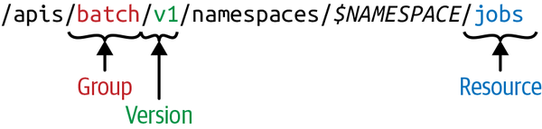

## API 对象

在 Kubernetes 集群中，Kubernetes 对象是我们持久化的实体，就是最终存入 etcd 中的数据，集群中通过这些实体来表示整个集群的状态。平时我们都是直接编写 YAML 资源清单文件，然后通过 kubectl 来提交创建对应的资源对象，那么它究竟是如何将我们的 YAML 文件转换成集群中的一个 API 对象的呢？

### 版本

这个就需要去了解下**`声明式 API`**的设计，为了可扩展性，Kubernetes 在不同的 API 路径（比如`/api/v1` 或者 `/apis/batch`）下面支持了多个 API 版本，不同的 API 版本意味着不同级别的稳定性和支持：

- Alpha 级别，例如 `v1alpha1` 默认情况下是被禁用的，可以随时删除对功能的支持，所以要慎用
- Beta 级别，例如 `v2beta1` 默认情况下是启用的，表示代码已经经过了很好的测试，但是对象的语义可能会在随后的版本中以不兼容的方式更改
- 稳定级别，比如 `v1` 表示已经是稳定版本了，也会出现在后续的很多版本中。

### API 路径

在 Kubernetes 集群中，一个 API 对象在 Etcd 里的完整资源路径，是由：`Group（API 组）`、`Version（API 版本）`和 `Resource（API 资源类型）`三个部分组成的。通过这样的结构，整个 Kubernetes 里的所有 API 对象，实际上就可以用如下的树形结构表示出来：


从上图中我们也可以看出 Kubernetes 的 API 对象的组织方式，在顶层，我们可以看到有一个核心组（由于历史原因，是 `/api/v1` 下的所有内容而不是在 `/apis/core/v1` 下面）和命名组（路径 `/apis/$NAME/$VERSION`）和系统范围内的实体，比如 `/metrics`。我们也可以用下面的命令来查看集群中的 API 组织形式：

```bash
$ kubectl get --raw /
{
  "paths": [
    "/api",
    "/api/v1",
    "/apis",
    "/apis/",
    ......
    "/version"
  ]
}
```

比如我们来查看批处理这个操作，在我们当前这个版本中存在两个版本的操作：`/apis/batch/v1` 和 `/apis/batch/v1beta1`，分别暴露了可以查询和操作的不同实体集合，同样我们还是可以通过 kubectl 来查询对应对象下面的数据：

```bash
$ kubectl get --raw /apis/batch/v1 | python -m json.tool
{
    "apiVersion": "v1",
    "groupVersion": "batch/v1",
    "kind": "APIResourceList",
    "resources": [
        {
            "categories": [
                "all"
            ],
            "kind": "Job",
            "name": "jobs",
            "namespaced": true,
            "singularName": "",
            "storageVersionHash": "mudhfqk/qZY=",
            "verbs": [
                "create",
                "delete",
                "deletecollection",
                "get",
                "list",
                "patch",
                "update",
                "watch"
            ]
        },
        {
            "kind": "Job",
            "name": "jobs/status",
            "namespaced": true,
            "singularName": "",
            "verbs": [
                "get",
                "patch",
                "update"
            ]
        }
    ]
}
```

但是这个操作和我们平时操作 HTTP 服务的方式不太一样，这里我们可以通过 `kubectl proxy` 命令来开启对 apiserver 的访问：

```bash
$ kubectl proxy
Starting to serve on 127.0.0.1:8001
```

然后重新开启一个新的终端，我们可以通过如下方式来访问批处理的 API 服务：

```bash
$ curl <http://127.0.0.1:8001/apis/batch/v1>
{
  "kind": "APIResourceList",
  "apiVersion": "v1",
  "groupVersion": "batch/v1",
  "resources": [
    {
      "name": "jobs",
      "singularName": "",
      "namespaced": true,
      "kind": "Job",
      "verbs": [
        "create",
        "delete",
        "deletecollection",
        "get",
        "list",
        "patch",
        "update",
        "watch"
      ],
      "categories": [
        "all"
      ],
      "storageVersionHash": "mudhfqk/qZY="
    },
    {
      "name": "jobs/status",
      "singularName": "",
      "namespaced": true,
      "kind": "Job",
      "verbs": [
        "get",
        "patch",
        "update"
      ]
    }
  ]
}
```

同样也可以去访问另外一个版本的对象数据：

```bash
$ curl <http://127.0.0.1:8001/apis/batch/v1beta1>
......
```

通常，Kubernetes API 支持通过标准 HTTP `POST`、`PUT`、`DELETE` 和 `GET` 在指定 PATH 路径上创建、更新、删除和检索操作，并使用 JSON 作为默认的数据交互格式。

比如现在我们要创建一个 Job 对象，那么我们的 YAML 文件的声明就需要怎么写：

```yaml
apiVersion: batch/v1
kind: Job
metadata:
  name: demo
  namespace: default
.......
```

其中 `Job` 就是这个 API 对象的资源类型 Kind，而资源 Resource 通常为 Kind 的小写复数词，比如这里就是 `jobs`，`batch` 就是它的组（Group），`v1` 就是它的版本（Version），API Group、Version 和资源就唯一定义了一个 HTTP 路径，然后在 kube-apiserver 端对这个 URL 进行了监听，然后把对应的请求传递给了对应的控制器进行处理而已。



> Resource 和 Kind 的区别是什么？需要注意的 Resource 指的是 HTTP Restful API 请求路径中的资源（理解 Restful API 的资源），而 Kind 对应的是系统中真正的实体，这两个是有本质区别的。

每个 Kind 都存在于一个 Group 和 Version 中 , 并通过 **GroupVersionKind (GVK)** 来标识，GVR 和 GVK 是相关联的，GVK 通过 GVR 标识的 HTTP 路径来提供服务，将 GVK 映射到 GVR 的过程就叫做 **REST mapping。**

## API 请求处理


上图是 Kubernetes API 处理请求的整个流程：

- HTTP 请求先由 `DefaultBuildHandlerChain()` 注册的一系列过滤器处理 , 这个函数位于[k8s.io/apiserver/pkg/server/config.go](https://github.com/kubernetes/kubernetes/blob/66674f549626cc41f04e475d2c0e865116c4cd40/staging/src/k8s.io/apiserver/pkg/server/config.go#L543) 文件中，它对请求进行一系列过滤操作，经过验证的就返回相应 HTTP 返回码
- 接下来根据请求的路径，通过 handler 路由到各种程序中 [k8s.io/apiserver/pkg/server/handler.go](https://github.com/kubernetes/kubernetes/blob/66674f549626cc41f04e475d2c0e865116c4cd40/staging/src/k8s.io/apiserver/pkg/server/handler.go#L42:6)
- 每个 API Group 都注册了一个 handler , 详情参见[k8s.io/apiserver/pkg/endpoints/groupversion.go](https://github.com/kubernetes/kubernetes/blob/66674f549626cc41f04e475d2c0e865116c4cd40/staging/src/k8s.io/apiserver/pkg/endpoints/groupversion.go#L99)和 [k8s.io/apiserver/pkg/endpoints/installer.go](https://github.com/kubernetes/kubernetes/blob/66674f549626cc41f04e475d2c0e865116c4cd40/staging/src/k8s.io/apiserver/pkg/endpoints/installer.go#L183) 它接受 HTTP 请求和上下文，并从 etcd 中检索和传递请求的对象进行数据处理。