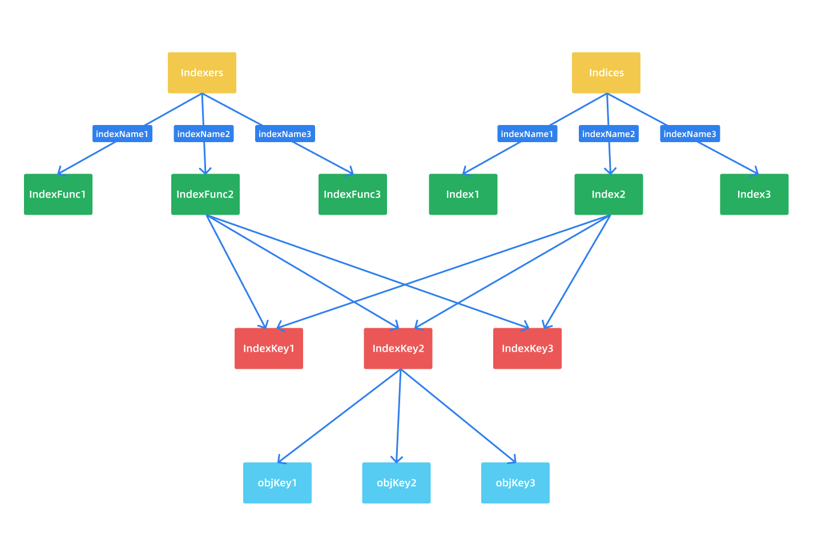

## 介绍

上节课我们讲到 DeltaFIFO 中的元素通过 Pop 函数弹出后，在指定的回调函数中将元素添加到了 Indexer 中。Indexer 是什么？字面意思是索引器，它就是 Informer 中的 LocalStore 部分，我们可以和数据库进行类比，数据库是建立在存储之上的，索引也是构建在存储之上，只是和数据做了一个映射，使得按照某些条件查询速度会非常快，所以说 Indexer 本身也是一个存储，只是它在存储的基础上扩展了索引功能。从 Indexer 接口的定义可以证明这一点：

```go
// k8s.io/client-go/tools/cache/indexer.go

// Indexer 使用多个索引扩展了 Store，并限制了每个累加器只能容纳当前对象
// 这里有3种字符串需要说明：
// 1. 一个存储键，在 Store 接口中定义（其实就是对象键）
// 2. 一个索引的名称（相当于索引分类名称）
// 3. 索引键，由 IndexFunc 生成，可以是一个字段值或从对象中计算出来的任何字符串
type Indexer interface {
	Store  // 继承了 Store 存储接口，所以说 Indexer 也是存储
	// indexName 是索引类名称，obj 是对象，计算 obj 在 indexName 索引类中的索引键，然后通过索引键把所有的对象取出来
  // 获取 obj 对象在索引类中的索引键相匹配的对象
	Index(indexName string, obj interface{}) ([]interface{}, error)
	// indexKey 是 indexName 索引分类中的一个索引键
  // 函数返回 indexKey 指定的所有对象键 IndexKeys returns the storage keys of the stored objects whose
	// set of indexed values for the named index includes the given
	// indexed value
	IndexKeys(indexName, indexedValue string) ([]string, error)
	// ListIndexFuncValues returns all the indexed values of the given index
	ListIndexFuncValues(indexName string) []string
	// ByIndex returns the stored objects whose set of indexed values
	// for the named index includes the given indexed value
	ByIndex(indexName, indexedValue string) ([]interface{}, error)
	// GetIndexer return the indexers
	GetIndexers() Indexers

	// 添加更多的索引在存储中
	AddIndexers(newIndexers Indexers) error
}
```

## Indexer

在去查看 Indexer 的接口具体实现之前，我们需要了解 Indexer 中几个非常重要的概念：Indices、Index、Indexers 及 IndexFunc。

```go
// k8s.io/client-go/tools/cache/indexer.go

// 用于计算一个对象的索引键集合
type IndexFunc func(obj interface{}) ([]string, error)

// 索引键与对象键集合的映射
type Index map[string]sets.String

// 索引器名称与 IndexFunc 的映射，相当于存储索引的各种分类
type Indexers map[string]IndexFunc

// 索引器名称与 Index 索引的映射
type Indices map[string]Index
```

这4个数据结构的命名非常容易让大家混淆，直接查看源码也不是那么容易的。这里我们来仔细解释下。首先什么叫索引，索引就是为了快速查找的，比如我们需要查找某个节点上的所有 Pod，那就让 Pod 按照节点名称排序列举出来，对应的就是 Index 这个类型，具体的就是 `map[node]sets.pod`，但是如何去查找可以有多种方式，就是上面的 Indexers 这个类型的作用。我们可以用一个比较具体的示例来解释他们的关系和含义，如下所示：

```go
package main

import (
	"fmt"

	v1 "k8s.io/api/core/v1"
	"k8s.io/apimachinery/pkg/api/meta"
	metav1 "k8s.io/apimachinery/pkg/apis/meta/v1"
	"k8s.io/client-go/tools/cache"
)

const (
	NamespaceIndexName = "namespace"
	NodeNameIndexName  = "nodeName"
)

func NamespaceIndexFunc(obj interface{}) ([]string, error) {
	m, err := meta.Accessor(obj)
	if err != nil {
		return []string{""}, fmt.Errorf("object has no meta: %v", err)
	}
	return []string{m.GetNamespace()}, nil
}

func NodeNameIndexFunc(obj interface{}) ([]string, error) {
	pod, ok := obj.(*v1.Pod)
	if !ok {
		return []string{}, nil
	}
	return []string{pod.Spec.NodeName}, nil
}

func main() {
	index := cache.NewIndexer(cache.MetaNamespaceKeyFunc, cache.Indexers{
		NamespaceIndexName: NamespaceIndexFunc,
		NodeNameIndexName:  NodeNameIndexFunc,
	})

	pod1 := &v1.Pod{
		ObjectMeta: metav1.ObjectMeta{
			Name:      "index-pod-1",
			Namespace: "default",
		},
		Spec: v1.PodSpec{NodeName: "node1"},
	}
	pod2 := &v1.Pod{
		ObjectMeta: metav1.ObjectMeta{
			Name:      "index-pod-2",
			Namespace: "default",
		},
		Spec: v1.PodSpec{NodeName: "node2"},
	}
	pod3 := &v1.Pod{
		ObjectMeta: metav1.ObjectMeta{
			Name:      "index-pod-3",
			Namespace: "kube-system",
		},
		Spec: v1.PodSpec{NodeName: "node2"},
	}

	_ = index.Add(pod1)
	_ = index.Add(pod2)
	_ = index.Add(pod3)

	// ByIndex 两个参数：IndexName（索引器名称）和 indexKey（需要检索的key）
	pods, err := index.ByIndex(NamespaceIndexName, "default")
	if err != nil {
		panic(err)
	}
	for _, pod := range pods {
		fmt.Println(pod.(*v1.Pod).Name)
	}

	fmt.Println("==========================")

	pods, err = index.ByIndex(NodeNameIndexName, "node2")
	if err != nil {
		panic(err)
	}
	for _, pod := range pods {
		fmt.Println(pod.(*v1.Pod).Name)
	}

}

// 输出结果为：
index-pod-1
index-pod-2
==========================
index-pod-2
index-pod-3
```

在上面的示例中首先通过 NewIndexer 函数实例化 Indexer 对象，第一个参数就是用于计算资源对象键的函数，这里我们使用的是 `MetaNamespaceKeyFunc` 这个默认的对象键函数；第二个参数是 Indexers，也就是存储索引器，上面我们知道 `Indexers` 的定义为 `map[string]IndexFunc`，为什么要定义成一个 map 呢？我们可以类比数据库中，我们要查询某项数据，索引的方式是不是多种多样啊？为了扩展，Kubernetes 中就使用一个 map 来存储各种各样的存储索引器，至于存储索引器如何生成，就使用一个 `IndexFunc` 暴露出去，给使用者自己实现即可。

这里我们定义的了两个索引键生成函数： `NamespaceIndexFunc` 与 `NodeNameIndexFunc`，一个根据资源对象的命名空间来进行索引，一个根据资源对象所在的节点进行索引。然后定义了3个 Pod，前两个在 default 命名空间下面，另外一个在 kube-system 命名空间下面，然后通过 `index.Add` 函数添加这3个 Pod 资源对象。然后通过 `index.ByIndex` 函数查询在名为 `namespace` 的索引器下面匹配索引键为 `default` 的 Pod 列表。也就是查询 default 这个命名空间下面的所有 Pod，这里就是前两个定义的 Pod。

对上面的示例如果我们理解了，那么就很容易理解上面定义的4个数据结构了：

- IndexFunc：索引器函数，用于计算一个资源对象的索引值列表，上面示例是指定命名空间为索引值结果，当然我们也可以根据需求定义其他的，比如根据 Label 标签、Annotation 等属性来生成索引值列表。
- Index：存储数据，对于上面的示例，我们要查找某个命名空间下面的 Pod，那就要让 Pod 按照其命名空间进行索引，对应的 Index 类型就是 `map[namespace]sets.pod`。
- Indexers：存储索引器，key 为索引器名称，value 为索引器的实现函数，上面的示例就是 `map["namespace"]MetaNamespaceIndexFunc`。
- Indices：存储缓存器，key 为索引器名称，value 为缓存的数据，对于上面的示例就是 `map["namespace"]map[namespace]sets.pod`。

可能最容易混淆的是 Indexers 和 Indices 这两个概念，因为平时很多时候我们没有怎么区分二者的关系，这里我们可以这样理解：Indexers 是存储索引的，Indices 里面是存储的真正的数据（对象键），这样可能更好理解。



按照上面的理解我们可以得到上面示例的索引数据如下所示：

```go
// Indexers 就是包含的所有索引器(分类)以及对应实现
Indexers: {  
  "namespace": NamespaceIndexFunc,
  "nodeName": NodeNameIndexFunc,
}
// Indices 就是包含的所有索引分类中所有的索引数据
Indices: {
	"namespace": {  //namespace 这个索引分类下的所有索引数据
		"default": ["pod-1", "pod-2"],  // Index 就是一个索引键下所有的对象键列表
		"kube-system": ["pod-3"]   // Index
	},
	"nodeName": {  //nodeName 这个索引分类下的所有索引数据(对象键列表)
		"node1": ["pod-1"],  // Index
		"node2": ["pod-2", "pod-3"]  // Index
	}
}
```

## ThreadSafeMap

上面我们理解了 Indexer 中的几个重要的数据类型，下面我们来看下 Indexer 接口的具体实现 cache，位于文件 `k8s.io/client-go/tools/cache/store.go` 中：

```go
// [k8s.io/client-go/tools/cache/store.go](<http://k8s.io/client-go/tools/cache/store.go>)

// cache 用一个 ThreadSafeStore 和一个关联的 KeyFunc 来实现 Indexer
type cache struct {
	// cacheStorage 是一个线程安全的存储
	cacheStorage ThreadSafeStore
  // keyFunc 用于计算对象键
	keyFunc KeyFunc
}
```

我们可以看到这个 cache 包含一个 `ThreadSafeStore` 的属性，这是一个并发安全的存储，因为是存储，所以自然就有存储相关的增、删、改、查等操作，Indexer 就是在 ThreadSafeMap 基础上进行封装的，实现了索引相关的功能。接下来我们先来看看 ThreadSafeStore 的定义，位于 `k8s.io/client-go/tools/cache/thread_safe_store.go` 文件中：

```go
type ThreadSafeStore interface {
	Add(key string, obj interface{})
	Update(key string, obj interface{})
	Delete(key string)
	Get(key string) (item interface{}, exists bool)
	List() []interface{}
	ListKeys() []string
	Replace(map[string]interface{}, string)
	Index(indexName string, obj interface{}) ([]interface{}, error)
	IndexKeys(indexName, indexKey string) ([]string, error)
	ListIndexFuncValues(name string) []string
	ByIndex(indexName, indexKey string) ([]interface{}, error)
	GetIndexers() Indexers

	AddIndexers(newIndexers Indexers) error
	Resync() error
}
```

从接口的定义可以看出 ThreadSafeStore 和 Index 基本上差不多，但还是有一些区别的，这个接口是需要通过对象键来进行索引的。接下来我们来看看这个接口的具体实现 threadSafeMap 的定义：

```go
// k8s.io/client-go/tools/cache/thread_safe_store.go

// threadSafeMap 实现了 ThreadSafeStore
type threadSafeMap struct {
	lock  sync.RWMutex
  // 存储资源对象数据，key(对象键) 通过 keyFunc 得到
  // 这就是真正存储的数据（对象键 -> 对象）
	items map[string]interface{}

	// indexers 索引分类与索引键函数的映射
	indexers Indexers
	// indices 通过索引可以快速找到对象键
	indices Indices
}
```

不要把索引键和对象键搞混了，索引键是用于对象快速查找的；对象键是对象在存储中的唯一命名，对象是通过名字+对象的方式存储的。接下来我们来仔细看下接口的具体实现，首先还是比较简单的 Add、Delete、Update 几个函数的实现：

```go
// k8s.io/client-go/tools/cache/thread_safe_store.go

// 添加对象
func (c *threadSafeMap) Add(key string, obj interface{}) {
	c.lock.Lock()
	defer c.lock.Unlock()
  // 获取老的对象
	oldObject := c.items[key]
  // 写入新的对象，items 中存的是 objKey -> obj 的映射
	c.items[key] = obj
  // 添加了新的对象，所以要更新索引
	c.updateIndices(oldObject, obj, key)
}

// 更新对象，可以看到实现和 Add 是一样的
func (c *threadSafeMap) Update(key string, obj interface{}) {
	c.lock.Lock()
	defer c.lock.Unlock()
	oldObject := c.items[key]
	c.items[key] = obj
	c.updateIndices(oldObject, obj, key)
}

// 删除对象
func (c *threadSafeMap) Delete(key string) {
	c.lock.Lock()
	defer c.lock.Unlock()
  // 判断对象是否存在，存在才执行删除操作
	if obj, exists := c.items[key]; exists {
    // 删除对象索引
		c.deleteFromIndices(obj, key)
    // 删除对象本身
		delete(c.items, key)
	}
}
```

可以看到基本的实现比较简单，就是添加、更新、删除对象数据后，然后更新或删除对应的索引，所以我们需要查看下更新或删除索引的具体实现：

```go
// k8s.io/client-go/tools/cache/thread_safe_store.go

// updateIndices 更新索引
func (c *threadSafeMap) updateIndices(oldObj interface{}, newObj interface{}, key string) {
	// 如果有旧的对象，需要先从索引中删除这个对象
	if oldObj != nil {
		c.deleteFromIndices(oldObj, key)
	}
  // 循环所有的索引器
	for name, indexFunc := range c.indexers {
    // 获取对象的索引键
		indexValues, err := indexFunc(newObj)
		if err != nil {
			panic(fmt.Errorf("unable to calculate an index entry for key %q on index %q: %v", key, name, err))
		}
    // 得到当前索引器的索引
		index := c.indices[name]
		if index == nil {
      // 没有对应的索引，则初始化一个索引
			index = Index{}
			c.indices[name] = index
		}
    // 循环所有的索引键
		for _, indexValue := range indexValues {
      // 得到索引键对应的对象键列表
			set := index[indexValue]
			if set == nil {
        // 没有对象键列表则初始化一个空列表
				set = sets.String{}
				index[indexValue] = set
			}
      // 将对象键插入到集合中，方便索引
			set.Insert(key)
		}
	}
}

// deleteFromIndices 删除对象索引
func (c *threadSafeMap) deleteFromIndices(obj interface{}, key string) {
  // 循环所有的索引器
	for name, indexFunc := range c.indexers {
    // 获取删除对象的索引键列表
		indexValues, err := indexFunc(obj)
		if err != nil {
			panic(fmt.Errorf("unable to calculate an index entry for key %q on index %q: %v", key, name, err))
		}
    // 获取当前索引器的索引
		index := c.indices[name]
		if index == nil {
			continue
		}
    // 循环所有索引键
		for _, indexValue := range indexValues {
      // 获取索引键对应的对象键列表
			set := index[indexValue]
			if set != nil {
        // 从对象键列表中删除当前要删除的对象键
				set.Delete(key)

				// 如果当集合为空的时候不删除set，那么具有高基数的短生命资源的 indices 会导致未使用的空集合随时间增加内存。
        // `kubernetes/kubernetes/issues/84959`.
        if len(set) == 0 {
					delete(index, indexValue)
				}
			}
		}
	}
}
```

添加索引和删除索引的实现都挺简单的，其实主要还是要对 indices、indexs 这些数据结构非常了解，这样就非常容易了，我们可以将 indexFunc 当成当前对象的命名空间来看待，这样对于上面的索引更新和删除的理解就肯定没问题了。

然后接下来就是几个查询相关的接口实现：

```go
// k8s.io/client-go/tools/cache/thread_safe_store.go

// 获取对象
func (c *threadSafeMap) Get(key string) (item interface{}, exists bool) {
	c.lock.RLock()  // 只需要读锁
	defer c.lock.RUnlock()
  // 直接从 map 中读取值
	item, exists = c.items[key]
	return item, exists
}

// 对象列举
func (c *threadSafeMap) List() []interface{} {
	c.lock.RLock()
	defer c.lock.RUnlock()
	list := make([]interface{}, 0, len(c.items))
	for _, item := range c.items {
		list = append(list, item)
	}
	return list
}

// 返回 threadSafeMap 中所有的对象键列表
func (c *threadSafeMap) ListKeys() []string {
	c.lock.RLock()
	defer c.lock.RUnlock()
	list := make([]string, 0, len(c.items))
	for key := range c.items {
		list = append(list, key)
	}
	return list
}

// 替换所有对象，相当于重新构建索引
func (c *threadSafeMap) Replace(items map[string]interface{}, resourceVersion string) {
	c.lock.Lock()
	defer c.lock.Unlock()
  // 直接覆盖之前的对象
	c.items = items

	// 重新构建索引
	c.indices = Indices{}
	for key, item := range c.items {
    // 更新元素的索引
		c.updateIndices(nil, item, key)
	}
}
```

然后接下来就是和索引相关的几个接口实现，第一个就是 Index 函数：

```go
// k8s.io/client-go/tools/cache/thread_safe_store.go

// 通过指定的索引器和对象获取符合这个对象特征的所有对象
func (c *threadSafeMap) Index(indexName string, obj interface{}) ([]interface{}, error) {
	c.lock.RLock()
	defer c.lock.RUnlock()
  // 获得索引器 indexName 的索引键计算函数
	indexFunc := c.indexers[indexName]
	if indexFunc == nil {
		return nil, fmt.Errorf("Index with name %s does not exist", indexName)
	}
  // 获取指定 obj 对象的索引键
	indexedValues, err := indexFunc(obj)
	if err != nil {
		return nil, err
	}
  // 获得索引器 indexName 的所有索引
	index := c.indices[indexName]
 
  // 用来存储对象键的集合
	var storeKeySet sets.String
	if len(indexedValues) == 1 {
    // 大多数情况下只有一个值匹配（默认获取的索引键就是对象的 namespace）
    // 直接拿到这个索引键的对象键集合
		storeKeySet = index[indexedValues[0]]
	} else {
    // 由于有多个索引键，则可能有重复的对象键出现，索引需要去重
		storeKeySet = sets.String{}
    // 循环索引键
		for _, indexedValue := range indexedValues {
      // 循环索引键下面的对象键，因为要去重
			for key := range index[indexedValue] {
				storeKeySet.Insert(key)
			}
		}
	}
  // 拿到了所有的对象键集合过后，循环拿到所有的对象集合
	list := make([]interface{}, 0, storeKeySet.Len())
	for storeKey := range storeKeySet {
		list = append(list, c.items[storeKey])
	}
	return list, nil
}
```

这个 Index 函数就是获取一个指定对象的索引键，然后把这个索引键下面的所有的对象全部获取到，比如我们要获取一个 Pod 所在命名空间下面的所有 Pod，如果更抽象一点，就是符合对象*某些特征*的所有对象，而这个特征就是我们指定的索引键函数计算出来的。然后接下来就是一个比较重要的 ByIndex 函数的实现：

```go
// k8s.io/client-go/tools/cache/thread_safe_store.go

// 和上面的 Index 函数类似，只是是直接指定的索引键
func (c *threadSafeMap) ByIndex(indexName, indexedValue string) ([]interface{}, error) {
	c.lock.RLock()
	defer c.lock.RUnlock()
  
  // 获得索引器 indexName 的索引键计算函数
	indexFunc := c.indexers[indexName]
	if indexFunc == nil {
		return nil, fmt.Errorf("Index with name %s does not exist", indexName)
	}
  // 获得索引器 indexName 的所有索引
	index := c.indices[indexName]
  // 获取指定索引键的所有所有对象键
	set := index[indexedValue]
  // 然后根据对象键遍历获取对象
	list := make([]interface{}, 0, set.Len())
	for key := range set {
		list = append(list, c.items[key])
	}

	return list, nil
}
```

可以很清楚地看到 ByIndex 函数和 Index 函数比较类似，但是更简单了，直接获取一个指定的索引键的全部资源对象。然后是其他几个索引相关的函数：

```go
// k8s.io/client-go/tools/cache/thread_safe_store.go

// IndexKeys 和上面的 ByIndex 几乎是一样的，只是这里是直接返回对象键列表
func (c *threadSafeMap) IndexKeys(indexName, indexedValue string) ([]string, error) {
	c.lock.RLock()
	defer c.lock.RUnlock()
  // 获取索引器 indexName 的索引键计算函数
	indexFunc := c.indexers[indexName]
	if indexFunc == nil {
		return nil, fmt.Errorf("Index with name %s does not exist", indexName)
	}
  // 获取索引器 indexName 的所有索引
	index := c.indices[indexName]
	// 直接获取指定索引键的对象键集合
	set := index[indexedValue]
	return set.List(), nil
}

// 获取索引器下面的所有索引键
func (c *threadSafeMap) ListIndexFuncValues(indexName string) []string {
	c.lock.RLock()
	defer c.lock.RUnlock()
  // 获取索引器 indexName 的所有索引
	index := c.indices[indexName]
	names := make([]string, 0, len(index))
  // 遍历索引得到索引键
	for key := range index {
		names = append(names, key)
	}
	return names
}

// 直接返回 indexers
func (c *threadSafeMap) GetIndexers() Indexers {
	return c.indexers
}

// 添加一个新的 Indexers
func (c *threadSafeMap) AddIndexers(newIndexers Indexers) error {
	c.lock.Lock()
	defer c.lock.Unlock()

	if len(c.items) > 0 {
		return fmt.Errorf("cannot add indexers to running index")
	}
  // 获取旧的索引器和新的索引器keys
	oldKeys := sets.StringKeySet(c.indexers)
	newKeys := sets.StringKeySet(newIndexers)
  
  // 如果包含新的索引器，则提示冲突
	if oldKeys.HasAny(newKeys.List()...) {
		return fmt.Errorf("indexer conflict: %v", oldKeys.Intersection(newKeys))
	}
  // 将新的索引器添加到 Indexers 中
	for k, v := range newIndexers {
		c.indexers[k] = v
	}
	return nil
}

// 没有真正实现 Resync 操作 
func (c *threadSafeMap) Resync() error {
	return nil
}
```

这里我们就将 ThreadSafeMap 的实现进行了分析说明。整体来说比较方便，一个就是将对象数据存入到一个 map 中，然后就是维护索引，方便根据索引来查找到对应的对象。

## cache

接下来再回过头去看 cache 的实现就非常简单了，因为 cache 就是对 ThreadSafeStore 的一个再次封装，很多操作都是直接调用的 `ThreadSafeStore` 的操作实现的，如下所示：

```go
// k8s.io/client-go/tools/cache/store.go

// Add 插入一个元素到 cache 中
func (c *cache) Add(obj interface{}) error {
	key, err := c.keyFunc(obj)  // 生成对象键
	if err != nil {
		return KeyError{obj, err}
	}
  // 将对象添加到底层的 ThreadSafeStore 中
	c.cacheStorage.Add(key, obj)
	return nil
}

// 更新cache中的对象
func (c *cache) Update(obj interface{}) error {
	key, err := c.keyFunc(obj)
	if err != nil {
		return KeyError{obj, err}
	}
	c.cacheStorage.Update(key, obj)
	return nil
}

// 删除cache中的对象
func (c *cache) Delete(obj interface{}) error {
	key, err := c.keyFunc(obj)
	if err != nil {
		return KeyError{obj, err}
	}
	c.cacheStorage.Delete(key)
	return nil
}

// 得到cache中所有的对象
func (c *cache) List() []interface{} {
	return c.cacheStorage.List()
}

// 得到cache中所有的对象键
func (c *cache) ListKeys() []string {
	return c.cacheStorage.ListKeys()
}

// 得到cache中的Indexers
func (c *cache) GetIndexers() Indexers {
	return c.cacheStorage.GetIndexers()
}

// 得到对象obj与indexName索引器关联的所有对象
func (c *cache) Index(indexName string, obj interface{}) ([]interface{}, error) {
	return c.cacheStorage.Index(indexName, obj)
}

func (c *cache) IndexKeys(indexName, indexKey string) ([]string, error) {
	return c.cacheStorage.IndexKeys(indexName, indexKey)
}

func (c *cache) ListIndexFuncValues(indexName string) []string {
	return c.cacheStorage.ListIndexFuncValues(indexName)
}

func (c *cache) ByIndex(indexName, indexKey string) ([]interface{}, error) {
	return c.cacheStorage.ByIndex(indexName, indexKey)
}

func (c *cache) AddIndexers(newIndexers Indexers) error {
	return c.cacheStorage.AddIndexers(newIndexers)
}

func (c *cache) Get(obj interface{}) (item interface{}, exists bool, err error) {
	key, err := c.keyFunc(obj)
	if err != nil {
		return nil, false, KeyError{obj, err}
	}
	return c.GetByKey(key)
}

func (c *cache) GetByKey(key string) (item interface{}, exists bool, err error) {
	item, exists = c.cacheStorage.Get(key)
	return item, exists, nil
}

// 替换cache中所有的对象
func (c *cache) Replace(list []interface{}, resourceVersion string) error {
	items := make(map[string]interface{}, len(list))
	for _, item := range list {
		key, err := c.keyFunc(item)
		if err != nil {
			return KeyError{item, err}
		}
		items[key] = item
	}
	c.cacheStorage.Replace(items, resourceVersion)
	return nil
}

func (c *cache) Resync() error {
	return nil
}
```

可以看到 cache 没有自己独特的实现方式，都是调用的包含的 `ThreadSafeStore` 操作接口。

## 总结

前面我们已经知道了 Reflector 通过 ListAndWatch 把数据传入 DeltaFIFO 后，经过 DeltaFIFO 的 Pop 函数将资源对象存入到了本地的一个存储 Indexer 中，而这个底层真正的存储其实就是上面的 ThreadSafeStore。

要理解 Indexer 组件，最主要就是要把索引、索引器（索引分类）、索引键、对象键这几个概念弄清楚，有时候确实容易混乱，我们将上面的示例理解了应该就很好理解了，我们可以简单的理解为 Indexer 就是简单的把相同命名空间的对象放在一个集合中，然后基于命名空间来查找对象。