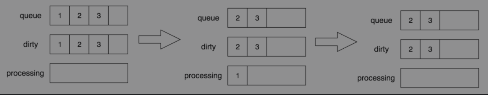
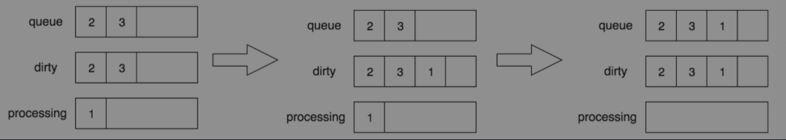
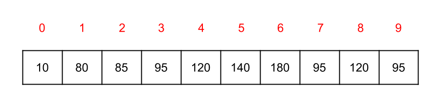
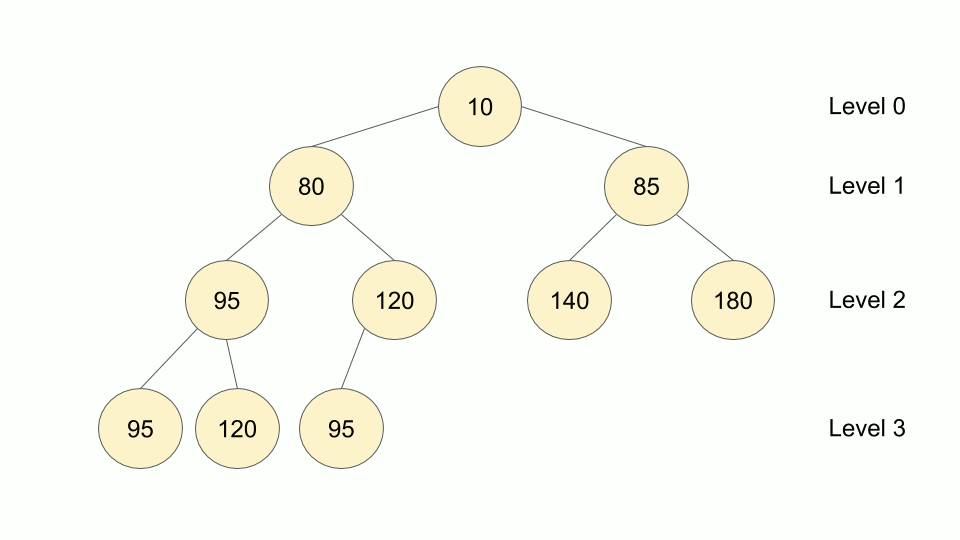
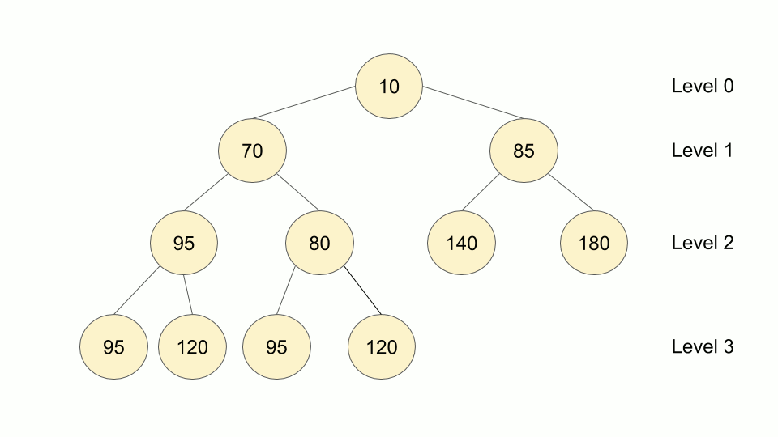
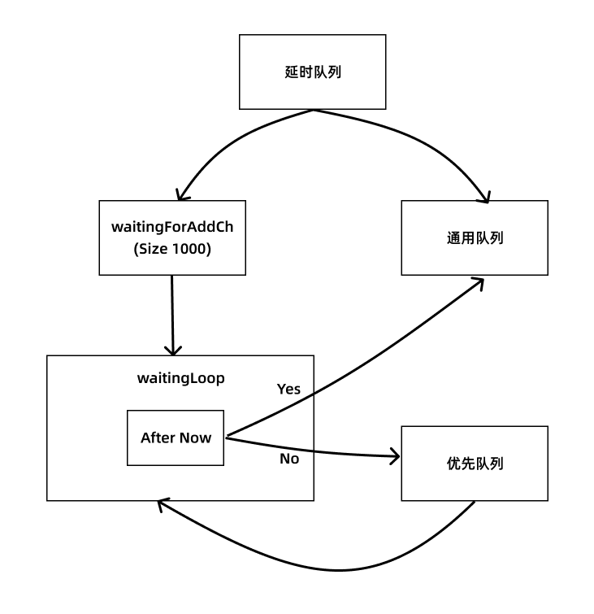
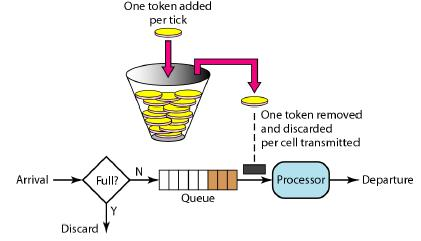

# 介绍

前面我们把 Informer 的整个流程完整分析了一遍，我们可以通过监听对象的变化，将资源对象写入到事件处理器的回调函数中，但是如果我们直接在回调函数中处理这些数据会比较慢，对于这种情况往往我们就会使用队列来接收这些数据，然后再通过其他协程去处理这些数据，可以大大加快数据的处理速度。这个其实和 channel 有点类似，但是 channel 功能过于单一，无法满足各类场景的需求，比如限制数据队列的写入速度。

为此在 client-go 中单独提供了一个 workqueue 的组件来实现队列的功能，由于 Kubernetes 很多模块都有队列的需求，所以统一实现在了 client-go 中，不仅可以用于 Kubernetes 内部，同时也可以供调用 client-go 的模块使用。client-go 中抽象了几种队列，包括通用队列、限速队列、延时队列等等。

# 通用队列

首先我们来看下 client-go 中队列是如何定义的，代码位于 `k8s.io/client-go/util/workqueue/queue.go` 文件中：

```go
// k8s.io/client-go/util/workqueue/queue.go

// 队列接口定义
type Interface interface {
	Add(item interface{})  // 向队列中添加一个元素
	Len() int  // 获取队列长度
	Get() (item interface{}, shutdown bool)  // 获取队列头部的元素，第二个返回值表示队列是否已经关闭
	Done(item interface{})  // 标记队列中元素已经处理完
	ShutDown()  // 关闭队列
	ShuttingDown() bool  // 查询队列是否正在关闭
}
```

既然是接口，那么肯定就有对应的实现，在当前文件中有一个名为 `Type` 的结构体，就实现了上面的队列接口：

```go
// k8s.io/client-go/util/workqueue/queue.go

// Type 是一个 workqueue。
type Type struct {
  // 定义实际存储元素的地方，用 slice 保证处理元素的顺序，
  // 队列中的每个元素都应该在 dirty 集合中，而不是在 processing 集合中。
	queue []t  // 队列中的元素可以是任意类型的元素

	// dirty 定义了所有需要处理的元素。
  // dirty 这个词应该类似 linux 内存管理中的 dirty，表示在内存(dirty)中但未写入硬盘(queue)的数据
	dirty set

  // 当前正在处理的元素都在 processing 集合中。
  // 这些元素可能同时在 dirty 集合中，当我们处理完某个元素，从这个集合中删除时，我们会检查它是否在 dirty 集合中，如果在，就把它加入队列。
	processing set

	cond *sync.Cond

	shuttingDown bool  // 关闭标志

	metrics queueMetrics  // 用于 Prometheus 监控指标

	unfinishedWorkUpdatePeriod time.Duration
	clock                      clock.Clock
}

// 空结构体
type empty struct{}
// 空接口，表示任意类型
type t interface{}  
// set 集合，用 map 来模拟 set 集合（元素不重复），集合中的元素是任意类型
type set map[t]empty
```

该结构体中最重要的3个属性是 queue、dirty、processing，我们可以先来看下该队列是如何实现上面的接口的，然后再理解这几个字段的关系就比较容易了。首先看下 Add 函数的实现：

```go
// k8s.io/client-go/util/workqueue/queue.go

// Add 标记 item 元素为需要处理
func (q *Type) Add(item interface{}) {
	q.cond.L.Lock()
	defer q.cond.L.Unlock()
  // 如果队列正在关闭，那么就直接返回了
	if q.shuttingDown {
		return
	}
  // 已经在脏数据集合中，也直接返回
	if q.dirty.has(item) {
		return
	}
  
	q.metrics.add(item)
  // 添加到脏数据集合中
	q.dirty.insert(item) 
  // 数据已经在正在处理的集合中了，那么也直接返回了
	if q.processing.has(item) {
		return
	}
  // 添加到元素队列的尾部
	q.queue = append(q.queue, item)
  // 通知其他协程解除阻塞
	q.cond.Signal()
}
```

上面的添加元素的函数并不是直接将元素存储在 queue 集合中，而是先添加到 dirty 集合中，这个地方的 dirty 集合主要是用来判断元素是否已经存在了，我们直接通过 queue 集合当然也可以判断，但是需要遍历一次，效率太低，而 dirty 是一个 set 集合（map 实现的），用来判断是否存在肯定是最快的方式了，所以如果数据在脏数据的集合中那么就不处理了。如果没在脏数据集合中那么就添加进去，还有一种情况是我们添加的这个元素正在处理，但是还没有调用 Done() 函数，也就是这个元素正在处理，此时再添加当前的元素应该是最新的，处理中的是过时的了，也就是脏的。

接下来看看 Get 函数是如何实现的：

```go
// k8s.io/client-go/util/workqueue/queue.go

// 阻塞，直到可以获取头部的元素进行处理
// 如果 shutdown=true，调用者应该结束他们的协程
// 当处理完一个元素后，必须调用 Done() 函数
func (q *Type) Get() (item interface{}, shutdown bool) {
	q.cond.L.Lock()
	defer q.cond.L.Unlock()
  // 队列没有关闭并且没有数据的时候，阻塞协程
	for len(q.queue) == 0 && !q.shuttingDown {
		q.cond.Wait()
	}
  // 协程被激活了，但是没有数据，则返回关闭状态
	if len(q.queue) == 0 {
		return nil, true
	}
  // 弹出第一个元素
	item, q.queue = q.queue[0], q.queue[1:]

	q.metrics.get(item)
  // 将当前元素加入到正在处理的集合中
	q.processing.insert(item)
  // 同时从脏数据集合中移除
	q.dirty.delete(item)

	return item, false
}
```

Get() 函数的实现比较简单，就是从真正的队列 queue 中取出第一个元素，取出来要放到正在处理的集合中，并从脏数据集合中移除。然后一个比较重要的函数就是 Done() 了，用来标记元素处理完成了：

```go
// k8s.io/client-go/util/workqueue/queue.go

// 完成标志着元素已经处理完毕，如果在处理过程中又被标记为脏数据，则会重新加入队列进行重新处理。
func (q *Type) Done(item interface{}) {
	q.cond.L.Lock()
	defer q.cond.L.Unlock()
  
	q.metrics.done(item)
  // 从正在处理的集合中删除，因为已经处理完了
	q.processing.delete(item)
  // 判断脏数据集合中是否有这个元素
  // 因为在处理的期间很可能元素又被添加了
  // 那么需要重新放到队列中去进行处理
	if q.dirty.has(item) {
    // 放回队列
		q.queue = append(q.queue, item)
    // 激活协程
		q.cond.Signal()
	}
}
```

Done() 函数的作用就是标记元素为已经处理完成了，只是在处理元素的期间很有可能该元素又被添加进来了，出现再了脏数据集合中，那么就需要重新放回数据队列进行处理。其他的几个函数实现非常简单：

```go
// k8s.io/client-go/util/workqueue/queue.go

// 返回当前队列中的元素长度
func (q *Type) Len() int {
	q.cond.L.Lock()
	defer q.cond.L.Unlock()
	return len(q.queue)
}

// 关闭队列，ShutDown 会使队列忽略所有新添加的元素
// 一旦工作协程排空了队列中的现有元素，它们就会被标记为退出。
func (q *Type) ShutDown() {
	q.cond.L.Lock()
	defer q.cond.L.Unlock()
  // 标记为关闭
	q.shuttingDown = true
	q.cond.Broadcast()
}

// 队列是否在关闭
func (q *Type) ShuttingDown() bool {
	q.cond.L.Lock()
	defer q.cond.L.Unlock()

	return q.shuttingDown
}
```

通过队上面队列的实现分析，我们可以用下图来进行说明。



通过 Add 方法往队列中分别插入1、2、3这3个元素，此时队列中的 queue 和 dirty 字段分别存有1、2、3元素，processing 为空。然后通过 Get 方法获取最先进入的元素1，此时队列中的 queue 和 dirty 字段分别存有2、3元素，而1元素会被放入 processing 字段中，表示该元素正在被处理。最后，当我们处理完1元素时，通过 Done 方法标记该元素已经被处理完成，此时队列中的 processing 字段中的1元素会被删除。然后用同样的方式继续处理后面的元素2、3。

如果在处理元素1的过程中，又有其他协程将该元素又加入到了队列中，处理流程如下图所示：



假设 goroutine A 通过 Get 方法获取1元素，1元素被添加到 processing 字段中，同一时间，goroutine B通过 Add 方法插入另一个1元素，此时在 processing 字段中已经存在相同的元素，所以后面的1元素并不会被直接添加到 queue 字段中，当前队列中的 dirty 字段中存有1、2、3元素，processing 字段存有1元素。在 goroutine A 通过 Done 方法标记处理完成后，如果 dirty 字段中存有1元素，则将1元素追加到 queue 字段中的尾部。

# 延时队列

延时队列是在通用队列基础上进行扩展的，因为它本质还是一个队列，只是加了一个新的函数来进行延迟，对应的接口定义如下所示：

```go
// k8s.io/client-go/util/workqueue/delaying_queue.go

// DelayingInterface 是一个延时队列，可以在以后的时间来添加元素的接口
// 这使得它更容易在处理失败后重新入队列，而不至于陷入 hot-loop
type DelayingInterface interface {
	Interface
	// 在指定的时间后讲元素添加到工作队列中
	AddAfter(item interface{}, duration time.Duration)
}
```

延时队列的定义很简单，就是增加了一个函数来实现元素的延迟添加而已，接下来我们继续来查看该接口的具体实现方式：

```go
// k8s.io/client-go/util/workqueue/delaying_queue.go

// delayingType 包装了 Interface 通用接口，并提供了延迟重新入队列
type delayingType struct {
	Interface  // 一个通用队列

	// 时钟用于跟踪延迟触发的时间
	clock clock.Clock

	// 关闭信号
	stopCh chan struct{}
	// 用来保证只发出一次关闭信号
	stopOnce sync.Once

	// 在触发之前确保我们等待的时间不超过 maxWait
	heartbeat clock.Ticker

	// waitingForAddCh 是一个 buffered channel，提供了一个缓冲通道
  // 延迟添加的元素封装成 waitFor 放到 channel 中
	waitingForAddCh chan *waitFor

	// 记录重试的次数
	metrics retryMetrics
}

// waitFor 持有要添加的数据和应该添加的时间
type waitFor struct {
	data    t  // 添加的元素数据
	readyAt time.Time  // 在什么时间添加到队列中
	index int  // 优先级队列（heap）中的索引
}
```

在延时队列的实现 delayingType 结构体中包含一个通用队列 Interface 的实现，然后最重要的一个属性就是 `waitingForAddCh`，这是一个 buffered channel，将延迟添加的元素封装成 `waitFor` 放到通道中，意思就是当到了指定的时间后就将元素添加到通用队列中去进行处理，还没有到时间的话就放到这个缓冲通道中。要了解是如何实现延时队列的我们还需要了解另外一个数据结构，那就是 `waitForPriorityQueue`：

```go
// k8s.io/client-go/util/workqueue/delaying_queue.go

// waitForPriorityQueue 为 waitFor 的元素集合实现了一个优先级队列
// 把需要延迟的元素放到一个队列中，然后在队列中按照元素的延时添加时间（readyAt）从小到大排序
// 其实这个优先级队列就是实现的 golang 中内置的 container/heap/heap.go 中的 Interface 接口
// 最终实现的队列就是 waitForPriorityQueue 这个集合是有序的，按照时间从小到大进行排列
type waitForPriorityQueue []*waitFor
```

`waitForPriorityQueue` 是一个有序的 waitFor 的集合，按照添加的时间从小到大进行排列，这就形成了一个优先级队列。

## 优先级队列

其实这个优先级队列是 golang 中内置的 `container/heap/heap.go` 文件中的 Interface 接口（常说的数据结构堆）的一个实现，我们要想实现自己的队列也完全可以去实现这个接口即可：

```go
// $GOROOT/src/container/heap/heap.go

// 堆接口定义
// 注意：这个接口中的 Push 和 Pop 函数是给 heap 包的实现调用的
// 任何实现了本接口的类型都可以用于构建小顶堆
// 小顶堆可以通过 heap.Init 建立，数据是递增顺序或者空的话也是最小堆
// 小顶堆的约束条件是：
// !h.Less(j, i) for 0 <= i < h.Len() and 2*i+1 <= j <= 2*i+2 and j < h.Len()

// 要从堆中添加和删除元素，可以直接使用 heap.Push 和 heap.Pop 函数。
type Interface interface {
	sort.Interface
	Push(x interface{}) 
	Pop() interface{}   
}

// Init 初始化一个堆
// 使用任何堆操作之前应先初始化，Init 函数对于堆的约束性是幂等的，并可能在任何时候堆的约束性被破坏时被调用
// 本函数复杂度为O(n)，其中n等于h.Len()。
func Init(h Interface) {
	// 构建堆
	n := h.Len()
	for i := n/2 - 1; i >= 0; i-- {
		down(h, i, n)
	}
}

// Push 将元素 x 添加到堆上
// 复杂度为 O(log n)，其中 n = h.Len()
func Push(h Interface, x interface{}) {
	h.Push(x)
  // 要保证堆的结构，所以添加进来的元素要重新调整
  // 元素添加到最后，然后不断上浮，因为要满足任一节点的值要小于左右子树的值
	up(h, h.Len()-1)
}

// 将元素 j 重新排到正确的位置
func up(h Interface, j int) {
	for {
		i := (j - 1) / 2 // 父节点的索引
    // 如果 j 就是父节点或者 j >= i（父节点元素 < 子节点元素）那就不用调整了
		if i == j || !h.Less(j, i) {
			break
		}
    // 父节点元素 > j 的元素，就交换二者
		h.Swap(i, j)
		j = i
	}
}

// Pop 从堆中移除并返回最小元素（根据 Less）
// 复杂度为 O(log n)，其中 n = h.Len()
// Pop 相当于 Remove(h, 0)
func Pop(h Interface) interface{} {
	n := h.Len() - 1
  // 将最后一个元素填充到堆顶，Pop 是弹出堆顶的元素
	h.Swap(0, n)
  // 然后不断的下沉这个元素
	down(h, 0, n)
  // 调用外部的实现者，h.Pop() 实现中会删除最后一个元素
	return h.Pop()
}

func down(h Interface, i0, n int) bool {
	i := i0  // 父节点索引
	for {
		j1 := 2*i + 1  // 左子节点的索引
		if j1 >= n || j1 < 0 { // 下沉到最后一个节点就不处理了
			break
		}
		j := j1  // 左子节点索引
		if j2 := j1 + 1; j2 < n && h.Less(j2, j1) {
			j = j2 // = 2*i + 2  // 右子节点索引
		}
    // 子节点 >= 父节点索引，那就不用处理了
		if !h.Less(j, i) {
			break
		}
    // 子节点 < 父节点，则交换父节点和子节点
		h.Swap(i, j)
		i = j
	}
	return i > i0
}

// 重新调整结构
func Fix(h Interface, i int) {
	if !down(h, i, h.Len()) {
		up(h, i)
	}
}

// $GOROOT/src/sort/sort.go

// 排序的接口定义
type Interface interface {
	// 集合元素大小
	Len() int
	// 比较索引 i 和 j 位置的元素大小
	Less(i, j int) bool
	// 交换索引 i 和 j 位置的元素
	Swap(i, j int)
}
```

堆是一种经过`排序的完全二叉树`，其中任一非终端节点的数据值均不大于（或不小于）其左孩子和右孩子节点的值。golang 中内置的堆是小顶堆（最小堆），任一节点的值是其子树所有结点的最小值：




> 堆又被为优先队列，尽管名为优先队列，但*堆并不是队列*。因为队列中允许的操作是先进先出（FIFO），在队尾插入元素，在队头取出元素。而堆虽然在堆底插入元素，在堆顶取出元素，但是堆中元素的排列不是按照到来的先后顺序，而是按照一定的优先顺序排列的。

下图是插入一个元素的示意图：



下图是从堆中删除一个元素的示意图：



## 延时队列的实现

接下来我们来看下 `waitForPriorityQueue` 是如何实现这个优先队列的：

```go
// k8s.io/client-go/util/workqueue/delaying_queue.go

// 获取队列长度，pq 就是一个 waitFor 集合，直接返回长度即可
func (pq waitForPriorityQueue) Len() int {
	return len(pq)
}

// 判断索引 i 和 j 上的元素大小
func (pq waitForPriorityQueue) Less(i, j int) bool {
  // 根据时间先后顺序来决定先后顺序
  // i 位置的元素时间在 j 之前，则证明索引 i 的元素小于索引 j 的元素
	return pq[i].readyAt.Before(pq[j].readyAt)
}

// 交换索引 i 和 j 的元素
func (pq waitForPriorityQueue) Swap(i, j int) {
  // 交换元素
	pq[i], pq[j] = pq[j], pq[i]
  // 更新元素里面的索引信息
	pq[i].index = i
	pq[j].index = j
}

// 添加元素到队列中
// 要注意不应该直接调用 Push 函数，而应该使用 `heap.Push`
func (pq *waitForPriorityQueue) Push(x interface{}) {
	n := len(*pq)
	item := x.(*waitFor)
	item.index = n
	*pq = append(*pq, item)
}

// 从队列中弹出最后一个元素
// 要注意不应该直接调用 Pop 函数，而应该使用 `heap.Pop`
func (pq *waitForPriorityQueue) Pop() interface{} {
	n := len(*pq)
	item := (*pq)[n-1]
	item.index = -1
	*pq = (*pq)[0:(n - 1)]
	return item
}

// 直接获取队列开头的元素，不会删除元素或改变队列
func (pq waitForPriorityQueue) Peek() interface{} {
	return pq[0]
}
```

上面就是 waitForPriorityQueue 这个优先队列的实现，接下来我们就来分析延时队列的具体实现了，因为延时队列集成通用队列，所以这里只对新增的函数做说明：

```go
// k8s.io/client-go/util/workqueue/delaying_queue.go

// 在指定的延迟时间之后将元素 item 添加到队列中
func (q *delayingType) AddAfter(item interface{}, duration time.Duration) {
	// 如果队列关闭了则直接退出
	if q.ShuttingDown() {
		return
	}

	q.metrics.retry()

	// 如果延迟的时间<=0，则相当于通用队列一样添加元素
	if duration <= 0 {
		q.Add(item)
		return
	}
	
  // select 没有 default case，所以可能会被阻塞
	select {
  // 如果调用了 ShutDown() 则解除阻塞
	case <-q.stopCh:
  // 把元素封装成 waitFor 传给 waitingForAddCh
	case q.waitingForAddCh <- &waitFor{data: item, readyAt: q.clock.Now().Add(duration)}:
	}
}
```

AddAfter 的函数实现比较简单，就是把元素和添加的时间封装成一个 waitFor 对象，然后发送给  `waitingForAddCh` 通道，所以具体怎么添加的元素需要查看如何从这个通道消费数据的地方，也就是 waitingLoop 函数，这个函数在实例化 `DelayingInterface` 后就用一个单独的协程启动了：

```go
// k8s.io/client-go/util/workqueue/delaying_queue.go

// waitingLoop 一直运行直到工作队列关闭为止
// 并对要添加的元素列表进行检查
func (q *delayingType) waitingLoop() {
	defer utilruntime.HandleCrash()

	// 创建一个占位符通道，当列表中没有元素的时候利用这个变量实现长时间等待
	never := make(<-chan time.Time)

	// 构造一个定时器，当等待队列头部的元素准备好时，该定时器就会失效
	var nextReadyAtTimer clock.Timer
	
  // 构造一个优先级队列
	waitingForQueue := &waitForPriorityQueue{}
  // 构造小顶堆结构
	heap.Init(waitingForQueue)
 
  // 用来避免元素重复添加，如果重复添加了就只更新时间
	waitingEntryByData := map[t]*waitFor{}
  
  // 死循环
	for {
    // 队列如果关闭了，则直接退出
		if q.Interface.ShuttingDown() {
			return
		}
    
    // 获取当前时间
		now := q.clock.Now()

		// 如果优先队列中有元素的话
		for waitingForQueue.Len() > 0 {
      // 获取第一个元素
			entry := waitingForQueue.Peek().(*waitFor)
      // 如果第一个元素指定的时间还没到时间，则跳出循环
      // 因为第一个元素是时间最小的
			if entry.readyAt.After(now) {
				break
			}

      // 时间已经过了，那就把它从优先队列中拿出来放入通用队列中
      // 同时要把元素从上面提到的 map 中删除，因为不用再判断重复添加了
			entry = heap.Pop(waitingForQueue).(*waitFor)
			q.Add(entry.data)
			delete(waitingEntryByData, entry.data)
		}

		nextReadyAt := never
    // 如果优先队列中还有元素，那就用第一个元素指定的时间减去当前时间作为等待时间
    // 因为优先队列是用时间排序的，后面的元素需要等待的时间更长，所以先处理排序靠前面的元素
		if waitingForQueue.Len() > 0 {
			if nextReadyAtTimer != nil {
				nextReadyAtTimer.Stop()
			}
      // 获取第一个元素
			entry := waitingForQueue.Peek().(*waitFor)
      // 第一个元素的时间减去当前时间作为等待时间
			nextReadyAtTimer = q.clock.NewTimer(entry.readyAt.Sub(now))
			nextReadyAt = nextReadyAtTimer.C()
		}

		select {
    // 退出信号
		case <-q.stopCh:
			return

    // 定时器，每过一段时间没有任何数据，那就再执行一次大循环
		case <-q.heartbeat.C():

    // 上面的等待时间信号，时间到了就有信号
    // 激活这个case，然后继续循环，添加准备好了的元素
		case <-nextReadyAt:
    
    // AddAfter 函数中放入到通道中的元素，这里从通道中获取数据
		case waitEntry := <-q.waitingForAddCh:
      // 如果时间已经过了就直接放入通用队列，没过就插入到有序队列
			if waitEntry.readyAt.After(q.clock.Now()) {
				insert(waitingForQueue, waitingEntryByData, waitEntry)
			} else {
        // 放入通用队列
				q.Add(waitEntry.data)
			}
      // 下面就是把channel里面的元素全部取出来
      // 如果没有数据了就直接退出
			drained := false
			for !drained {
				select {
				case waitEntry := <-q.waitingForAddCh:
					if waitEntry.readyAt.After(q.clock.Now()) {
						insert(waitingForQueue, waitingEntryByData, waitEntry)
					} else {
						q.Add(waitEntry.data)
					}
				default:
					drained = true
				}
			}
		}
	}
}

// 插入元素到有序队列，如果已经存在了则更新时间
func insert(q *waitForPriorityQueue, knownEntries map[t]*waitFor, entry *waitFor) {
	// 查看元素是否已经存在
	existing, exists := knownEntries[entry.data]
	if exists {
    // 元素存在，就比较谁的时间靠后就用谁的时间
		if existing.readyAt.After(entry.readyAt) {
			existing.readyAt = entry.readyAt
      // 时间变了需要重新调整优先级队列
			heap.Fix(q, existing.index)
		}
		return
	}
  
  // 把元素放入有序队列中
	heap.Push(q, entry)
  // 并记录在上面的 map 里面，用于判断是否存在
	knownEntries[entry.data] = entry
}
```

到这里延时队列核心代码就分析完了，其实实现的原理很简单，既然是延时队列那肯定就有元素执行的时间，根据这个时间的先后顺序来构造一个优先级队列，时间到了的话就把这个元素放到通用队列中去进行正常的处理就行，所以重点就是优先级队列的实现，而这里使用的优先级队列是 golang 内置的 heap 接口实现，所以归根结底还是对**`堆`**这种数据结构的理解。



# 限速队列

接下来就是限速队列的实现，限速队列在我们日常应用中非常广泛，其原理也比较简单，利用延迟队列的特性，延迟某个元素的插入时间来达到限速的目的。所以限速队列是扩展的延迟队列，在其基础上增加了 AddRateLimited、Forget、NumRequeues 3个方法。限速队列接口的定义如下所示：

```go
// k8s.io/client-go/util/workqueue/rate_limiting_queue.go

// RateLimitingInterface 是对加入队列的元素进行速率限制的接口
type RateLimitingInterface interface {
  // 延时队列
	DelayingInterface 

	// 在限速器说ok后，将元素item添加到工作队列中
	AddRateLimited(item interface{})

	// 丢弃指定的元素
	Forget(item interface{})

  // 查询元素放入队列的次数
	NumRequeues(item interface{}) int
}
```

很明显我们可以看出来限速队列是在延时队列基础上进行的扩展，接下来我们查看下限速队列的实现结构：

```go
// k8s.io/client-go/util/workqueue/rate_limiting_queue.go

// 限速队列的实现
type rateLimitingType struct {
  // 同样集成了延迟队列
	DelayingInterface
  // 因为是限速队列，所以在里面定义一个限速器
	rateLimiter RateLimiter
}

// 通过限速器获取延迟时间，然后加入到延时队列
func (q *rateLimitingType) AddRateLimited(item interface{}) {
	q.DelayingInterface.AddAfter(item, q.rateLimiter.When(item))
}

// 直接通过限速器获取元素放入队列的次数
func (q *rateLimitingType) NumRequeues(item interface{}) int {
	return q.rateLimiter.NumRequeues(item)
}

// 直接通过限速器丢弃指定的元素
func (q *rateLimitingType) Forget(item interface{}) {
	q.rateLimiter.Forget(item)
}
```

我们可以看到限速队列的实现非常简单，就是通过包含的限速器去实现各种限速的功能，所以我们要真正去了解的是限速器的实现原理。

## 限速器

限速器当然也是一种接口抽象，我们可以实现各种各样的限速器，甚至不限速也可以，该接口定义如下所示：

```go
// k8s.io/client-go/util/workqueue/default_rate_limiter.go

// 限速器接口
type RateLimiter interface {
	// 获取指定的元素需要等待的时间
	When(item interface{}) time.Duration
	// 释放指定元素，表示该元素已经被处理了
	Forget(item interface{})
	// 返回某个对象被重新入队多少次，监控用
	NumRequeues(item interface{}) int
}
```

可以看到和上面的限速队列的扩展接口方法非常类似，索引在实现的时候我们都是直接调用限速器对应的实现方法。接下来我们来看看几种限速器的具体实现。

### **BucketRateLimiter**

第一个要了解的限速器使用非常频繁 - BucketRateLimiter（令牌桶限速器），这是一个固定速率（qps）的限速器，该限速器是利用 `golang.org/x/time/rate` 库来实现的，令牌桶算法内部实现了一个存放 token（令牌）的“桶”，初始时“桶”是空的，token 会以固定速率往“桶”里填充，直到将其填满为止，多余的 token 会被丢弃。每个元素都会从令牌桶得到一个 token，只有得到 token 的元素才允许通过，而没有得到 token 的元素处于等待状态。令牌桶算法通过控制发放 token 来达到限速目的。

> 比如抽奖、抢优惠、投票、报名……等场景，在面对突然到来的上百倍流量峰值，除了消息队列，预留容量以外，我们可以考虑做峰值限流。因为对于大部分营销类活动，消息限流（对被限流的消息直接丢弃，并直接回复：“系统繁忙，请稍后再试。”）并不会对营销的结果有太大影响。

令牌桶是有一个固定大小的桶，系统会以恒定的速率向桶中放 Token，桶满了就暂时不放了，而用户则从桶中取 Token，如果有剩余的 Token 就可以一直取，如果没有剩余的 Token，则需要等到系统中放置了 Token 才行。



golang 中就自带了一个令牌桶限速器的实现，我们可以使用以下方法构造一个限速器对象：

```go
limiter := NewLimiter(10, 1);
```

该构造函数包含两个参数：

1. 第一个参数是 `r Limit`。代表每秒可以向 Token 桶中产生多少 token，Limit 实际上是 float64 的别名。
2. 第二个参数是 `b int`。b 代表 Token 桶的容量大小。

上面我们构造出的限速器含义就是，其令牌桶大小为 1，以每秒 10 个 Token 的速率向桶中放置 Token。

除了直接指定每秒产生的 Token 个数外，还可以用 `Every` 方法来指定向 Token 桶中放置 Token 的间隔，例如：

```go
limit := Every(100 * time.Millisecond)
limiter := NewLimiter(limit, 1)
```

以上就表示每 100ms 往桶中放一个 Token，本质上也就是一秒钟产生 10 个。

Limiter 提供了三类方法供用户消费 Token，用户可以每次消费一个 Token，也可以一次性消费多个 Token。而每种方法代表了当 Token 不足时，各自不同的对应手段。

**Wait/WaitN**

```go
func (lim *Limiter) Wait(ctx context.Context) (err error)
func (lim *Limiter) WaitN(ctx context.Context, n int) (err error)
```

Wait 实际上就是 `WaitN(ctx,1)`。当使用 Wait 方法消费 Token 时，如果此时桶内 Token 不足时 (小于 N)，那么 Wait 方法将会阻塞一段时间，直至 Token 满足条件，当然如果充足则直接返回。我们可以看到，Wait 方法有一个 context 参数，我们可以设置 context 的 Deadline 或者 Timeout，来决定此次 Wait 的最长时间。

**Allow/AllowN**

```go
func (lim *Limiter) Allow() bool
func (lim *Limiter) AllowN(now time.Time, n int) bool
```

Allow 实际上就是 `AllowN(time.Now(),1)`。AllowN 方法表示，截止到某一时刻，目前桶中数目是否至少为 n 个，满足则返回 true，同时从桶中消费 n 个 token。反之返回不消费 Token，false。通常对应这样的线上场景，如果请求速率过快，就直接丢到某些请求。

**Reserve/ReserveN**

```go
func (lim *Limiter) Reserve() *Reservation
func (lim *Limiter) ReserveN(now time.Time, n int) *Reservation
```

Reserve 相当于 `ReserveN(time.Now(), 1)`。ReserveN 的用法就相对来说复杂一些，当调用完成后，无论 Token 是否充足，都会返回一个 `Reservation` 对象指针。

你可以调用该对象的 *Delay() 方法，该方法返回了需要等待的时间，*如果等待时间为 0，则说明不用等待。必须等到等待时间之后，才能进行接下来的工作。或者，如果不想等待，可以调用 Cancel() 方法，该方法会将 Token 归还。

**动态调整速率**

此外 Limiter 还支持调整速率和桶大小：

1. `SetLimit(Limit)` 改变放入 Token 的速率
2. `SetBurst(int)` 改变 Token 桶大小

有了这两个方法，可以根据现有环境和条件，根据我们的需求，动态的改变 Token 桶大小和速率。

**令牌桶限速器实现**

了解了令牌桶如何使用后，接下来就可以直接查看下令牌桶限速器是如何实现的：

```go
// k8s.io/client-go/util/workqueue/default_rate_limiter.go

// 令牌桶限速器，固定速率（qps)
type BucketRateLimiter struct {
  // golang 自带的 Limiter 
	*rate.Limiter
}

var _ RateLimiter = &BucketRateLimiter{}

func (r *BucketRateLimiter) When(item interface{}) time.Duration {
	// 获取需要等待的时间（延迟），而且这个延迟是一个相对固定的周期
  return r.Limiter.Reserve().Delay()
}

func (r *BucketRateLimiter) NumRequeues(item interface{}) int {
	// 固定频率，不需要重试
  return 0
}

func (r *BucketRateLimiter) Forget(item interface{}) {
  // 不需要重试，因此也不需要忘记
}
```

令牌桶限速器里面直接包装一个令牌桶 Limiter 对象，直接通过 `Limiter.Reserve().Delay()` 方法就可以获取元素需要延迟的时间，再使用这个限速器的时候，默认初始化参数为：

```go
// k8s.io/client-go/util/workqueue/default_rate_limiter.go

BucketRateLimiter{Limiter: rate.NewLimiter(rate.Limit(10), 100)}
```

通过 rate.NewLimiter 实例化，传入 r 和 b 两个参数，r 表示每秒往“”桶中填充 token 的数量，b 表示令牌桶的大小，这里可以看到默认的参数为速率为10，即每秒放入10个 bucket，桶容量大小为100。比如在一个限速周期内插入了1000个元素，通过 `r.Limiter.Reserve().Delay()` 函数返回指定元素应该等待的时间，前100（b）个元素会立刻被处理，而后面的元素的延迟时间分别为 item100/100ms 、 item101/200ms 、 item102/300ms 、 item103/400ms ，以此類推。

### ItemExponentialFailureRateLimiter

`ItemExponentialFailureRateLimiter`（指数增长限速器） 是比较常用的限速器，从字面意思解释是元素错误次数**指数递增限速器**，他会根据元素错误次数逐渐累加等待时间，具体实现如下：

```go
// k8s.io/client-go/util/workqueue/default_rate_limiters.go

// 当对象处理失败的时候，其再次入队的等待时间 × 2，到 MaxDelay 为止，直到超过最大失败次数
type ItemExponentialFailureRateLimiter struct {
    // 修改失败次数用到的锁
    failuresLock sync.Mutex           
    // 记录每个元素错误次数
    failures     map[interface{}]int  
    // 元素延迟基数
    baseDelay time.Duration           
    // 元素最大的延迟时间
    maxDelay  time.Duration           
}

// 实现限速器的When接口
func (r *ItemExponentialFailureRateLimiter) When(item interface{}) time.Duration {
    r.failuresLock.Lock()
    defer r.failuresLock.Unlock()

    // 累加错误计数
    exp := r.failures[item]
    r.failures[item] = r.failures[item] + 1
 
    // 通过错误次数计算延迟时间，公式是2^i * baseDelay，按指数递增
    backoff := float64(r.baseDelay.Nanoseconds()) * math.Pow(2, float64(exp))
    if backoff > math.MaxInt64 {
        // 最大延迟时间
        return r.maxDelay
    }

    // 计算后的延迟值和最大延迟值之间取最小值
    calculated := time.Duration(backoff)
    if calculated > r.maxDelay {
        return r.maxDelay
    }
 
    return calculated
}

// 元素错误次数，直接从 failures 中取
func (r *ItemExponentialFailureRateLimiter) NumRequeues(item interface{}) int {
    r.failuresLock.Lock()
    defer r.failuresLock.Unlock()
 
    return r.failures[item]
}

//  直接从 failures 删除指定元素
func (r *ItemExponentialFailureRateLimiter) Forget(item interface{}) {
    r.failuresLock.Lock()
    defer r.failuresLock.Unlock()
 
    delete(r.failures, item)
}
```

从上面 When() 函数中的算法实现来看，该限速器是出现错误后不断尝试的过程，而且随着**尝试次数的增加按照指数增加延迟时间**。

### **ItemFastSlowRateLimiter**

`ItemFastSlowRateLimiter` （快慢限速器）和 `ItemExponentialFailureRateLimiter` 很像，都是用于错误尝试的，但是 `ItemFastSlowRateLimiter` 的限速策略是尝试次数超过阈值用长延迟，否则用短延迟，不过该限速器很少使用。

```go
// k8s.io/client-go/util/workqueue/default_rate_limiters.go

// 快慢限速器，先以 fastDelay 为周期进行尝试，超过 maxFastAttempts 次数后，按照 slowDelay 为周期进行尝试
type ItemFastSlowRateLimiter struct {
    failuresLock sync.Mutex          
    // 错误次数计数
    failures     map[interface{}]int 

    // 错误尝试阈值
    maxFastAttempts int        
    // 短延迟时间      
    fastDelay       time.Duration    
    // 长延迟时间
    slowDelay       time.Duration    
}

func (r *ItemFastSlowRateLimiter) When(item interface{}) time.Duration {
    r.failuresLock.Lock()
    defer r.failuresLock.Unlock()
 
    // 一样累加错误计数
    r.failures[item] = r.failures[item] + 1

    // 错误次数还未超过阈值
    if r.failures[item] <= r.maxFastAttempts {
        // 用短延迟
        return r.fastDelay
    }
    // 超过了用长延迟
	  return r.slowDelay
}

func (r *ItemFastSlowRateLimiter) NumRequeues(item interface{}) int {
    r.failuresLock.Lock()
    defer r.failuresLock.Unlock()
 
    return r.failures[item]
}

func (r *ItemFastSlowRateLimiter) Forget(item interface{}) {
    r.failuresLock.Lock()
    defer r.failuresLock.Unlock()
 
    delete(r.failures, item)
}
```

### **MaxOfRateLimiter**

MaxOfRateLimiter 也可以叫混合限速器，他内部有多个限速器，选择所有限速器中**速度最慢**（延迟最大）的一种方案。比如内部有三个限速器，When() 接口返回的就是三个限速器里面延迟最大的。

```go
// k8s.io/client-go/util/workqueue/default_rate_limiters.go

// 混合限速器，选择所有限速器中速度最慢的一种方案
type MaxOfRateLimiter struct {
    // 限速器数组
    limiters []RateLimiter   
}

func (r *MaxOfRateLimiter) When(item interface{}) time.Duration {
    ret := time.Duration(0)
    // 获取所有限速器里面时间最大的延迟时间
    for _, limiter := range r.limiters {
        curr := limiter.When(item)
        if curr > ret {
            ret = curr
        }
    }
    return ret
}

func (r *MaxOfRateLimiter) NumRequeues(item interface{}) int {
	ret := 0
    // Requeues 次数也是取最大值
    for _, limiter := range r.limiters {
        curr := limiter.NumRequeues(item)
        if curr > ret {
            ret = curr
        }
    }
    return ret
}

func (r *MaxOfRateLimiter) Forget(item interface{}) {
    // 循环遍历 Forget
    for _, limiter := range r.limiters {
        limiter.Forget(item)
    }
}
```

混合限速器的实现非常简单，而在 Kubernetes 中默认的控制器限速器初始化就是使用的混合限速器：

```go
// k8s.io/client-go/util/workqueue/default_rate_limiters.go

// 实例化默认的限速器，由 ItemExponentialFailureRateLimiter 和
// BucketRateLimiter 组成的混合限速器
func DefaultControllerRateLimiter() RateLimiter {
	return NewMaxOfRateLimiter(
		NewItemExponentialFailureRateLimiter(5*time.Millisecond, 1000*time.Second),
		// 10 qps, 100 bucket 容量
		&BucketRateLimiter{Limiter: rate.NewLimiter(rate.Limit(10), 100)},
	)
}

func NewItemExponentialFailureRateLimiter(baseDelay time.Duration, maxDelay time.Duration) RateLimiter {
	return &ItemExponentialFailureRateLimiter{
		failures:  map[interface{}]int{},
		baseDelay: baseDelay,
		maxDelay:  maxDelay,
	}
}
```

到这里我们就将限速队列分析完了，接下来我们需要来看下 WorkQueue 到底如何使用。