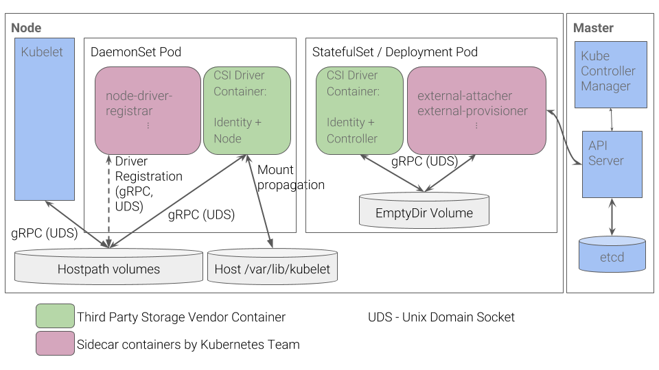

Kubernetes从1.9版本开始引入容器存储接口Container Storage Interface（CSI）机制，用于在Kubernetes和外部存储系统之间建立一套标准的存储管理接口，通过该接口为容器提供存储服务。CSI从Kubernetes 1.10版本升级为Beta版，到1.13版本升级为GA版。

### 设计背景

Kubernetes通过PV、PVC、Storageclass已经提供了一种强大的**基于插件**的存储管理机制，但是各种存储插件提供的存储服务都是基于一种被称为“in-tree”的凡是提供的，这要求存储插件的代码必须要被放进Kubernetes的主干代码库中才能被Kubernetes调用，属于紧耦合的开发模式。这种“in-tree”的方式带来一些问题：

- 存储插件的代码需要与Kubernetes的代码放在同一代码库中，并与Kubernetes的二进制文件共同发布；
- 存储插件的代码开发者必须遵循Kubernetes的代码开发规范；
- 存储插件的代码开发者必须遵循Kubernetes的发布流程，包括添加对Kubernetes存储系统的支持和错误修复；
- Kubernetes社区需要对存储插件的代码进行维护，包括审核、测试等工作；
- 存储插件代码中的问题可能影响Kubernetes组件的运行，并且很难排查问题；
- 存储插件代码与Kubernetes的核心组件（kubulet和kube-controller-manager）享有相同的系统特权权限，可能存在可靠性和安全性问题。

Kubernetes已有的**Flex Volume**插件机制试图通过为外部存储暴露一个基于可执行程序（exec）的API来解决这些问题。尽管它允许第三方存储插件提供商在Kubernetes核心代码之外开发存储驱动，但仍然有两个问题没有得到很好的解决：

- 部署第三方驱动的可执行文件仍然需要宿主机的root权限，存在安全隐患；
- 存储插件在执行mount、attach这些操作时，通常需要在宿主机上安装一些第三方工具包和依赖库，使得部署过程更加复杂，例如部署Ceph时需要安装rbd库，部署GlusterFS时需要安装mount.glusterfs库，等等。

基于以上这些问题和考虑，Kubernetes逐步推出与容器对接的存储接口标准，存储提供方只需要基于标准接口进行存储插件的实现，就能与Kubernetes的原生存储机制为容器提供存储服务。这套标准被称为CSI。在CSI成为Kubernetes的存储供应标准之后，存储提供方的代码就能与Kubernetes代码彻底解耦，部署也与Kubernetes核心组件分离，显然，存储插件的开发由提供方自行维护，就能为Kubernetes用户提供更多的存储功能，也更加安全可靠。基于CSI的存储插件机制也被称为“out-of-tree”的服务提供方式，是未来Kubernetes第三方存储插件的标准方案。

### CSI存储插件的关键组件

其中主要包括两种组件：CSI Controller和CSI Node。

1. CSI Controller

CSI Controller的主要功能是提供存储服务视角对存储资源和存储卷进行管理和操作。在Kubernetes中建议将其部署为单实例Pod，可以使用Statefulset或Deployment控制器进行部署，设置副本数量为1，保证为一种存储插件只运行一个控制器实例。

在这个Pod内部署两个容器，如下所述：

- [x] 与Master（kube-controller-manager）通信的辅助sidecar容器（以额外的容器来扩展或增强主容器，这个额外的容器就被称为sidecar容器）；

在sidecar容器内又可以包含external-attacher和external-provisioner两个容器，他们的功能分别如下：

- external-attacher：监控VolumeAttachment资源对象的变更，触发正对CSI端点的ControllerPublish和ControllerUnpublish操作；

- external-provisioner：监控PersistentVolumeClaim资源对象的变更，触发针对CSI端点的CreateVolume和DeleteVolume操作；

- [x] CSI Driver存储驱动容器，由第三方存储提供商提供，需要实现上述接口。

这两个容器通过本地Socket（Unix Domain Socket，UDS），并使用gRPC协议进行通信。sidecar容器通过Socket调用CSI Driver容器的CSI接口，CSI Driver容器负责具体的存储卷操作。

2. CSI Node

CSI Node的主要功能是对主机（Node）上的Volume进行管理和操作。在Kubernetes中建议将其部署为Daemonset，在每个Node上都运行一个Pod。

在这个Pod中部署以下两个容器：

- [x] 与kubelet通信的辅助sidecar容器node-driver-register，主要功能是将存储驱动注册到kubelet中；
- [x] CSI Driver存储驱动容器，由第三方提供商提供，主要功能是接收kubelet的调用，需要实现一系列与Node相关的CSI接口，例如NodePublishVolume接口（用于将Volume挂载到容器内的目标路径）、NodeUnpublishVolume接口（用于从容器中卸载Volume），等等。

node-driver-register容器与kubelet通过Node主机的一个hostpath目录下的Unix socket进行通信。CSI Driver容器与kubelet通过Node主机的另一个hostpath目录下的Unix socket进行通信，同时需要将kubelet的工作目录（默认为/var/lib/kubelet）挂载给CSI Driver容器，用于为Pod进行Volume的管理操作（包括mount、unmount等）。