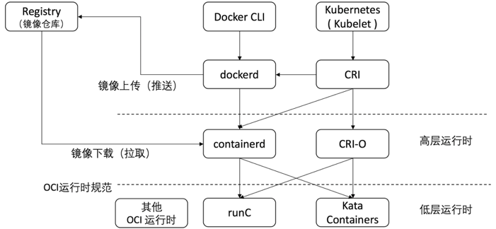
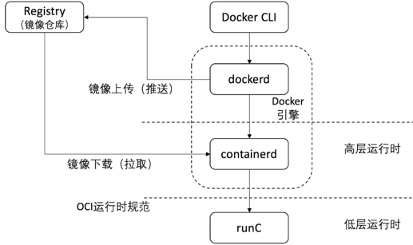
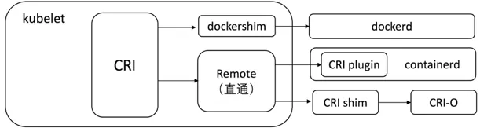

> 摘自公众号 分布式实验室

### 容器技术的发展背景

近些年来，容器技术迅速席卷全球，颠覆了应用的开发、交付和运行模式，在云计算、互联网等领域得到了广泛应用。其实，容器技术在约二十年前就出现了，但直到2013年Docker推出之后才遍地开花，其中有偶然因素，也有大环境造就的必然因素。这里回顾一下容器的产生的背景和发展过程。

在电子计算机刚出现时，由于硬件成本高昂，人们试图寻找能够多用户共享计算资源的方式，以提高资源利用率和降低成本。在20世纪60年代，基于硬件技术的主机虚拟化技术出现了。一台物理主机可以被划分为若干个小的机器，每个机器的硬件互不共享，并可以安装各自的操作系统来使用。20世纪90年代后期，X86架构的硬件虚拟化技术逐渐兴起，可在同一台物理机上隔离多个操作系统实例，带来了很多的优点，目前绝大多数的数据中心都采用了硬件虚拟化技术。

虽然硬件虚拟化提供了分隔资源的能力，但是采用虚拟机方式隔离应用程序时，效率往往较低，毕竟还要在每个虚拟机中安装或复制一个操作系统实例，然后把应用部署到其中。因此人们探索出一种更轻量的方案——操作系统虚拟化，使面向应用的管理更便捷。所谓操作系统虚拟化，就是由操作系统创建虚拟的系统环境，使应用感知不到其他应用的存在，仿佛在独自占有全部的系统资源，从而实现应用隔离的目的。在这种方式中不需要虚拟机，也能够实现应用彼此隔离，由于应用是共享同一个操作系统实例的，因此比虚拟机更节省资源，性能更好。操作系统虚拟化在不少系统里面也被称为容器（Container），下面也会以容器来指代操作系统虚拟化。

操作系统虚拟化最早出现在2000年，FreeBSD 4.0推出了Jail。Jail加强和改进了用于文件系统隔离的chroot环境。到了2004年，Sun公司发布了Solaris 10的Containers，包括Zones和Resource management两部分。Zones实现了命名空间隔离和安全访问控制，Resource management实现了资源分配控制。2007年，Control Groups（简称cgroups）进入Linux内核，可以限定和隔离一组进程所使用的资源（包括CPU、内存、I/O和网络等）。

2013年，Docker公司发布Docker开源项目，提供了一系列简便的工具链来使用容器。毫不夸张地说，Docker公司率先点燃了容器技术的火焰，拉开了云原生应用变革的帷幕，促进容器生态圈一日千里地发展。截至2020年，Docker Hub中的镜像累计下载了1300亿次，用户创建了约600万个容器镜像库。从这些数据可以看到，用户正在以惊人的速度从传统模式切换到基于容器的应用发布和运维模式。

2015年，OCI（Open Container Initiative）作为Linux基金会项目成立，旨在推动开源技术社区制定容器镜像和运行时规范，使不同厂家的容器解决方案具备互操作能力。同年还成立了CNCF，目的是促进容器技术在云原生领域的应用，降低用户开发云原生应用的门槛。创始会员包括谷歌、红帽、Docker、VMware等多家公司和组织。

CNCF成立之初只有一个开源项目，就是后来大名鼎鼎的Kubernetes。Kubernetes是一个容器应用的编排工具，最早由谷歌的团队研发，后来开源并捐赠给了CNCF成为种子项目。由于Kubernetes是厂家中立的开源项目，开源后得到了社区用户和开发者的广泛参与和支持。到了2018年，Kubernetes已成为容器编排领域事实上的标准，并成为首个CNCF的毕业（graduated）项目。2020年8月，CNCF旗下的开源项目增加到了63个，包括原创于中国的Harbor等项目。

从容器的发展历程可以看到，容器在出现的早期并没有得到人们的广泛关注，主要原因是当时开放的云计算环境还没出现或者未成为主流。2010年之后，随着IaaS、PaaS和SaaS等云平台逐渐成熟，用户对云端应用开发、部署和运维的效率不断重视，重新发掘了容器的价值，最终促成了容器技术的盛行。

### 容器的基本原理

本节以Linux容器为例，讲解容器的实现原理，主要包括命名空间（Namespace）和控制组（cgroups）。

**命名空间**

命名空间是Linux操作系统内核的一种资源隔离方式，使不同的进程具有不同的系统视图。系统视图就是进程能够感知到的系统环境，如主机名、文件系统、网络协议栈、其他用户和进程等。使用命名空间后，每个进程都具备独立的系统环境，进程间彼此感觉不到对方的存在，进程之间相互隔离。目前，Linux中的命名空间共有6种，可以嵌套使用。

- Mount：隔离了文件系统的挂载点（mount points），处于不同“mount”命名空间中的进程可以看到不同的文件系统。
- Network：隔离进程网络方面的系统资源，包括网络设备、IPv4和IPv6的协议栈、路由表、防火墙等。
- IPC：进程间相互通信的命名空间，不同命名空间中的进程不能通信。
- PID：进程号在不同的命名空间中是独立编号的，不同的命名空间中的进程可以有相同的编号。当然，这些进程在操作系统中的全局（命名空间外）编号是唯一的。
- UTS：系统标识符命名空间，在每个命名空间中都可以有不同的主机名和NIS域名。
- User：命名空间中的用户可以有不同于全局的用户ID和组ID，从而具有不同的特权。

命名空间实现了在同一操作系统中隔离进程的方法，几乎没有额外的系统开销，所以是非常轻量的隔离方式，进程启动和运行的过程在命名空间中和外面几乎没有差别。

**控制组**

命名空间实现了进程隔离功能，但由于各个命名空间中的进程仍然共享同样的系统资源，如CPU、磁盘I/O、内存等，所以如果某个进程长时间占用某些资源，其他命名空间里的进程就会受到影响，这就是“吵闹的邻居（noisy neighbors）”现象。因此，命名空间并没有完全达到进程隔离的目的。为此，Linux内核提供了控制组（Control Groups，cgroups）功能来处理这个问题。

Linux把进程分成控制组，给每组里的进程都设定资源使用规则和限制。在发生资源竞争时，系统会根据每个组的定义，按照比例在控制组之间分配资源。控制组可设定规则的资源包括CPU、内存、磁盘I/O和网络等。通过这种方式，就不会出现某些进程无限度抢占其他进程资源的情况。

Linux系统通过命名空间设置进程的可见且可用资源，通过控制组规定进程对资源的使用量，这样隔离进程的虚拟环境（即容器）就建立起来了。

### 容器运行时

Linux提供了命名空间和控制组两大系统功能，它们是容器的基础。但是，要把进程运行在容器中，还需要有便捷的SDK或命令来调用Linux的系统功能，从而创建出容器。容器的运行时（runtime）就是容器进程运行和管理的工具。

容器运行时分为低层运行时和高层运行时，功能各有侧重。低层运行时主要负责运行容器，可在给定的容器文件系统上运行容器的进程；高层运行时则主要为容器准备必要的运行环境，如容器镜像下载和解压并转化为容器所需的文件系统、创建容器的网络等，然后调用低层运行时启动容器。主要的容器运行时的关系如下图所示。



**OCI运行时规范**

成立于2015年的OCI是Linux基金会旗下的合作项目，以开放治理的方式制定操作系统虚拟化（特别是Linux容器）的开放工业标准，主要包括容器镜像格式和容器运行时（runtime）。初始成员包括Docker、亚马逊、CoreOS、谷歌、微软和VMware等公司。OCI成立之初，Docker公司为其捐赠了容器镜像格式和运行时的草案及相应的实现代码。原来属于Docker的libcontainer项目被捐赠给OCI，成为独立的容器运行时项目runC。

OCI运行时规范定义了容器配置、运行时和生命周期的标准，主流的容器运行时都遵循OCI运行时的规范，从而提高系统的可移植性和互操作性，用户可根据需要进行选择。

首先，容器启动前需要在文件系统中按一定格式存放所需的文件。OCI运行时规范定义了容器文件系统包（filesystem bundle）的标准，在OCI运行时的实现中通常由高层运行时下载OCI镜像，并将OCI镜像解压成OCI运行时文件系统包，然后OCI运行时读取配置信息和启动容器里的进程。OCI运行时文件系统包主要包括以下两部分。

- config.json：这是必需的配置文件，存放于文件系统包的根目录下。OCI运行时规范对Linux、Windows、Solaris和虚拟机4种平台的运行时做了相应的配置规范。
- 容器的根文件系统：容器启动后进程所使用的根文件系统，由 config.json 中的root.path属性确定该文件系统的路径，通常是“rootfs/”。

然后，在定义文件系统包的基础上，OCI运行时规范制定了运行时和生命周期管理规范。生命周期定义了容器从创建到删除的全过程，可用以下三条命令说明。

- “create”命令：在调用该命令时需要用到文件系统包的目录位置和容器的唯一标识。在创建运行环境时需要使用config.json里面的配置。在创建的过程中，用户可加入某些事件钩子（hook）来触发一些定制化处理，这些事件钩子包括prestart、createRuntime和createContainer。
- “start”命令：在调用该命令时需要运行容器的唯一标识。用户可在 config.json 的process 属性中指明运行程序的详细信息。“start”命令包括两个事件钩子：startContainer和poststart。
- “delete”命令：在调用该命令时需要运行容器的唯一标识。在用户的程序终止后（包括正常和异常退出），容器运行时执行“delete”命令以清除容器的运行环境。“delete”命令有一个事件钩子：poststop。

除了上述生命周期命令，OCI运行时还必须支持另外两条命令。

“state”命令：在调用该命令时需要运行容器的唯一标识。该命令查询某个容器的状态，必须包括的状态属性有ociVersion、id、status、pid和bundle，可选属性有annotation。不同的运行时实现可能会有一些差异。下面是一个容器状态的例子：

```json
{
        "ociVersion": "1.0.1",
        "id": "oci-container001",
        "status": "running",
        "pid": 8080,
        "bundle": "/containers/nginx",
        "annotations": {
            "key1": "value1"
        }
}
```

“kill”命令：在调用该命令时需要运行容器的唯一标识和信号（signal）编号。该命令给容器进程发送信号，如Linux操作系统的信号9表示立即终止进程。

**runC**

runC是OCI运行时规范的参考实现，也是最常用的容器运行时，被其他多个项目使用，如containerd和CRI-O等。runC也是低层容器运行时，开发人员可通过runC实现容器的生命周期管理，避免烦琐的操作系统调用。根据OCI运行时规范，runC不包括容器镜像的管理功能，它假定容器的文件包已经从镜像里解压出来并存放于文件系统中。runC创建的容器需要手动配置网络才能与其他容器或者网络节点连通，为此可在容器启动之前通过OCI定义的事件钩子来设置网络。

由于runC提供的功能比较单一，复杂的环境需要更高层的容器运行时来生成，所以runC常常成为其他高层容器运行时的底层实现基础。

**containerd**

在OCI成立时，Docker公司把其Docker项目拆分为runC的低层运行时及高层运行时功能。2017年，Docker公司把这部分高层容器运行时的功能集中到containerd项目里，捐赠给云原生计算基金会。

containerd 已经成为多个项目共同使用的高层容器运行时，提供了容器镜像的下载和解压等镜像管理功能，在运行容器时，containerd先把镜像解压成OCI的文件系统包，然后调用runC运行容器。containerd提供了API，其他应用程序可以通过API与containerd交互。“ctr”是containerd的命令行工具，和“docker”命令很相像。但作为容器运行时，containerd只注重在容器运行等方面，因而不包含开发者使用的镜像构建和镜像上传镜像仓库等功能。

**Docker**

Docker引擎是最早流行也是最广泛使用的容器运行时之一，是一个容器管理工具，架构如下图所示。Docker的客户端（命令行CLI工具）通过API调用容器引擎Docker Daemon（dockerd）的功能，完成各种容器管理任务。



Docker引擎在发布时是一个单体应用，所有功能都集中在一个可执行文件里，后来按功能分拆成runC和containerd两个不同层次的运行时，分别捐献给了OCI和CNCF。上面两节已经分别介绍了runC和containerd的主要特点，剩下的dockerd就是Docker公司维护的容器运行时。

dockerd同时提供了面向开发者和面向运维人员的功能。其中，面向开发者的命令主要提供镜像管理功能。容器镜像一般可由Dockerfile构建（build）而来。Dockerfile是一个文本文件，通过一组命令关键字定义了容器镜像所包含的基础镜像（base image）、所需的软件包及有关应用程序。在Dockerfile编写完成以后，就可以用“docker build”命令构建镜像了。下面是一个Dockerfile的简单例子：

```dockerfile
FROM ubuntu:18.04
EXPOSE 8080
CMD ["nginx", "-g", "daemon off;"]
```

容器的镜像在构建之后被存放在本地镜像库里，当需要与其他节点共享镜像时，可上传镜像到镜像仓库（Registry）以供其他节点下载。

Docker还提供了容器存储和网络映射到宿主机的功能，大部分由containerd实现。应用的数据可以被保存在容器的私有文件系统里面，这部分数据会随着容器一起被删除。对需要数据持久化的有状态应用来说，可用数据卷Volume的方式导入宿主机上的文件目录到容器中，对该目录的所有写操作都将被保存到宿主机的文件系统中。Docker可以把容器内的网络映射到宿主机的网络上，并且可以连接外部网络。

**CRI和CRI-O**

Kubernetes是当今主流的容器编排平台，为了适应不同场景的需求，Kubernetes需要有使用不同容器运行时的能力。为此，Kubernetes从1.5版本开始，在kubelet中增加了一个容器运行时接口CRI（Container Runtime Interface），需要接入Kubernetes的容器运行时必须实现CRI接口。由于kubelet的任务是管理本节点的工作负载，需要有镜像管理和运行容器的能力，因此只有高层容器运行时才适合接入CRI。CRI和容器运行时的关系如下图所示。



CRI和容器运行时之间需要有个接口层，通常称之为shim（垫片），用以匹配相应的容器运行时。CRI接口由shim实现，定义如下，分为RuntimeService和ImageServiceManager（代码参见GitHub上kubernetes/cri-api的项目文件“pkg/apis/services.go”）：

```go
// RuntimeService接口必须由容器运行时实现
// 以下方法必须是线程安全的
type RuntimeService interface {
RuntimeVersioner
ContainerManager
PodSandboxManager
ContainerStatsManager

// UpdateRuntimeConfig更新运行时配置
UpdateRuntimeConfig(runtimeConfig *runtimeapi.RuntimeConfig) error

// Status返回运行时的状态
Status() (*runtimeapi.RuntimeStatus, error)
}

// ImageManagerService接口必须由容器管理器实现
// 以下方法必须是线程安全的
type ImageManagerService interface {
// ListImages列出现有镜像
ListImages(filter *runtimeapi.ImageFilter) ([]*runtimeapi.Image, error)

// ImageStatus返回镜像状态
ImageStatus(image *runtimeapi.ImageSpec) (*runtimeapi.Image, error)

// PullImage用认证配置拉取镜像
PullImage(image *runtimeapi.ImageSpec, auth *runtimeapi.AuthConfig, podSandboxConfig *runtimeapi.PodSandboxConfig) (string, error)

// RemoveImage删除镜像
RemoveImage(image *runtimeapi.ImageSpec) error

// ImageFsInfo返回存储镜像的文件系统信息
ImageFsInfo() ([]*runtimeapi.FilesystemUsage, error)
}
```

Docker运行时被普遍使用，它的CRI shim被称为dockershim，内置在Kubernetes的kubelet中，由Kubernetes项目组开发和维护。其他运行时则需要提供外置的shim。containerd从1.1版本开始内置了CRI plugin，不再需要外置shim来转发请求，因此效率更高。在安装Docker的最新版本时，会自动安装containerd，所以在一些系统中，Docker和Kubernetes可以同时使用containerd来运行容器，但是二者的镜像用了命名空间隔离，彼此是独立的，即镜像不可以共用。因为Docker和containerd常常同时存在，因此在不需要使用Docker的系统中只安装containerd即可。

containerd最早是为Docker设计的代码，包含一些用户相关的功能。相比之下，CRI-O是替代Docker或者containerd的高效且轻量级的容器运行时方案，是CRI的一个实现，能够运行符合OCI规范的容器，所以被称为CRI-O。CRI-O是原生为生产系统运行容器设计的，有个简单的命令行工具供测试用，但并不能进行容器管理。CRI-O支持OCI的容器镜像格式，可以从容器镜像仓库中下载镜像。CRI-O支持runC和Kata Containers这两种低层容器运行时。