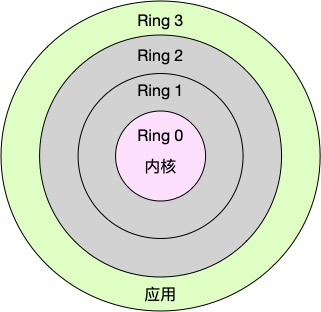

# [CPU 上下文切换详解](https://awen.me/post/50982.html)

# 问题

多个进程之间竞争 CPU 的时候并没有真正运行，为什么会导致负载升高？

原因就是 CPU 上下文切换

# 什么是 CPU 上下文切换

Linux 是一个多任务操作系统，它支持远大于CPU 数量的任务同时运行，但实际上这些任务并不是真正的在运行，而是因为系统在很短的时间内将CPU轮流分配给它们，造成同时运行的错觉。


而每个任务在运行之前， CPU 都需要知道任务从哪里加载，到哪里去，系统需要先设置好**CPU 寄存器和程序计数器**

CPU寄存器，是CPU内置的容量小、但速度极快的内存。而程序计数器，则是用来存储CPU正在执行的指令位置、或者即将执行的下一条指令位置。它们都是CPU在运行任何任务前，必须的依赖环境，因此也被叫做CPU上下文。


**上下文切换** 就是先把前一个任务的 CPU 上线保存起来，然后加载新任务的上下文到这些寄存器和程序计数器，最后再跳转到程序计数器所指定的新位置，运行任务。而这些保存起来的上下文，会存储在系统内核中，并在任务重新调度执行时再次加载。这样就能保证任务原来的状态不受影响，让任务看起来是连续的。

根据任务的不同，CPU的上下文切换就可以分为几个不同的场景，也就是`进程上下文切换`、`线程上下文切换`以及`中断上下文切换`。

## 进程上下文切换

Linux按照特权等级，把进程的运行空间分为内核空间和用户空间，分别对应着下图中，CPU特权等级的Ring 0和Ring 3。

- 内核空间(Ring 0)具有最高权限，可以直接访问所有资源;
- 用户空间(Ring 3)只能访问受限资源，不能直接访问内存等硬件设备，必须通过系统调用陷入到内核中，才能访问这些特权资源。



换个角度看，也就是说，进程既可以在用户空间运行，又可以在内核空间中运行。进程在用户空间运行时，被称为进程的用户态，而陷入内核空间的时候，被称为进程的内核态。

从用户态到内核态的转变，需要通过系统调用来完成。比如，当我们查看文件内容时，就需要多次系统调用来完成:首先调用open()打开文件，然后调用read()读取文件内容，并调用write()将内容写到标准输出，最后再调用close() 关闭文件。

**系统调用过程中也会发生上下文切换**

CPU寄存器里原来用户态的指令位置，需要先保存起来。接着，为了执行内核态代码，CPU寄存器需要更新为内核态指令的新位置。最后才是跳转到内核态运行内核任务。

而系统调用结束后，CPU寄存器需要恢复原来保存的用户态，然后再切换到用户空间，继续运行进程。所以，一次系统调用的过程，其实是发生了**两次CPU上下文切换**。

系统调用过程中，并不会涉及到虚拟内存等进程用户态的资源，也不会切换进程。

和**进程上下文切换**是不一样的:

- 进程上下文切换，是指从一个进程切换到另一个进程运行。
- 而系统调用过程中一直是同一个进程在运行。

> 系统调用过程通常称为特权模式切换，而不是上下文切换。但实际上，系统调用过程中，CPU的上下文切换还是无法避免的。

## 进程上下文切换跟系统调用又有什么区别呢?

进程是由内核来管理和调度的，进程的切换只能发生在内核态。

进程的上下文不仅包括了虚拟内存、栈、全局变量等用户空间的资源，还包括了内核堆栈、寄存器等内核空间的状态，。CPU 寄存器里原来用户态的指令位置，需要先保存起来。接着，为了执行内核态代码，CPU 寄存器需要更新为内核态指令的新位置。最后才是跳转到内核态运行内核任务。

进程的上下文切换就比系统调用时多了一步：在保存当前进程的内核状态和 CPU 寄存器之前，需要先把该进程的虚拟内存、栈等保存下来；而加载了下一进程的内核态后，还需要刷新进程的虚拟内存和用户栈。

如下图所示，保存上下文和恢复上下文的过程并不是“免费”的，需要内核在 CPU 上运行才能完成。


## 进程上下文切换的潜在性能问题

根据 Tsuna 的测试报告，每次上下文切换都需要几十纳秒到数微秒的 CPU 时间。这个时间还是相当可观的，特别是在进程上下文切换次数较多的情况下，很容易导致 CPU 将大量时间耗费在寄存器、内核栈以及虚拟内存等资源的保存和恢复上，进而大大缩短了真正运行进程的时间。这也正是导致平均负载升高的一个重要因素。

另外，我们知道， Linux 通过 TLB（Translation Lookaside Buffer）来管理虚拟内存到物理内存的映射关系。当虚拟内存更新后，TLB 也需要刷新，内存的访问也会随之变慢。特别是在多处理器系统上，缓存是被多个处理器共享的，刷新缓存不仅会影响当前处理器的进程，还会影响共享缓存的其他处理器的进程。

### 发生进程上下文切换的场景

1.为了保证所有进程可以得到公平调度，CPU 时间被划分为一段段的时间片，这些时间片再被轮流分配给各个进程。这样，当某个进程的时间片耗尽了，就会被系统挂起，切换到其它正在等待 CPU 的进程运行。

2.进程在系统资源不足（比如内存不足）时，要等到资源满足后才可以运行，这个时候进程也会被挂起，并由系统调度其他进程运行。

3.当进程通过睡眠函数 sleep 这样的方法将自己主动挂起时，自然也会重新调度。

4.当有优先级更高的进程运行时，为了保证高优先级进程的运行，当前进程会被挂起，由高优先级进程来运行

5.发生硬件中断时，CPU 上的进程会被中断挂起，转而执行内核中的中断服务程序。

## 线程上下文切换

线程与进程最大的区别在于：**线程是调度的基本单位，而进程则是资源拥有的基本单位**。说白了，所谓内核中的任务调度，实际上的调度对象是线程；而进程只是给线程提供了虚拟内存、全局变量等资源。

所以，对于线程和进程，我们可以这么理解：

- 当进程只有一个线程时，可以认为进程就等于线程。
- 当进程拥有多个线程时，这些线程会共享相同的虚拟内存和全局变量等资源。这些资源在上下文切换时是不需要修改的。
- 另外，线程也有自己的私有数据，比如栈和寄存器等，这些在上下文切换时也是需要保存的。

### 发生线程上下文切换的场景

1. 前后两个线程属于不同进程。此时，因为资源不共享，所以切换过程就跟进程上下文切换是一样。
2. 前后两个线程属于同一个进程。此时，因为虚拟内存是共享的，所以在切换时，虚拟内存这些资源就保持不动，只需要切换线程的私有数据、寄存器等不共享的数据

## 中断上下文切换

为了快速响应硬件的事件，**中断处理会打断进程的正常调度和执行，转而调用中断处理程序，响应设备事件**。而在打断其他进程时，就需要将进程当前的状态保存下来，这样在中断结束后，进程仍然可以从原来的状态恢复运行。

**跟进程上下文不同，中断上下文切换并不涉及到进程的用户态**。所以，即便中断过程打断了一个正处在用户态的进程，也不需要保存和恢复这个进程的虚拟内存、全局变量等用户态资源。中断上下文，其实只包括内核态中断服务程序执行所必需的状态，包括 CPU 寄存器、内核堆栈、硬件中断参数等。

**对同一个 CPU 来说，中断处理比进程拥有更高的优先级**，所以中断上下文切换并不会与进程上下文切换同时发生。同样道理，由于中断会打断正常进程的调度和执行，所以大部分中断处理程序都短小精悍，以便尽可能快的执行结束。

另外，跟进程上下文切换一样，中断上下文切换也需要消耗 CPU，切换次数过多也会耗费大量的 CPU，甚至严重降低系统的整体性能。所以，当你发现中断次数过多时，就需要注意去排查它是否会给你的系统带来严重的性能问题。

# 如何查看系统上下文切换情况

vmstat 是一个常用的系统性能分析工具，主要用来分析系统的内存使用情况，也常用来分析 CPU 上下文切换和中断的次数。

```shell
root@linux:~# vmstat 5  #表示每5秒输出一组数据
procs -----------memory---------- ---swap-- -----io---- -system-- ------cpu-----
 r  b   swpd   free   buff  cache   si   so    bi    bo   in   cs us sy id wa st
 0  0      0 5908100  98072 2064032    0    0     4   267  101  190  7  1 91  1  0
```

我们一起来看这个结果，你可以先试着自己解读每列的含义。在这里，我重点强调下，需要特别关注的四列内容:

- cs (context switch) 是每秒.上下文切换的次数。
- in (interrupt) 则是每秒中断的次数。
- r(Running or Runnable) 是就绪队列的长度，也就是正在运行和等待CPU的进程数。
- b (Blocked) 则是处于不可中断睡眠状态的进程数。

可以看到，这个例子中的上下文切换次数cs是190次，而系统中断次数in则是101次，而就绪队列长度r和不可中断状态进程数b都是0。

vmstat只给出了系统总体的.上下文切换情况，要想查看每个进程的详细情况，就需要使用我们前面提到过的pidstat了。给它加上-w选项，你就可以查看每个进程上下文切换的情况了。

```shell
root@linux:~/sysstat/sysstat# ./pidstat -w 5 # 5秒输出一组数据
Linux 4.4.0-21-generic (linux) 	03/26/19 	_x86_64_	(4 CPU)

17:21:19      UID       PID   cswch/s nvcswch/s  Command
17:21:24        0         7      2.00      0.00  rcu_sched
17:21:24        0        10      0.20      0.00  watchdog/0
17:21:24        0        11      0.20      0.00  watchdog/1
17:21:24        0        16      0.20      0.00  watchdog/2
17:21:24        0        21      0.20      0.00  watchdog/3
17:21:24        0        32      0.20      0.00  khugepaged
17:21:24        0       613      0.20      0.00  irqbalance
17:21:24        0      6552      1.00      0.00  kworker/2:1
17:21:24        0      6681      0.20      0.00  pidstat
17:21:24        0      6824      0.20      0.00  kworker/u128:0
17:21:24        0     17308     20.00      0.00  apt
17:21:24        0     39806      0.60      0.00  kworker/3:1
```

这个结果中有两列内容是我们的重点关注对象。一个是 cswch ，表示每秒自愿上下文切换（voluntary context switches）的次数，另一个则是 nvcswch ，表示每秒非自愿上下文切换（non voluntary context switches）的次数。

所谓`自愿上下文切换`，是指进程无法获取所需资源，导致的上下文切换。比如说， I/O、内存等系统资源不足时，就会发生自愿上下文切换。 而`非自愿上下文切换`，则是指进程由于时间片已到等原因，被系统强制调度，进而发生的上下文切换。比如说，大量进程都在争抢 CPU 时，就容易发生非自愿上下文切换。

## 实战

使用 sysbench 以10个线程运行 5分钟的基准测试，模拟多线程切换

```shell
[root@linux ~]#  sysbench --threads=10 --max-time=300 threads run
WARNING: --max-time is deprecated, use --time instead
sysbench 1.0.9 (using system LuaJIT 2.0.4)

Running the test with following options:
Number of threads: 10
Initializing random number generator from current time


Initializing worker threads...

Threads started!
```

观察上下文切换

```shell
[root@linux ~]# vmstat 1
procs -----------memory---------- ---swap-- -----io---- -system-- ------cpu-----
 r  b   swpd   free   buff  cache   si   so    bi    bo   in   cs us sy id wa st
 1  0      0 6500396  51892 1334564    0    0    47   391 2594 7463  4  5 90  1  0
 0  0      0 6500396  51900 1334560    0    0     0    24   38   37  0  0 100  1  0
 0  0      0 6500396  51900 1334564    0    0     0     0   15   15  0  0 100  0  0
 0  0      0 6500396  51900 1334564    0    0     0     0   13   11  0  0 100  0  0
 0  0      0 6500396  51900 1334564    0    0     0     0   19   19  0  0 100  0  0
 7  0      0 6499864  51900 1334564    0    0     0     0 7171 159273  3 10 88  0  0
 6  0      0 6499344  51900 1334564    0    0     0    12 108087 1908954 18 79  3  0  0
 7  0      0 6499344  51900 1334564    0    0     0     0 110938 1913795 19 78  3  0  0
 8  0      0 6499344  51900 1334564    0    0     0     0 96891 1926280 19 78  3  0  1
```

可以看到 cs 从19 直接飙升到 1926280，

r列 就绪列队已经到了8，远超过系统的CPU 个数2，所以肯定有大量的CPU 竞争。

us(user)和sy(system)列 这两列的 CPU 使用率加起来已经快100%了，其中 cpu 使用率，也就是sy 高达78%，说明 CPU 主要是被内核占用了。

in列 ：中断次数也上升到了 96891 左右，说明中断处理也是个潜在问题。

综合这几个指标，我们可以知道，系统的就绪队列过长，也就是正在运行和等待 CPU 的进程数过多，导致了大量的上下文切换，而上下文切换又导致了系统 CPU 的占用率升高。

那如何查看是什么进程导致的问题呢，可以使用pidstat 查看，可以看到是sysbench 占用 CPU 100%

```shell
[root@linux ~]# pidstat -w -u 1 # -w 表示参数输出进程切换指标，-u 表示输出 CPU 指标
平均时间:   UID       PID    %usr %system  %guest    %CPU   CPU  Command
平均时间:     0     50913    0.08    0.38    0.00    0.46     -  pidstat
平均时间:     0     50914   36.04  100.00    0.00  100.00     -  sysbench

18时17分42秒   UID       PID   cswch/s nvcswch/s  Command
18时17分43秒     0         9      4.00      0.00  rcu_sched
18时17分43秒     0        95      2.00      0.00  kworker/0:2
18时17分43秒     0       401      2.00      0.00  kworker/1:2
18时17分43秒     0     43323      1.00      0.00  sshd
18时17分43秒     0     50913      1.00      0.00  pidstat
```

通过pidstat -t 参数可以输出线程指标

```shell
[root@linux ~]# pidstat -wt 1
Linux 3.10.0-862.el7.x86_64 (linux) 	2019年03月26日 	_x86_64_	(2 CPU)

18时23分31秒   UID      TGID       TID   cswch/s nvcswch/s  Command
18时23分32秒     0         3         -      1.96      0.00  ksoftirqd/0
18时23分32秒     0         -         3      1.96      0.00  |__ksoftirqd/0
18时23分32秒     0         9         -      7.84      0.00  rcu_sched
18时23分32秒     0         -         9      7.84      0.00  |__rcu_sched
18时23分32秒     0        14         -      0.98      0.00  ksoftirqd/1
18时23分32秒     0         -        14      0.98      0.00  |__ksoftirqd/1
18时23分32秒     0        95         -      2.94      0.00  kworker/0:2
18时23分32秒     0         -        95      2.94      0.00  |__kworker/0:2
18时23分32秒     0       401         -      1.96      0.00  kworker/1:2
18时23分32秒     0         -       401      1.96      0.00  |__kworker/1:2
18时23分32秒     0         -     22095      0.98      0.00  |__in:imjournal
18时23分32秒     0         -     22418      0.98      0.00  |__tuned
18时23分32秒     0     50930         -      0.98      0.00  sshd
18时23分32秒     0         -     50930      0.98      0.00  |__sshd
18时23分32秒     0     50946         -      0.98      0.00  vmstat
18时23分32秒     0         -     50946      0.98      0.00  |__vmstat
18时23分32秒     0         -     50949  26451.96 130818.63  |__sysbench
18时23分32秒     0         -     50950  27600.98 133845.10  |__sysbench
18时23分32秒     0         -     50951  23982.35 126614.71  |__sysbench
18时23分32秒     0         -     50952  33937.25 134397.06  |__sysbench
18时23分32秒     0         -     50953  30947.06 145492.16  |__sysbench
18时23分32秒     0         -     50954  23159.80 150108.82  |__sysbench
18时23分32秒     0         -     50955  28414.71 145317.65  |__sysbench
18时23分32秒     0         -     50956  23020.59 161437.25  |__sysbench
18时23分32秒     0         -     50957  28937.25 139644.12  |__sysbench
18时23分32秒     0         -     50958  27500.98 152278.43  |__sysbench
18时23分32秒     0     50982         -      0.98      0.00  pidstat
18时23分32秒     0         -     50982      0.98      0.00  |__pidstat
```

观察 /proc/interrupt 文件内容，查看变化

```
# -d 参数表示高亮显示变化的区域$ watch -d cat /proc/interrupts
```


观察一段时间，你可以发现，变化速度最快的是**重调度中断（RES）**，这个中断类型表示，唤醒空闲状态的 CPU 来调度新的任务运行。这是多处理器系统（SMP）中，调度器用来分散任务到不同 CPU 的机制，通常也被称为**处理器间中断**（Inter-Processor Interrupts，IPI）。

所以，这里的中断升高还是因为过多任务的调度问题，跟前面上下文切换次数的分析结果是一致的。

## 上下文切换多少合适

这个数值其实取决于系统本身的 CPU 性能。如果系统的上下文切换次数比较稳定，那么从数百到一万以内，都应该算是正常的。但当上下文切换次数超过一万次，或者切换次数出现数量级的增长时，就很可能已经出现了性能问题。 这时，你还需要根据上下文切换的类型，再做具体分析。

比方说：

- 自愿上下文切换变多了，说明进程都在等待资源，有可能发生了 I/O 等其他问题；
- 非自愿上下文切换变多了，说明进程都在被强制调度，也就是都在争抢 CPU，说明 CPU 的确成了瓶颈；
- 中断次数变多了，说明 CPU 被中断处理程序占用，还需要通过查看 /proc/interrupts 文件来分析具体的中断类型。