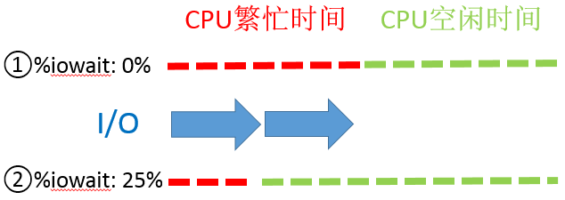
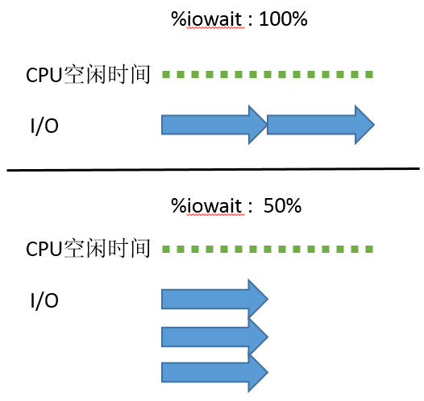

# [理解 %IOWAIT (%WIO)](http://linuxperf.com/?p=33)

%iowait 是 “sar -u” 等工具检查CPU使用率时显示的一个指标，在Linux上显示为 %iowait，在有的Unix版本上显示为 %wio，含义都是一样的。这个指标常常被误读，很多人把它当作I/O问题的征兆，我自己每隔一段时间就会遇到对 %iowait 紧张兮兮的客户，不得不费尽唇舌反复解释。事实上这个指标所含的信息量非常少，不能单独用来判断系统有没有I/O问题。在此我们详细探讨一下它真正的含义，先从man page上的解释开始：

```shell
09:35:06 AM     CPU     %user     %nice   %system   %iowait    %steal     %idle
09:35:07 AM     all      0.00      0.00      0.00      0.00      0.00    100.00
09:35:08 AM     all      0.51      0.00      2.53     13.13      0.00     83.84
09:35:09 AM     all      1.54      0.00      7.69     39.49      0.00     51.28
09:35:10 AM     all      2.04      0.00      9.18     39.80      0.00     48.98
09:35:11 AM     all      1.02      0.00      7.65     40.31      0.00     51.02
```

 Linux:
%iowait
Percentage of time that the CPU or CPUs were idle during
which the system had an outstanding disk I/O request.

HP-UX:
%wio
idle with some process waiting for I/O (only block I/O, raw
I/O, or VM pageins/swapins indicated).

Linux和HP-UX的man page分别从两个角度描述了这个指标：Linux着眼于I/O，强调的是仍有未完成的I/O请求；而HP-UX着眼于进程，强调的是仍有进程在等待I/O。二者所说的是同一件事的两个方面，合在一起就完整了，就是：至少有一个I/O请求尚未完成，有进程因为等待它而休眠。

**我们不妨采纳Linux的措辞，%iowait 表示在一个采样周期内有百分之几的时间属于以下情况：CPU空闲、并且有仍未完成的I/O请求。**

对 %iowait 常见的误解有两个：一是误以为 %iowait 表示CPU不能工作的时间，二是误以为 %iowait 表示I/O有瓶颈。

第一种误解太低级了，%iowait 的首要条件就是CPU空闲，既然空闲当然就可以接受运行任务，只是因为没有可运行的进程，CPU才进入空闲状态的。那为什么没有可运行的进程呢？因为进程都处于休眠状态、在等待某个特定事件：比如等待定时器、或者来自网络的数据、或者键盘输入、或者等待I/O操作完成，等等。

第二种误解更常见，为什么人们会认为 %iowait 偏高是有I/O瓶颈的迹象呢？他们的理由是：”%iowait  的第一个条件是CPU空闲，意即所有的进程都在休眠，第二个条件是仍有未完成的I/O请求，意味着进程休眠的原因是等待I/O，而 %iowait 升高则表明因等待I/O而休眠的进程数量更多了、或者进程因等待I/O而休眠的时间更长了。“ 听上去似乎很有道理，但是不对：

首先 %iowait 升高并不能证明等待I/O的进程数量增多了，也不能证明等待I/O的总时间增加了。为什么呢？看看下面两张图就明白了。

第一张图演示的是，在I/O完全一样的情况下，CPU忙闲状态的变化就能够影响 %iowait 的大小。下图我们看到，在CPU繁忙期间发生的I/O，无论有多少，%iowait 的值都是不受影响的（因为 %iowait 的第一个前提条件就是CPU必须空闲）；当CPU繁忙程度下降时，有一部分I/O落入了CPU空闲的时间段内，这就导致了 %iowait 升高。可见，I/O并没有变化，%iowait 却升高了，原因仅仅是CPU的空闲时间增加了。请记住，系统中有成百上千的进程数，任何一个进程都可以引起CPU和I/O的变化，因为 %iowait、%idle、%user、%system 等这些指标都是全局性的，并不是特指某个进程。


再往下看第二张图，它描述了另一种情形：假设CPU的繁忙状况保持不变的条件下，即使 %iowait 升高也不能说明I/O负载加重了。
如果2个I/O请求依次提交、使得整个时段内始终有I/O在进行，那么 %iowait 是100%；
如果3个I/O请求同时提交，因为系统有能力同时处理多个I/O，所以3个并发的I/O从开始到结束的时间与一个I/O一样，%iowait 的结果只有50%。
2个I/O使 %iowait 达到了100%，3个I/O的 %iowait 却只有50%，显然 %iowait 的高低与I/O的多少没有必然关系，而是与I/O的并发度相关。所以，仅凭 %iowait 的上升不能得出*I/O负载增加* 的结论。



 

这就是为什么说 %iowait 所含的信息量非常少的原因，它是一个非常模糊的指标，如果看到 %iowait 升高，还需检查I/O量有没有明显增加，avserv/avwait/avque等指标有没有明显增大，应用有没有感觉变慢，如果都没有，就没什么好担心的。