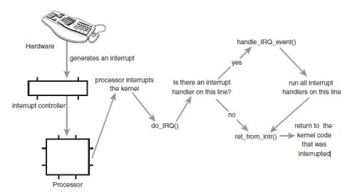

### 概述

从本质上来讲，中断是一种电信号，当设备有某种事件发生时，它就会产生中断，通过总线把电信号发送给中断控制器。

如果中断的线是激活的，中断控制器就把电信号发送给处理器的某个特定引脚。处理器于是立即停止自己正在做的事，

跳到中断处理程序的入口点，进行中断处理。

### 硬中断

由与系统相连的外设(比如网卡、硬盘)自动产生的。主要是用来通知操作系统系统外设状态的变化。比如当网卡收到数据包的时候，就会发出一个中断。我们通常所说的中断指的是硬中断(hardirq)。

硬中断是由硬件产生的，比如，像磁盘，网卡，键盘，时钟等。每个设备或设备集都有它自己的IRQ（中断请求）。基于IRQ，CPU可以将相应的请求分发到对应的硬件驱动上（注：硬件驱动通常是内核中的一个子程序，而不是一个独立的进程）。

处理中断的驱动是需要运行在CPU上的，因此，当中断产生的时候，CPU会中断当前正在运行的任务，来处理中断。在有多核心的系统上，一个中断通常只能中断一颗CPU（也有一种特殊的情况，就是在大型主机上是有硬件通道的，它可以在没有主CPU的支持下，可以同时处理多个中断。）。

硬中断可以直接中断CPU。它会引起内核中相关的代码被触发。对于那些需要花费一些时间去处理的进程，中断代码本身也可以被其他的硬中断中断。

对于时钟中断，内核调度代码会将当前正在运行的进程挂起，从而让其他的进程来运行。它的存在是为了让调度代码（或称为调度器）可以调度多任务。

### 软中断

为了满足实时系统的要求，中断处理应该是越快越好。linux为了实现这个特点，当中断发生的时候，硬中断处理那些短时间就可以完成的工作，而将那些处理事件比较长的工作，放到中断之后来完成，也就是软中断(softirq)来完成。

软中断的处理非常像硬中断。然而，它们仅仅是由当前正在运行的进程所产生的。

通常，软中断是一些对I/O的请求。这些请求会调用内核中可以调度I/O发生的程序。对于某些设备，I/O请求需要被立即处理，而磁盘I/O请求通常可以排队并且可以稍后处理。根据I/O模型的不同，进程或许会被挂起直到I/O完成，此时内核调度器就会选择另一个进程去运行。I/O可以在进程之间产生并且调度过程通常和磁盘I/O的方式是相同。

软中断仅与内核相联系。而内核主要负责对需要运行的任何其他的进程进行调度。一些内核允许设备驱动的一些部分存在于用户空间，并且当需要的时候内核也会调度这个进程去运行。

软中断并不会直接中断CPU。也只有当前正在运行的代码（或进程）才会产生软中断。这种中断是一种需要内核为正在运行的进程去做一些事情（通常为I/O）的请求。有一个特殊的软中断是Yield调用，它的作用是请求内核调度器去查看是否有一些其他的进程可以运行。

### 中断嵌套

Linux下硬中断是可以嵌套的，但是没有优先级的概念，也就是说任何一个新的中断都可以打断正在执行的中断，但同种中断除外。软中断不能嵌套，但相同类型的软中断可以在不同CPU上并行执行。

### 软中断指令

int是软中断指令。

中断向量表是中断号和中断处理函数地址的对应表。

int n - 触发软中断n。相应的中断处理函数的地址为：中断向量表地址 + 4 * n。

### 硬中断和软中断的区别

软中断是执行中断指令产生的，而硬中断是由外设引发的。

硬中断的中断号是由中断控制器提供的，软中断的中断号由指令直接指出，无需使用中断控制器。

硬中断是可屏蔽的，软中断不可屏蔽。

硬中断处理程序要确保它能快速地完成任务，这样程序执行时才不会等待较长时间，称为上半部。

软中断处理硬中断未完成的工作，是一种推后执行的机制，属于下半部。

### 开关

(1) 硬中断的开关

简单禁止和激活当前处理器上的本地中断：

local_irq_disable();

local_irq_enable();

保存本地中断系统状态下的禁止和激活：

unsigned long flags;

local_irq_save(flags);

local_irq_restore(flags);

(2) 软中断的开关

禁止下半部，如softirq、tasklet和workqueue等：

local_bh_disable();

local_bh_enable();

需要注意的是，禁止下半部时仍然可以被硬中断抢占。

(3) 判断中断状态

\#define in_interrupt() (irq_count()) // 是否处于中断状态(硬中断或软中断)

\#define in_irq() (hardirq_count()) // 是否处于硬中断

\#define in_softirq() (softirq_count()) // 是否处于软中断