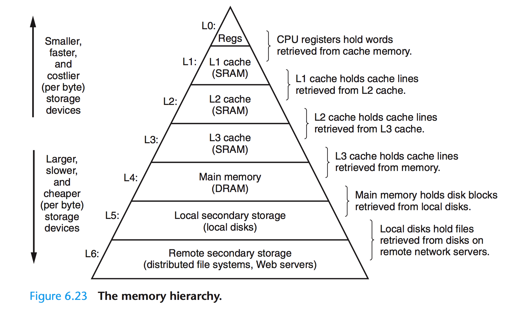
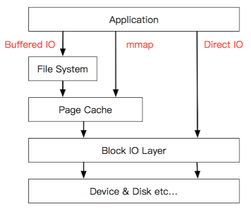

# [聊聊 Linux IO](http://www.0xffffff.org/2017/05/01/41-linux-io/)

### 写在前面

在开始正式的讨论前，我先抛出几个问题：

- 谈到磁盘时，常说的HDD磁盘和SSD磁盘最大的区别是什么？这些差异会影响我们的系统设计吗？
- 单线程写文件有点慢，那多开几个线程一起写是不是可以加速呢？
- `write(2)`函数成功返回了，数据就已经成功写入磁盘了吗？此时设备断电会有影响吗？会丢失数据吗？

- `write(2)`调用是原子的吗？多线程写文件是否要对文件加锁？有没有例外，比如`O_APPEND`方式？
- 坊间传闻，`mmap(2)`的方式读文件比传统的方式要快，因为少一次拷贝。真是这样吗？为什么少一次拷贝？

如果你觉得这些问题都很简单，都能很明确的回答上来。那么很遗憾这篇文章不是为你准备的，你可以关掉网页去做其他更有意义的事情了。如果你觉得无法明确的回答这些问题，那么就耐心地读完这篇文章，相信不会浪费你的时间。受限于个人时间和文章篇幅，部分议题如果我不能给出更好的解释或者已有专业和严谨的资料，就只会给出相关的参考文献的链接，请读者自行参阅。

言归正传，我们的讨论从存储器的层次结构开始。




受限于存储介质的存取速率和成本，现代计算机的存储结构呈现为金字塔型[1]。越往塔顶，存取效率越高、但成本也越高，所以容量也就越小。得益于程序访问的局部性原理[2]，这种节省成本的做法也能取得不俗的运行效率。从存储器的层次结构以及计算机对数据的处理方式来看，上层一般作为下层的Cache层来使用（广义上的Cache）。比如寄存器缓存CPU Cache的数据，CPU Cache L1~L3层视具体实现彼此缓存或直接缓存内存的数据，而内存往往缓存来自本地磁盘的数据。

本文主要讨论磁盘IO操作，故只聚焦于Local Disk的访问特性和其与DRAM之间的数据交互。

### 无处不在的缓存


如图，当程序调用各类文件操作函数后，用户数据（User Data）到达磁盘（Disk）的流程如图所示[3]。图中描述了Linux下文件操作函数的层级关系和内存缓存层的存在位置。中间的黑色实线是用户态和内核态的分界线。

从上往下分析这张图，首先是C语言`stdio`库定义的相关文件操作函数，这些都是用户态实现的跨平台封装函数。`stdio`中实现的文件操作函数有自己的`stdio buffer`，这是在用户态实现的缓存。此处使用缓存的原因很简单——系统调用总是昂贵的。如果用户代码以较小的size不断的读或写文件的话，`stdio`库将多次的读或者写操作通过buffer进行聚合是可以提高程序运行效率的。`stdio`库同时也支持`fflush(3)`函数来主动的刷新buffer，主动的调用底层的系统调用立即更新buffer里的数据。特别地，`setbuf(3)`函数可以对`stdio`库的用户态buffer进行设置，甚至取消buffer的使用。

系统调用的`read(2)/write(2)`和真实的磁盘读写之间也存在一层buffer，这里用术语`Kernel buffer cache`来指代这一层缓存。在Linux下，文件的缓存习惯性的称之为`Page Cache`，而更低一级的设备的缓存称之为`Buffer Cache`. 这两个概念很容易混淆，这里简单的介绍下概念上的区别：`Page Cache`用于缓存文件的内容，和文件系统比较相关。文件的内容需要映射到实际的物理磁盘，这种映射关系由文件系统来完成；`Buffer Cache`用于缓存存储设备块（比如磁盘扇区）的数据，而不关心是否有文件系统的存在（文件系统的元数据缓存在`Buffer Cache`中）。

综上，既然讨论Linux下的IO操作，自然是跳过`stdio`库的用户态这一堆东西，直接讨论系统调用层面的概念了。对`stdio`库的IO层有兴趣的同学可以自行去了解。从上文的描述中也介绍了文件的内核级缓存是保存在文件系统的`Page Cache`中的。所以后面的讨论基本上是讨论IO相关的系统调用和文件系统`Page Cache`的一些机制。

### Linux内核中的IO栈

这一小节来看Linux内核的IO栈的结构。先上一张全貌图[4]：

由图可见，从系统调用的接口再往下，Linux下的IO栈致大致有三个层次：

1. 文件系统层，以 `write(2)` 为例，内核拷贝了`write(2)`参数指定的用户态数据到文件系统Cache中，并适时向下层同步
2. 块层，管理块设备的IO队列，对IO请求进行合并、排序（还记得操作系统课程学习过的IO调度算法吗？）
3. 设备层，通过DMA与内存直接交互，完成数据和具体设备之间的交互

结合这个图，想想Linux系统编程里用到的`Buffered IO`、`mmap(2)`、`Direct IO`，这些机制怎么和Linux IO栈联系起来呢？上面的图有点复杂，我画一幅简图，把这些机制所在的位置添加进去：



这下一目了然了吧？传统的`Buffered IO`使用`read(2)`读取文件的过程什么样的？假设要去读一个冷文件（Cache中不存在），`open(2)`打开文件内核后建立了一系列的数据结构，接下来调用`read(2)`，到达文件系统这一层，发现`Page Cache`中不存在该位置的磁盘映射，然后创建相应的`Page Cache`并和相关的扇区关联。然后请求继续到达块设备层，在IO队列里排队，接受一系列的调度后到达设备驱动层，此时一般使用DMA方式读取相应的磁盘扇区到Cache中，然后`read(2)`拷贝数据到用户提供的用户态buffer中去（`read(2)`的参数指出的）。

整个过程有几次拷贝？从磁盘到`Page Cache`算第一次的话，从`Page Cache`到用户态buffer就是第二次了。而`mmap(2)`做了什么？`mmap(2)`直接把`Page Cache`映射到了用户态的地址空间里了，所以`mmap(2)`的方式读文件是没有第二次拷贝过程的。那`Direct IO`做了什么？这个机制更狠，直接让用户态和块IO层对接，直接放弃`Page Cache`，从磁盘直接和用户态拷贝数据。好处是什么？写操作直接映射进程的buffer到磁盘扇区，以DMA的方式传输数据，减少了原本需要到`Page Cache`层的一次拷贝，提升了写的效率。对于读而言，第一次肯定也是快于传统的方式的，但是之后的读就不如传统方式了（当然也可以在用户态自己做Cache，有些商用数据库就是这么做的）。

除了传统的`Buffered IO`可以比较自由的用偏移+长度的方式读写文件之外，`mmap(2)`和`Direct IO`均有数据按页对齐的要求，`Direct IO`还限制读写必须是底层存储设备块大小的整数倍（甚至Linux 2.4还要求是文件系统逻辑块的整数倍）。所以接口越来越底层，换来表面上的效率提升的背后，需要在应用程序这一层做更多的事情。所以想用好这些高级特性，除了深刻理解其背后的机制之外，也要在系统设计上下一番功夫。

### Page Cache 的同步

广义上Cache的同步方式有两种，即`Write Through（写穿）`和`Write back（写回）`. 从名字上就能看出这两种方式都是从写操作的不同处理方式引出的概念（纯读的话就不存在Cache一致性了，不是么）。对应到Linux的`Page Cache`上所谓`Write Through`就是指`write(2)`操作将数据拷贝到`Page Cache`后立即和下层进行同步的写操作，完成下层的更新后才返回。而`Write back`正好相反，指的是写完`Page Cache`就可以返回了。`Page Cache`到下层的更新操作是异步进行的。

Linux下`Buffered IO`默认使用的是`Write back`机制，即文件操作的写只写到`Page Cache`就返回，之后`Page Cache`到磁盘的更新操作是异步进行的。`Page Cache`中被修改的内存页称之为脏页（Dirty Page），脏页在特定的时候被一个叫做`pdflush(Page Dirty Flush)`的内核线程写入磁盘，写入的时机和条件如下：

- 当空闲内存低于一个特定的阈值时，内核必须将脏页写回磁盘，以便释放内存。
- 当脏页在内存中驻留时间超过一个特定的阈值时，内核必须将超时的脏页写回磁盘。
- 用户进程调用`sync(2)`、`fsync(2)`、`fdatasync(2)`系统调用时，内核会执行相应的写回操作。

刷新策略由以下几个参数决定（数值单位均为1/100秒）：

```
# flush每隔5秒执行一次root@082caa3dfb1d / $ sysctl vm.dirty_writeback_centisecsvm.dirty_writeback_centisecs = 500# 内存中驻留30秒以上的脏数据将由flush在下一次执行时写入磁盘root@082caa3dfb1d / $ sysctl vm.dirty_expire_centisecsvm.dirty_expire_centisecs = 3000# 若脏页占总物理内存10％以上，则触发flush把脏数据写回磁盘root@082caa3dfb1d / $ sysctl vm.dirty_background_ratiovm.dirty_background_ratio = 10
```

默认是写回方式，如果想指定某个文件是写穿方式呢？即写操作的可靠性压倒效率的时候，能否做到呢？当然能，除了之前提到的`fsync(2)`之类的系统调用外，在`open(2)`打开文件时，传入`O_SYNC`这个flag即可实现。这里给篇参考文章[5]，不再赘述（更好的选择是去读TLPI相关章节）。

文件读写遭遇断电时，数据还安全吗？相信你有自己的答案了。使用`O_SYNC`或者`fsync(2)`刷新文件就能保证安全吗？现代磁盘一般都内置了缓存，代码层面上也只能讲数据刷新到磁盘的缓存了。当数据已经进入到磁盘的高速缓存时断电了会怎么样？这个恐怕不能一概而论了。不过可以使用`hdparm -W0`命令关掉这个缓存，相应的，磁盘性能必然会降低。

### 文件操作与锁

当多个进程/线程对同一个文件发生写操作的时候会发生什么？如果写的是文件的同一个位置呢？这个问题讨论起来有点复杂了。首先`write(2)`调用不是原子操作，不要被TLPI的中文版5.2章节的第一句话误导了（英文版也是有歧义的，作者在[这里](http://www.man7.org/tlpi/errata/index.html)给出了勘误信息）。当多个`write(2)`操作对一个文件的同一部分发起写操作的时候，情况实际上和多个线程访问共享的变量没有什么区别。按照不同的逻辑执行流，会有很多种可能的结果。也许大多数情况下符合预期，但是本质上这样的代码是不可靠的。

特别的，文件操作中有两个操作是内核保证原子的。分别是`open(2)`调用的`O_CREAT`和`O_APPEND`这两个flag属性。前者是文件不存在就创建，后者是每次写文件时把文件游标移动到文件最后追加写（NFS等文件系统不保证这个flag）。有意思的问题来了，以`O_APPEND`方式打开的文件`write(2)`操作是不是原子的？文件游标的移动和调用写操作是原子的，那写操作本身会不会发生改变呢？有的开源软件比如apache写日志就是这样写的，这是可靠安全的吗？坦白讲我也不清楚，有人说`Then O_APPEND is atomic and write-in-full for all reasonably-sized> writes to regular files.`但是我也没有找到很权威的说法。这里给出一个邮件列表上的讨论，可以参考下[6]。今天先放过去，后面有时间的话专门研究下这个问题。如果你能给出很明确的说法和证明，还望不吝赐教。

Linux下的文件锁有两种，分别是`flock(2)`的方式和`fcntl(2)`的方式，前者源于BSD，后者源于System V，各有限制和应用场景。老规矩，TLPI上讲的很清楚的这里不赘述。我个人是没有用过文件锁的，系统设计的时候一般会避免多个执行流写一个文件的情况，或者在代码逻辑上以mutex加锁，而不是直接加锁文件本身。数据库场景下这样的操作可能会多一些（这个纯属臆测），这就不是我了解的范畴了。

### 磁盘的性能测试

在具体的机器上跑服务程序，如果涉及大量IO的话，首先要对机器本身的磁盘性能有明确的了解，包括不限于IOPS、IO Depth等等。这些数据不仅能指导系统设计，也能帮助资源规划以及定位系统瓶颈。比如我们知道机械磁盘的连续读写性能一般不会超过120M/s，而普通的SSD磁盘随意就能超过机械盘几倍（商用SSD的连续读写速率达到2G+/s不是什么新鲜事）。另外由于磁盘的工作原理不同，机械磁盘需要旋转来寻找数据存放的磁道，所以其随机存取的效率受到了“寻道时间”的严重影响，远远小于连续存取的效率；而SSD磁盘读写任意扇区可以认为是相同的时间，随机存取的性能远远超过机械盘。所以呢，在机械磁盘作为底层存储时，如果一个线程写文件很慢的话，多个线程分别去写这个文件的各个部分能否加速呢？不见得吧？如果这个文件很大，各个部分的寻道时间带来极大的时间消耗的话，效率就很低了（先不考虑`Page Cache`）。SSD呢？可以明确，设计合理的话，SSD多线程读写文件的效率会高于单线程。当前的SSD盘很多都以高并发的读取为卖点的，一个线程压根就喂不饱一块SSD盘。一般SSD的IO Depth都在32甚至更高，使用32或者64个线程才能跑满一个SSD磁盘的带宽（同步IO情况下）。

具体的SSD原理不在本文计划内，这里给出一篇详细的参考文章[7]。有时候一些文章中所谓的SATA磁盘一般说的就是机械盘（虽然SATA本身只是一个总线接口）。接口会影响存储设备的最大速率，基本上是`SATA -> PCI-E -> NVMe`的发展路径，具体请自行Google了解。

具体的设备一般使用`fio`工具[8]来测试相关磁盘的读写性能。fio的介绍和使用教程有很多[9]，不再赘述。这里不想贴性能数据的原因是存储介质的发展实在太快了，一方面不想贴某些很快就过时的数据以免让初学者留下不恰当的第一印象，另一方面也希望读写自己实践下fio命令。

前文提到存储介质的原理会影响程序设计，我想稍微的解释下。这里说的“影响”不是说具体的读写能到某个速率，程序中就依赖这个数值，换个工作环境就性能大幅度降低（当然，为专门的机型做过优化的结果很可能有这个副作用）。而是说根据存储介质的特性，程序的设计起码要遵循某个设计套路。举个简单的例子，SATA机械盘的随机存取很慢，那系统设计时，就要尽可能的避免随机的IO出现，尽可能的转换成连续的文件存取来加速运行。比如Google的LevelDB就是转换随机的Key-Value写入为Binlog（连续文件写入）+ 内存插入MemTable（内存随机读写可以认为是O(1)的性能），之后批量dump到磁盘（连续文件写入）。这种`LSM-Tree`的设计便是合理的利用了存储介质的特性，做到了最大化的性能利用（磁盘换成SSD也依旧能有很好的运行效率）。

### 写在最后

每天抽出不到半个小时，零零散散地写了一周，这是说是入门都有些谬赞了，只算是对Linux下的IO机制稍微深入的介绍了一点。无论如何，希望学习完Linux系统编程的同学，能继续的往下走一走，尝试理解系统调用背后隐含的机制和原理。探索的结果无所谓，重要的是探索的过程以及相关的学习经验和方法。前文提出的几个问题我并没有刻意去解答所有的，但是读到现在，不知道你自己能回答上几个了？


#### 参考文献

[1] 图片引自《Computer Systems: A Programmer’s Perspective》Chapter 6 The Memory Hierarchy, 另可参考 [https://zh.wikipedia.org/wiki/%E5%AD%98%E5%82%A8%E5%99%A8%E5%B1%B1](https://zh.wikipedia.org/wiki/存储器山)

[2] Locality of reference，https://en.wikipedia.org/wiki/Locality_of_reference

[3] 图片引自《The Linux Programming Interface》Chapter 13 FILE I/O BUFFERING

[4] Linux Storage Stack Diagram, https://www.thomas-krenn.com/en/wiki/Linux_Storage_Stack_Diagram

[5] O_DIRECT和O_SYNC详解, http://www.cnblogs.com/suzhou/p/5381738.html

[6] http://librelist.com/browser/usp.ruby/2013/6/5/o-append-atomicity/

[7] Coding for SSD, https://dirtysalt.github.io/coding-for-ssd.html

[8] fio作者Jens Axboe是Linux内核IO部分的maintainer，工具主页 http://freecode.com/projects/fio/

[9] How to benchmark disk, https://www.binarylane.com.au/support/solutions/articles/1000055889-how-to-benchmark-disk-i-o

[10] 深入Linux内核架构, （德）莫尔勒, 人民邮电出版社