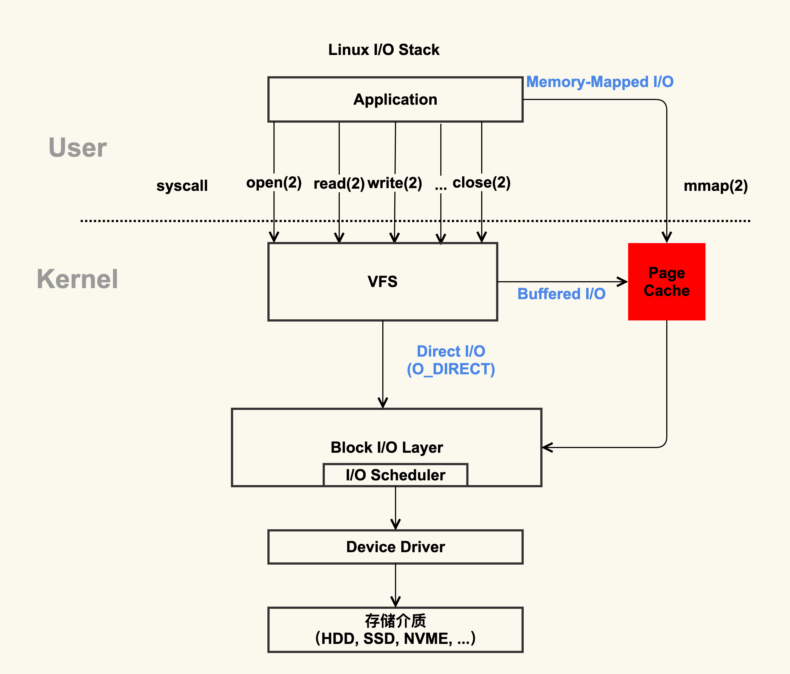
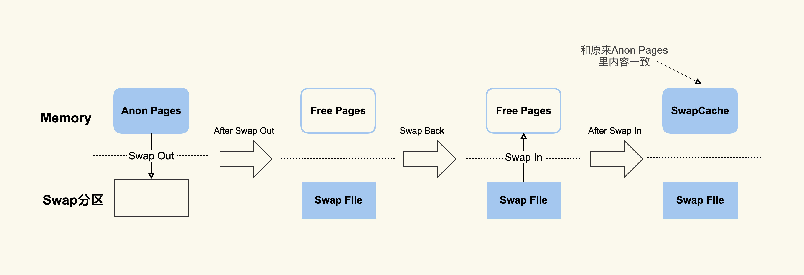
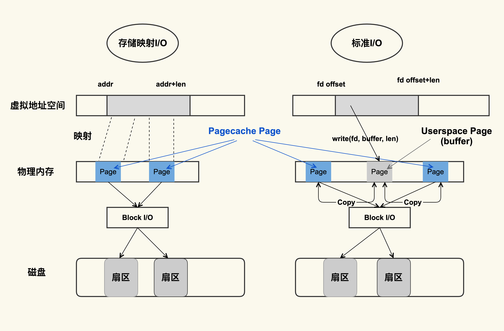
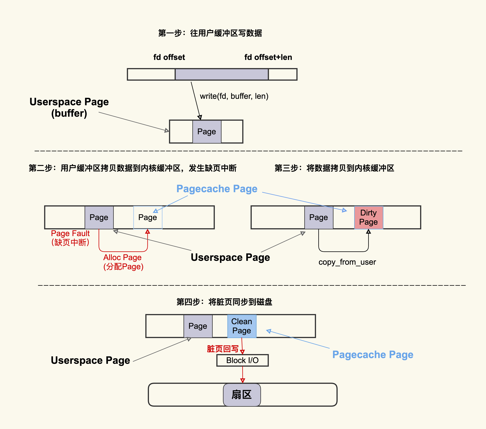
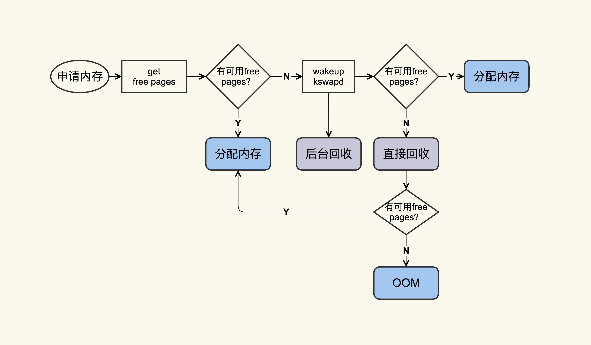
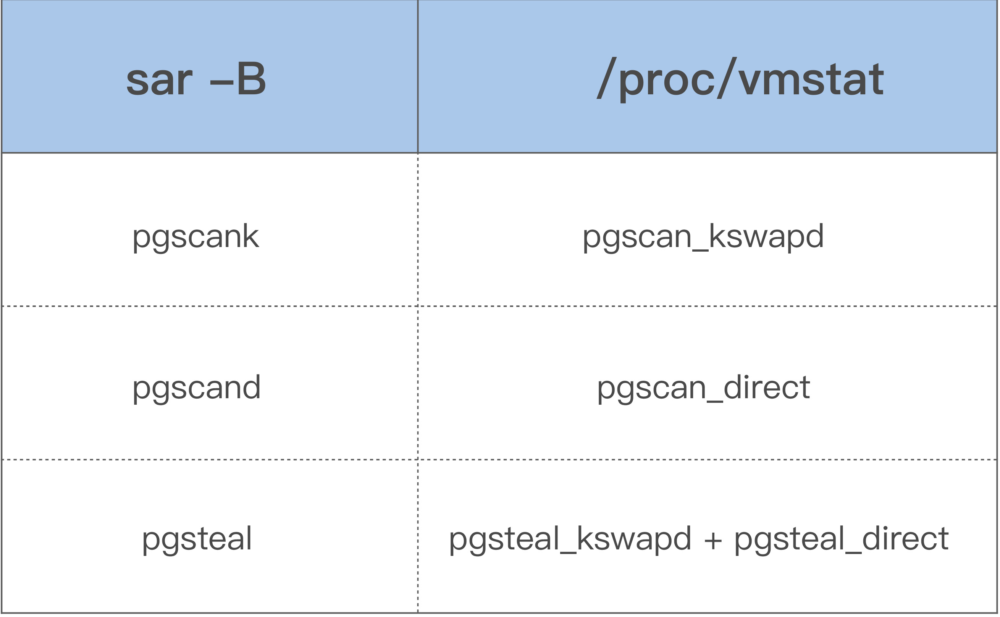

#### Page Cache管理不当可能导致的问题

Page Cache 管理不当除了会增加系统 I/O 吞吐外，还会引起业务性能抖动：

- 服务器的 load 飙高；

- 服务器的 I/O 吞吐飙高；

- 业务响应时延出现大的毛刺；

- 业务平均访问时延明显增加；

#### Page Cache是什么



图中红色的地方就是 Page Cache，很明显，Page Cache 是内核管理的内存，也就是说，它属于内核不属于用户。

观测可通过`/proc/meminfo`、 `/proc/vmstat`、`free`来查看具体使用情况：

```shell
[root@test-tke-node-k54 ~]# cat /proc/meminfo
...
Buffers:         5720888 kB
Cached:         26212340 kB
SwapCached:            0 kB
Active:         17327096 kB
Inactive:       19861896 kB
Active(anon):    2063788 kB
Inactive(anon):    62964 kB
Active(file):   15263308 kB
Inactive(file): 19798932 kB
...
Shmem:             63424 kB
...
SReclaimable:   11075616 kB
...
```

> 计算：
>
> Buffers + Cached + SwapCached = Active(file) + Inactive(file) + Shmem + SwapCached
>
> 等式两边的内容就是page cache

在 Page Cache 中，Active(file)+Inactive(file) 是 File-backed page（与文件对应的内存页），是我们最需要关注的部分。因为我们平时用的 mmap() 内存映射方式和 buffered I/O 来消耗的内存就属于这部分，最重要的是，这部分在真实的生产环境上也最容易产生问题；

而 SwapCached 是在打开了 Swap 分区后，把 Inactive(anon)+Active(anon) 这两项里的匿名页给交换到磁盘（swap out），然后再读入到内存（swap in）后分配的内存。由于读入到内存后原来的 Swap File 还在，所以 SwapCached 也可以认为是 File-backed page，即属于 Page Cache。这样做的目的也是为了减少 I/O。



SwapCached 只在 Swap 分区打开的情况下才会有，建议在生产环境中关闭 Swap 分区，因为 Swap 过程产生的 I/O 会很容易引起性能抖动。

除了 SwapCached，Page Cache 中的 Shmem 是指匿名共享映射这种方式分配的内存（free 命令中 shared 这一项），比如 tmpfs（临时文件系统）。

`free`中的`buff/cache`：

```shell
[root@test-tke-node-k54 ~]# free -k
              total        used        free      shared  buff/cache   available
Mem:       65439460     6856904    15578544       63488    43004012    61070328
Swap:             0           0           0
```

通过 procfs 源码里面的proc/sysinfo.c这个文件，可以发现 buff/cache 包括下面这几项：

> buff/cache = Buffers + Cached + SReclaimable

从这个公式中，可以看到 free 命令中的 buff/cache 是由 Buffers、Cached 和 SReclaimable 这三项组成的，它强调的是内存的可回收性，也就是说，可以被回收的内存会统计在这一项。

其中 SReclaimable 是指可以被回收的内核内存，包括 dentry 和 inode 等。而这部分内容是内核非常细节性的东西。

#### Page Cache存在的意义

> 减少 I/O，提升应用的 I/O 速度。

#### Page Cache的诞生

Page Cache 的产生有两种不同的方式：

- Buffered I/O（标准 I/O）；
- Memory-Mapped I/O（存储映射 I/O）；



两种方式的差异：

- 标准 I/O 是写的 (write(2)) 用户缓冲区 (Userpace Page 对应的内存)，然后再将用户缓冲区里的数据拷贝到内核缓冲区 (Pagecache Page 对应的内存)；如果是读的 (read(2)) 话则是先从内核缓冲区拷贝到用户缓冲区，再从用户缓冲区读数据，也就是 buffer 和文件内容不存在任何映射关系；

- 对于存储映射 I/O 而言，则是直接将 Pagecache Page 给映射到用户地址空间，用户直接读写 Pagecache Page 中内容；

显然，存储映射 I/O 要比标准 I/O 效率高一些，毕竟少了“用户空间到内核空间互相拷贝”的过程。




这个过程大致可以描述为：首先往用户缓冲区 buffer(这是 Userspace Page) 写入数据，然后 buffer 中的数据拷贝到内核缓冲区（这是 Pagecache Page），如果内核缓冲区中还没有这个 Page，就会发生 Page Fault 会去分配一个 Page，拷贝结束后该 Pagecache Page 是一个 Dirty Page（脏页），然后该 Dirty Page 中的内容会同步到磁盘，同步到磁盘后，该 Pagecache Page 变为 Clean Page 并且继续存在系统中。

我建议你可以将 Alloc Page 理解为 Page Cache 的“诞生”，将 Dirty Page 理解为 Page Cache 的婴幼儿时期（最容易生病的时期），将 Clean Page 理解为 Page Cache 的成年时期（在这个时期就很少会生病了）。

但是请注意，并不是所有人都有童年的，比如孙悟空，一出生就是成人了，Page Cache 也一样，如果是读文件产生的 Page Cache，它的内容跟磁盘内容是一致的，所以它一开始是 Clean Page，除非改写了里面的内容才会变成 Dirty Page（返老还童）。

就像我们为了让婴幼儿健康成长，要悉心照料他 / 她一样，为了提前发现或者预防婴幼儿时期的 Page Cache 发病，我们也需要一些手段来观测它：

```shell
[root@test-tke-node-k54 ~]# cat /proc/vmstat | egrep "dirty|writeback"
nr_dirty 87
nr_writeback 0
```

如上所示，nr_dirty 表示当前系统中积压了多少脏页，nr_writeback 则表示有多少脏页正在回写到磁盘中，他们两个的单位都是 Page(4KB)。

通常情况下，小朋友们（Dirty Pages）聚集在一起（脏页积压）不会有什么问题，但在非常时期比如流感期间，就很容易导致聚集的小朋友越多病症就会越严重。

#### Page Cache回收

你可以把 Page Cache 的回收行为 (Page Reclaim) 理解为 Page Cache 的“自然死亡”。

言归正传，我们知道，服务器运行久了后，系统中 free 的内存会越来越少，用 free 命令来查看，大部分都会是 used 内存或者 buff/cache 内存，比如说下面这台生产环境中服务器的内存使用情况：

```shell
$ free -g
       total  used  free  shared  buff/cache available
Mem:     125    41     6       0          79        82
Swap:      0     0     0
```

free 命令中的 buff/cache 中的这些就是“活着”的 Page Cache，那它们什么时候会“死亡”（被回收）呢？我们来看一张图：



你可以看到，应用在申请内存的时候，即使没有 free 内存，只要还有足够可回收的 Page Cache，就可以通过回收 Page Cache 的方式来申请到内存，回收的方式主要是两种：直接回收和后台回收。

那它是具体怎么回收的呢？你要怎么观察呢？其实在我看来，观察 Page Cache 直接回收和后台回收最简单方便的方式是使用 sar：

```shell
$ sar -B 1
02:14:01 PM  pgpgin/s pgpgout/s   fault/s  majflt/s  pgfree/s pgscank/s pgscand/s pgsteal/s    %vmeff


02:14:01 PM      0.14    841.53 106745.40      0.00  41936.13      0.00      0.00      0.00      0.00
02:15:01 PM      5.84    840.97  86713.56      0.00  43612.15    717.81      0.00    717.66     99.98
02:16:01 PM     95.02    816.53 100707.84      0.13  46525.81   3557.90      0.00   3556.14     99.95
02:17:01 PM     10.56    901.38 122726.31      0.27  54936.13   8791.40      0.00   8790.17     99.99
02:18:01 PM    108.14    306.69  96519.75      1.15  67410.50  14315.98     31.48  14319.38     99.80
02:19:01 PM      5.97    489.67  88026.03      0.18  48526.07   1061.53      0.00   1061.42     99.99
```

借助上面这些指标，你可以更加明确地观察内存回收行为，下面是这些指标的具体含义：

- pgscank/s : kswapd(后台回收线程) 每秒扫描的 page 个数。
- pgscand/s: Application 在内存申请过程中每秒直接扫描的 page 个数。
- pgsteal/s: 扫描的 page 中每秒被回收的个数。
- %vmeff: pgsteal/(pgscank+pgscand), 回收效率，越接近 100 说明系统越安全，越接近 0 说明系统内存压力越大。

这几个指标也是通过解析 /proc/vmstat 里面的数据来得出的，对应关系如下：

