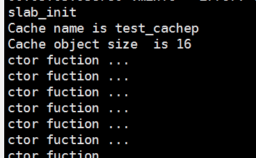
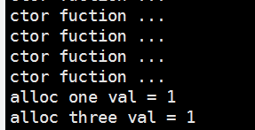

# [linux内核slab机制分析]( https://www.jianshu.com/p/95d68389fbd1 )

### 1.内部碎片和外部碎片

**外部碎片**
 什么是外部碎片呢？我们通过一个图来解释：


 假设这是一段连续的页框，阴影部分表示已经被使用的页框，现在需要申请一个连续的5个页框。这个时候，在这段内存上不能找到连续的5个空闲的页框，就会去另一段内存上去寻找5个连续的页框，这样子，久而久之就形成了页框的浪费。称为外部碎片。 内核中使用伙伴算法的迁移机制很好的解决了这种外部碎片。**内部碎片** 当我们申请几十个字节的时候，内核也是给我们分配一个页，这样在每个页中就形成了很大的浪费。称之为内部碎片。 内核中引入了slab机制去尽力的减少这种内部碎片。

### 2.slab分配机制

slab分配器是基于对象进行管理的，所谓的对象就是内核中的数据结构（例如：task_struct,file_struct 等）。相同类型的对象归为一类，每当要申请这样一个对象时，slab分配器就从一个slab列表中分配一个这样大小的单元出去，而当要释放时，将其重新保存在该列表中，而不是直接返回给伙伴系统，从而避免内部碎片。slab分配器并不丢弃已经分配的对象，而是释放并把它们保存在内存中。slab分配对象时，会使用最近释放的对象的内存块，因此其驻留在cpu高速缓存中的概率会大大提高。

### 3.内核中slab的主要数据结构


image.png


**简要分析下这个图：**
**举例说明：**


> - 首先要查看inode_cachep的slabs_partial链表，如果slabs_partial非空，就从中选中一个slab，返回一个指向已分配但未使用的inode结构的指针。完事之后，如果这个slab满了，就把它从slabs_partial中删除，插入到slabs_full中去，结束；
> - 如果slabs_partial为空，也就是没有半满的slab，就会到slabs_empty中寻找。如果slabs_empty非空，就选中一个slab，返回一个指向已分配但未使用的inode结构的指针，然后将这个slab从slabs_empty中删除，插入到slabs_partial（或者slab_full）中去，结束；
> - 如果slabs_empty也为空，那么没办法，cache内存已经不足，只能新创建一个slab了。
>    接下来我们来分析下slab在内核中数据结构的组织，首先要从kmem_cache这个结构体说起了

```cpp
struct kmem_cache {
    struct array_cache *array[NR_CPUS];//per_cpu数据，记录了本地高速缓存的信息，也是用于跟踪最近释放的对象，每次分配和释放都要直接访问它。
    unsigned int batchcount;//本地高速缓存转入和转出的大批数据数量
    unsigned int limit;//本地高速缓存中空闲对象的最大数目
    unsigned int shared;

    unsigned int buffer_size;/*buffer的大小，就是对象的大小*/
    u32 reciprocal_buffer_size;

    unsigned int flags;     /* constant flags */
    unsigned int num;       /* # of objs per slab *//*slab中有多少个对象*/

    /* order of pgs per slab (2^n) */
    unsigned int gfporder;/*每个slab中有多少个页*/

    gfp_t gfpflags;       /*与伙伴系统交互时所提供的分配标识*/  

    size_t colour;          /* cache colouring range *//*slab中的着色*/
    unsigned int colour_off;    /* colour offset */着色的偏移量
    struct kmem_cache *slabp_cache;
    unsigned int slab_size;              //slab管理区的大小
    unsigned int dflags;        /* dynamic flags */

    /* constructor func */
    void (*ctor)(void *obj);    /*构造函数*/

/* 5) cache creation/removal */
    const char *name;/*slab上的名字*/
    struct list_head next;              //用于将高速缓存连入cache chain

/* 6) statistics */ //一些用于调试用的变量
#ifdef CONFIG_DEBUG_SLAB
    unsigned long num_active;
    unsigned long num_allocations;
    unsigned long high_mark;
    unsigned long grown;
    unsigned long reaped;
    unsigned long errors;
    unsigned long max_freeable;
    unsigned long node_allocs;
    unsigned long node_frees;
    unsigned long node_overflow;
    atomic_t allochit;
    atomic_t allocmiss;
    atomic_t freehit;
    atomic_t freemiss;

    int obj_offset;
    int obj_size;
#endif /* CONFIG_DEBUG_SLAB */
    //用于组织该高速缓存中的slab
    struct kmem_list3 *nodelists[MAX_NUMNODES];/*最大的内存节点*/

};

/* Size description struct for general caches. */
struct cache_sizes {
    size_t          cs_size;
    struct kmem_cache   *cs_cachep;
#ifdef CONFIG_ZONE_DMA
    struct kmem_cache   *cs_dmacachep;
#endif
};
```

由上面的总图可知，一个核心的数据结构就是kmem_list3，它描述了slab描述符的状态。

```cpp
struct kmem_list3 {
/*三个链表中存的是一个高速缓存slab*/
/*在这三个链表中存放的是cache*/
    struct list_head slabs_partial; //包含空闲对象和已经分配对象的slab描述符
    struct list_head slabs_full;//只包含非空闲的slab描述符
    struct list_head slabs_free;//只包含空闲的slab描述符
    unsigned long free_objects;  /*高速缓存中空闲对象的个数*/
    unsigned int free_limit;   //空闲对象的上限
    unsigned int colour_next;   /* Per-node cache coloring *//*即将要着色的下一个*/
    spinlock_t list_lock;
    struct array_cache *shared; /* shared per node */
    struct array_cache **alien; /* on other nodes */
    unsigned long next_reap;    /* updated without locking *//**/
    int free_touched;       /* updated without locking */
};
```

接下来介绍描述单个slab的结构struct slab

```cpp
struct slab {
    struct list_head list;   //用于将slab连入keme_list3的链表
    unsigned long colouroff;   //该slab的着色偏移
    void *s_mem;        /* 指向slab中的第一个对象*/
    unsigned int inuse; /* num of objs active in slab */已经分配出去的对象
    kmem_bufctl_t free;       //下一个空闲对象的下标
    unsigned short nodeid;   //节点标识符
};
```

在kmem_cache中还有一个重要的数据结构struct array_cache.这是一个指针数组，数组的元素是系统的cpu的个数。该结构用来描述每个cpu的高速缓存，它的主要作用是减少smp系统中对于自旋锁的竞争。

> - 实际上，每次分配内存都是直接与本地cpu高速缓存进行交互，只有当其空闲内存不足时，才会从keme_list中的slab中引入一部分对象到本地高速缓存中，而keme_list中的空闲对象也不足时，那么就要从伙伴系统中引入新的页来建立新的slab了。

```cpp
struct array_cache {
    unsigned int avail;/*当前cpu上有多少个可用的对象*/
    unsigned int limit;/*per_cpu里面最大的对象的个数，当超过这个值时，将对象返回给伙伴系统*/
    unsigned int batchcount;/*一次转入和转出的对象数量*/
    unsigned int touched;/*标示本地cpu最近是否被使用*/
    spinlock_t lock;/*自旋锁*/
    void *entry[];  /*
             * Must have this definition in here for the proper
             * alignment of array_cache. Also simplifies accessing
             * the entries.
             */
};
```

对上面提到的各个数据结构做一个总结，用下图来描述：


image.png

### 4.关于slab分配器的API

下面看一下slab分配器的接口——看看slab缓存是如何创建、撤销以及如何从缓存中分配一个对象的。一个新的kmem_cache通过kmem_cache_create()函数来创建：

```cpp
struct kmem_cache *
kmem_cache_create( const char *name, size_t size, size_t align,
                   unsigned long flags， void (*ctor)(void*));
```

*name是一个字符串，存放kmem_cache缓存的名字；size是缓存所存放的对象的大小；align是slab内第一个对象的偏移；flag是可选的配置项，用来控制缓存的行为。最后一个参数ctor是对象的构造函数，一般是不需要的，以NULL来代替。kmem_cache_create()成功执行之后会返回一个指向所创建的缓存的指针，否则返回NULL。kmem_cache_create()可能会引起阻塞（睡眠），因此不能在中断上下文中使用。

撤销一个kmem_cache则是通过kmem_cache_destroy()函数：

```csharp
int kmem_cache_destroy( struct kmem_cache *cachep);
```

该函数成功则返回0，失败返回非零值。调用kmem_cache_destroy()之前应该满足下面几个条件：首先，cachep所指向的缓存中所有slab都为空闲，否则的话是不可以撤销的；其次在调用kmem_cache_destroy()过程中以及调用之后，调用者需要确保不会再访问这个缓存；最后，该函数也可能会引起阻塞，因此不能在中断上下文中使用。
 可以通过下面函数来从kmem_cache中分配一个对象：

```cpp
void* kmem_cache_alloc(struct kmem_cache* cachep, gfp_t flags);
```

这个函数从cachep指定的缓存中返回一个指向对象的指针。如果缓存中所有slab都是满的，那么slab分配器会通过调用kmem_getpages()创建一个新的slab。

释放一个对象的函数如下：

```csharp
void kmem_cache_free(struct kmem_cache* cachep,  void* objp);
```

**这个函数是将被释放的对象返还给先前的slab，其实就是将cachep中的对象objp标记为空闲而已**

### 5.使用以上的API写内核模块，生成自己的slab高速缓存。

其实到了这里，应该去分析以上函数的源码，但是几次奋起分析，都被打趴在地。所以就写个内核模块，鼓励下自己吧。

```cpp
#include <linux/autoconf.h>
#include <linux/module.h>
#include <linux/slab.h>

MODULE_AUTHOR("wangzhangjun");
MODULE_DESCRIPTION("slab test module");

static struct kmem_cache  *test_cachep = NULL;
struct slab_test
{
    int val;
};
void fun_ctor(struct slab_test *object , struct kmem_cache  *cachep , unsigned long flags )
{
    printk(KERN_INFO "ctor fuction ...\n");
    object->val = 1;
}

static int __init slab_init(void)
{
    struct slab_test *object = NULL;//slab的一个对象
    printk(KERN_INFO "slab_init\n");
//注意：这个函数的第二个参数（对象的大小），是有上限和下限的
//4Byte<=object size <= 4M(即在4字节到4M之间)，如果不在这个范围之内，会导致内核崩溃
    test_cachep = kmem_cache_create("test_cachep",sizeof(struct slab_test)*3,0,SLAB_HWCACHE_ALIGN,fun_ctor);
    if(NULL == test_cachep) 
                return  -ENOMEM ;
    printk(KERN_INFO "Cache name is %s\n",kmem_cache_name(test_cachep));//获取高速缓存的名称
    printk(KERN_INFO "Cache object size  is %d\n",kmem_cache_size(test_cachep));//获取高速缓存的大小
    object = kmem_cache_alloc(test_cachep,GFP_KERNEL);//从高速缓存中分配一个对象
    if(object)
    {
        printk(KERN_INFO "alloc one val = %d\n",object->val);
        kmem_cache_free( test_cachep, object );//归还对象到高速缓存
        //这句话的意思是虽然对象归还到了高速缓存中，但是高速缓存中的值没有做修改
        //只是修改了一些它的状态。
        printk(KERN_INFO "alloc three val = %d\n",object->val);
            object = NULL;
        }else
            return -ENOMEM;
    return 0;
}

static void  __exit slab_clean(void)
{
    printk(KERN_INFO "slab_clean\n");
    if(test_cachep)
                kmem_cache_destroy(test_cachep);//调用这个函数时test_cachep所指向的缓存中所有的slab都要为空

}

module_init(slab_init);
module_exit(slab_clean);
MODULE_LICENSE("GPL");
```

我们结合结果来分析下这个内核模块：




image.png


 这是dmesg的结果，可以发现我们自己创建的高速缓存的名字test_cachep,还有每个对象的大小。



image.png


 还有构造函数修改了对象里面的值，至于为什么构造函数会出现这么多次，可能是因为，这个函数被注册了之后，系统的其他地方也会调用这个函数。在这里可以分析源码，当调用keme_cache_create()的时候是没有调用对象的构造函数的，调用kmem_cache_create()并没有分配slab,而是在创建对象的时候发现没有空闲对象，在分配对象的时候，会调用构造函数初始化对象。 另外结合上面的代码可以发现，alloc three val是在kmem_cache_free之后打印的，但是它的值依然可以被打印出来，这充分说明了，slab这种机制是在将某个对象使用完之后，就其缓存起来，它还是切切实实的存在于内存中。 再结合/proc/slabinfo的信息看我们自己创建的slab高速缓存


image.png


 可以发现名字为test_cachep的高速缓存，每个对象的大小（objsize）是16,和上面dmesg看到的值相同，objperslab（每个slab中的对象时202），pagesperslab（每个slab中包含的页数），可以知道。

### 6.总结

目前只是对slab机制的原理有了一个感性的认识，对于这部分相关的源码涉及到着色以及内存对齐等细节。看的不是很清楚，后面还需要仔细研究。