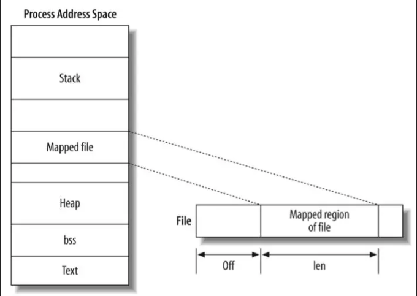
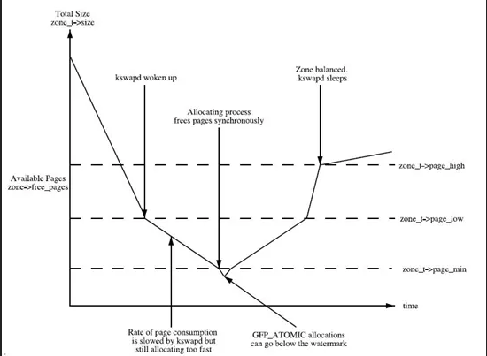
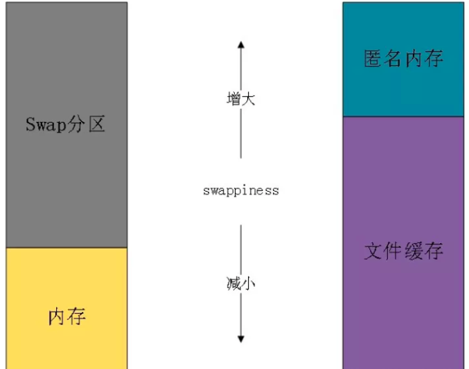

## [告别“一页障目”](https://mp.weixin.qq.com/s/rzKIwqxmfwppHMQRbkuxUw)

没有宏观概念，上来通过撸代码来理解简直就是耍流氓，效率极低。为了更有效的理解内存管理的来龙去脉很有必要先了解一些基础概念，然后再去撸代码。来，先一起看看那些内存里的各种页的含义和应用场景。

用户进程的内存页分为两种：

- file-backed pages（文件背景页）
- anonymous pages（匿名页）

比如进程的代码段、映射的文件都是**file-backed**，而进程的堆、栈都是不与文件相对应的、就属于**匿名页**。

file-backed pages在内存不足的时候可以直接写回对应的硬盘文件里，称为page-out，不需要用到交换区(swap)；而anonymous pages在内存不足时就只能写到硬盘上的交换区(swap)里，称为swap-out。

**file-backed pages（文件背景页）**

对于有文件背景的页面，程序去读文件时，可以通过read也可以通过mmap去读。当你通过任何一种方式从磁盘读文件时，内核都会给你申请一个**page cache**，来缓存硬盘上的内容。这样的话，读过一遍的数据，本进程或其他进程下次再读的时候就直接从page cache里去拿，就很快了，提升系统的整体性能。因此用户的read/write实际上是跟page cache的相互拷贝。 

而用户的mmap则会将一段虚拟地址（3G以下）映射到page cache上，这样的话，用户就可以通过读写这段虚拟地址来修改文件内容，省去了内核和用户之间的拷贝。

所以文件对于用户程序来讲其实只是内存，page cache就是磁盘中文件的一个副本。可以通过 “echo 3 > /proc/sys/vm/drop_cache” 来清cache。清掉之后，进程第一次读文件就会变慢。

通过free命令可以看到当前page cache占用内存的大小，free命令中会打印buffers和cached。*通过文件系统来访问文件（挂载文件系统，通过文件名打开文件）产生的缓存就由cached记录，而直接操作裸盘（打开/dev/sda设备去读写）产生的缓存就由buffers记录。*

实际上文件系统本身再读写文件就是操作裸分区的方式，用户态也可以直接操作裸盘，像dd命令操作一个设备名也是直接访问裸分区。那么，通过文件系统读写的时候，就会既有cached又有buffers。从图中可以看到，文件名等元数据和文件系统相关，是进cached，实际的数据缓存还是在buffers。例如，read一个文件（如ext4文件系统）的时候，如果文件cache命中了，就不用走到ext4层，从vfs层就返回了。 

当然，还可以在open的时候加上O_DIRECT标记，做直接IO，就连buffers都不进了，直接读写磁盘。 

***anonymous pages（匿名页）***

没有文件背景的页面，即匿名页（anonymous page），如堆，栈，数据段等，不是以文件形式存在，因此无法和磁盘文件交换，但可以通过硬盘上划分额外的swap分区或使用swap文件进行交换。swap分区可以将不活跃的页交换到硬盘中，缓解内存紧张。swap分区可以当做针对匿名页伪造的文件背景。

***页面回收(reclaim)***

- 有**文件背景**的数据实际上就是page cache，但page cache不能无限增加，不能说慢慢的所有文件都缓存到内存了。肯定要有一个机制，让不常用的文件数据从page cache刷出去。内核中有一个水位控制的机制，在系统内存不够用的时候，会触发页面回收。
- 对于没有文件背景的页面即**匿名页**，比如堆、栈、数据段，如果没有swap分区，不能与磁盘交换，就要常驻内存了。但是常驻内存的话，就会吃内存，可以通过给硬盘搞一个swap分区或硬盘中创建一个swap文件让匿名页也能交换到磁盘上。可认为是为匿名页伪造的文件背景。swap分区或swap文件实际上最终是到达了增大内存的效果。当然，如果频繁交换的话，被交换出去的数据的访问就会慢一些，因为要有IO操作了。

**1. 水位（watermark）控制:**

内核中有三个水位：

- min：如果剩余内存减少到触及这个水位，可认为内存严重不足，当前进程就会被堵住，kernel会直接在这个进程的进程上下文里面做内存回收（direct reclaim）。
- low：当剩余内存慢慢减少，触到这个水位时，就会触发**kswapd线程**的内存回收。
- high: 进行内存回收时，内存慢慢增加，触到这个水位时，就停止回收。

由于每个ZONE是分别管理各自内存的，因此每个ZONE都有这三个水位

**2. swapness：**

回收的时候，是回收有文件背景的页还是匿名页还是都会回收呢，可通过**/proc/sys/vm/swapness**来控制让谁回收多一点点。swappiness越大，越倾向于回收匿名页；swappiness越小，越倾向于回收file-backed的页面。当然，它们的回收方法都是一样的LRU算法，即最近最少使用的页会被回收。

**3. 如何计算水位：**

**/proc/sys/vm/min_free_kbytes** 是一个用户可配置的值，默认值是min_free_kbytes = 4 * sqrt(lowmem_kbytes)。然后根据min算出来low和high水位的值：low=5/4*min，high=6/4*min。

***脏页的写回***

sync是用来回写脏页的，脏页不能在内存中呆的太久，因为如果突然断电没有写到硬盘的话脏数据就丢了，另一方面如果攒了很多一起写回也会明显占用CPU时间。

那么脏页时候写回呢？脏页回写的时机由**时间**和**空间**两方面共同控制：

**时间：**

- dirty_expire_centisecs: 脏页的到期时间，或理解为老化时间，单位是1/100s，内核中的flusher thread会检查驻留内存的时间超过dirty_expire_centisecs的脏页，超过的就回写。 
- dirty_writeback_centisecs:内核的flusher thread周期性被唤醒(wakeup_flusher_threads())的时间间隔，每次被唤醒都会去检查是否有脏页老化了。如果将这个值置为0，则flusher线程就完全不会被唤醒了。 

**空间：**

- dirty_ratio: 一个写磁盘的进程所产生的脏页到达这个比例时，这个进程自己就会去回写脏页。 
- dirty_background_ratio: 如果脏页的数量超过这个比例时，flusher线程就会启动脏页回写。

所以：

1. 即使只有一个脏页，那如果它超时了，也会被写回。防止脏页在内存驻留太久。dirty_expire_centisecs这个值默认是3000，即30s，可以将其设置得短一些，这样掉电后丢失的数据会更少，但磁盘写操作也更密集。
2. 不能有太多的脏页，否则会给磁盘IO造成很大压力，例如在内存不够做内存回收时，还要先回写脏页，也会明显耗时。

需要注意的是，在达到dirty_background_ratio后，flusher线程（名为“[flush-devname]”）开始回写，但由于写磁盘速度慢，如果此时应用进程还在不停地写磁盘，flusher线程回写没那么快，那么就会导致进程的脏页达到dirty_ratio，这时这个进程就会去回写脏页而导致write被堵住。也就是说dirty_background_ratio通常是比dirty_ratio小的。

脏页都是指有文件背景的页面，匿名页不会存在脏页。从/proc/meminfo的’Dirty’一行可以看到当前系统的脏页有多少，用sync命令可以刷掉。

***zRAM机制***

不用swap分区，也可以用zRAM机制来缓解内存紧张：从内存里拿出一段内存空间（compressed block），作为交换空间模拟硬盘的交换分区，用来交换匿名页，并且让kernel看到的物理内存大小不包括这段内存。而这段交换空间自带透明压缩功能，即交换到这块zRAM分区时，Linux会自动将这块匿名页压缩存放。系统访问这块页面的内容时，产生page fault后从交换分区去拿，这时Linux给你透明解压再交换出来。 

使用zRAM的好处，就是访存比访问硬盘或flash的速度提高很多，且不用考虑寿命问题，并且由于这段内存是压缩后存储的，因此可以存更多的数据，虽然占用了一段内存，但实际可以存更多的数据，也达到了增加内存的效果。缺点就是压缩要占用CPU时间。

Android里面普遍使用了zRAM技术，由于zRAM牺牲了CPU时间，所以交换次数还是越少越好。像Android和windows，内存越大越好，因为发生交换的几率就小。这样两个进程相互切换（如微博和微信）时就会变得流畅，因为内存足够的话，后台进程无需被换进swap分区或被OOM杀掉。当然如果你只打打电话，就没必要大内存啦。