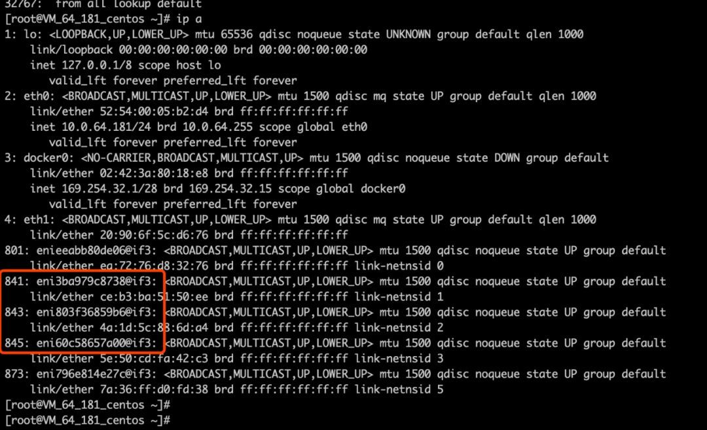
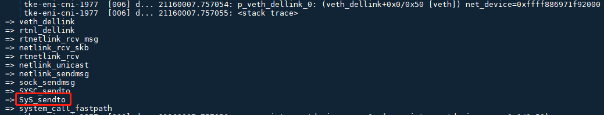
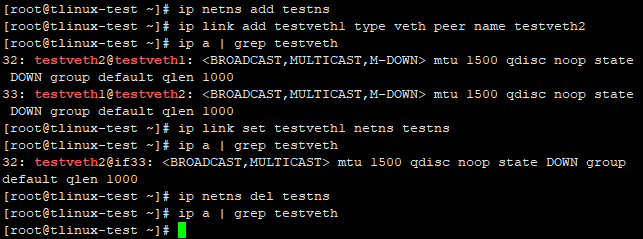
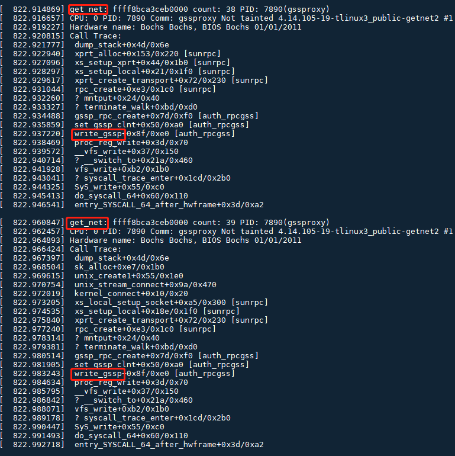

# [【内核模块auth_rpcgss】netns引用计数泄露导致容器弹性网卡残留]( https://cloud.tencent.com/developer/article/1442247 )

我们不久前定位了一个Linux内核bug，这个bug会影响所有在特权容器中启用了use-gss-proxy的Linux环境，表现为容器的网络命名空间(net namespace)无法彻底释放，导致容器终止后关联的虚拟网卡未能自动清除，运行时间长的机器上会观察到内存泄露。目前upstream还没有对这个bug的修复，我们内部已经做好了patch待测。

这个问题的定位过程很有借鉴价值，特此与大家分享。

**【问题现象】**

在k8s环境里，容器终止之后概率性地发生弹性网卡残留现象，而且只有privileged容器才有问题，不加privileged就没问题： 



这个问题在客户的环境里可以稳定复现，但是在容器团队的测试环境无法复现，给排查问题的过程增加了不少障碍。

**【定位过程】**

### **1. 为什么虚拟网卡未被自动删除？** 

思路是这样的：因为测试发现残留的弹性网卡是可以通过"ip link del ..."命令手工删除的，内核中删除弹性网卡的函数是veth_dellink()，我们可以利用ftrace跟踪veth_dellink()调用，对比正常情况和发生残留的情况，试图搞清楚发生残留的时候有什么异常。ftrace脚本如下：

```shell
#!/bin/bash

SYS_TRACE=/sys/kernel/debug/tracing
[ -e $SYS_TRACE/events/kprobes/enable ] && echo 0 > $SYS_TRACE/events/kprobes/enable
echo > $SYS_TRACE/kprobe_events
echo > $SYS_TRACE/trace
echo nostacktrace > $SYS_TRACE/trace_options

if [ $# -eq 1 -a $1=="stop" ]; then
        echo "stopped"
        exit
fi

echo "p veth_dellink net_device=%di" >> $SYS_TRACE/kprobe_events

echo stacktrace > $SYS_TRACE/trace_options

for evt in `ls $SYS_TRACE/events/kprobes/*/enable`; do
        echo 1 > $evt
done

cat $SYS_TRACE/trace_pipe
```

 以上ftrace脚本观察到正常场景下，tke-eni-cni进程有主动删除网卡的动作，而发生残留的场景下则没有。主动删除网卡的call trace是这样的：



tke-eni-cni进程不主动删除网卡的原因是net namespace已经被删除了，"lsns -t net"已经看不到了，在/var/run/docker/netns下也没了。而且net namespace被删除不应该导致虚拟网卡残留，恰恰相反，理论上net namespace销毁的过程中会自动删除关联的弹性网卡，可以通过以下的简单测试来验证，在客户的系统上验证也是没问题的：



阅读源代码，看到netns的内核数据结构是struct net，其中的count字段表示引用计数，只有当netns的引用计数归零之后才能执行销毁动作：

```shell
struct net {
    refcount_t passive;
    atomic_t count;
...
```

 用crash工具查看内核，可以看到struct net的引用计数确实没有归零，难怪没有触发销毁动作：

```shell
crash> struct net.count ffffa043bb9d9600
  count = {
    counter = 2
  }
```

至此我们得出的判断是：导致弹性网卡残留的原因是netns泄露。

###  

### **2. 是谁导致了netns引用计数泄露？**

由于弹性网卡残留现象只出现在privileged容器，那么加不加privileged有什么区别呢？

 加了privileged权限可以在容器里启动systemd服务。

 对比发现，privileged容器里多了很多后台服务，怀疑是其中某个服务导致了netns引用计数泄露。我们一个一个依次排除，最终找到了直接导致netns泄露的后台服务是：gssproxy。

可是，容器终止后，在gssproxy后台进程也消失的情况下，netns引用计数仍然不能归零，这就很难解释了，因为用户态进程退出之后应该会释放它占用的所有资源，不应该影响内核，说明问题没那么简单，很可能内核有bug。

**【复现问题】**

之前容器团队在测试环境里复现不出问题，是因为信息量不够，我们定位到这一步，得到的信息已经可以复现问题了，步骤如下。

然后创建镜像，并运行它，注意以下第一条命令是执行特权容器，第二条是非特权容器

先创建以下Dockerfile用于制作镜像：

```shell
FROM centos:7
ENV container docker
RUN echo 'root:root' | chpasswd

ADD gssproxy-0.4.1-7.el7.x86_64.rpm /gssproxy-0.4.1-7.el7.x86_64.rpm
ADD nfs-utils-1.3.0-0.21.el7.x86_64.rpm /nfs-utils-1.3.0-0.21.el7.x86_64.rpm 
RUN yum localinstall -y gssproxy-0.4.1-7.el7.x86_64.rpm
RUN yum localinstall -y nfs-utils-1.3.0-0.21.el7.x86_64.rpm

RUN (cd /lib/systemd/system/sysinit.target.wants/; for i in *; do [ $i == \
systemd-tmpfiles-setup.service ] || rm -f $i; done); \
rm -f /etc/systemd/system/*.wants/*;\
rm -f /lib/systemd/system/local-fs.target.wants/*; \
rm -f /lib/systemd/system/sockets.target.wants/*udev*; \
rm -f /lib/systemd/system/sockets.target.wants/*initctl*; \
rm -f /lib/systemd/system/basic.target.wants/*;\
rm -f /lib/systemd/system/anaconda.target.wants/*;
VOLUME [ "/sys/fs/cgroup" ]

RUN systemctl enable gssproxy
CMD ["/usr/sbin/init"]
```

然后创建镜像，并运行它，注意以下第一条命令是执行特权容器，第二条是非特权容器

```shell
# docker run --privileged -it local/c7-systemd
# docker run -it local/c7-systemd
```


同时利用crash工具实时观察net namespace：在

```shell
crash> net_namespace_list
net_namespace_list = $2 = {
  next = 0xffffffff907ebe18, 
  prev = 0xffffa043bb9dac18
}
```

在运行容器之前，所有的nets如下：

```shell
crash> list 0xffffffff907ebe18
ffffffff907ebe18
ffffa043bb220018
ffffa043bb221618
ffffa043bb222c18
ffffa043bb224218
ffffa043bb225818
ffffa043bb9d8018
ffffa043bb9d9618
ffffffff907ed400
```

在运行容器之后，多了一个netns：

```shell
crash> list 0xffffffff907ebe18
ffffffff907ebe18
ffffa043bb220018
ffffa043bb221618
ffffa043bb222c18
ffffa043bb224218
ffffa043bb225818
ffffa043bb9d8018
ffffa043bb9d9618
ffffa043bb9dac18  <<<新增的netns
ffffffff907ed400
```

然后我们杀掉这个容器：

```shell
[root@tlinux-test ~]# docker ps
CONTAINER ID        IMAGE               COMMAND             CREATED             STATUS              PORTS               NAMES
12e632ca0ac7        local/c7-systemd    "/usr/sbin/init"    2 hours ago         Up 2 hours                              zealous_darwin
[root@tlinux-test ~]# docker kill 12e632ca0ac7
12e632ca0ac7
```

crash再看，netns并没有释放（如下），这样就成功地复现了问题。

```shell
crash> list 0xffffffff907ebe18
ffffffff907ebe18
ffffa043bb220018
ffffa043bb221618
ffffa043bb222c18
ffffa043bb224218
ffffa043bb225818
ffffa043bb9d8018
ffffa043bb9d9618
ffffa043bb9dac18   <<< 没有释放
ffffffff907ed400
crash> struct net.count ffffa043bb9dac00
  count = {
    counter = 2   <<< 引用计数没有归零
  }
```

##  

**【追查问题根源】**

内核里修改引用计数的函数是get_net和put_net，一个递增，一个递减，通过追踪这两个函数就可以找到导致netns泄露的代码，但是由于它们都是inline函数，所以无法用ftrace或systemtap等工具进行动态追踪，只能自制debug kernel来调试。我们在get_net和put_net中添加了如下代码：

```c
+    printk("put_net: %px count: %d PID: %i(%s)\n", net, net->count, current->pid, current->comm);+    dump_stack();
```

捕捉到可疑的调用栈如下，auth_rpcgss内核模块中，write_gssp()产生了两次get_net引用，但是容器终止的过程中没有相应的put_net：



通过strace跟踪gssproxy进程的启动过程，可以看到导致调用write_gssp()的操作是往/proc/net/rpc/use-gss-proxy里写入1：

```shell
20818 open("/proc/net/rpc/use-gss-proxy", O_RDWR) = 9
20818 write(9, "1", 1)                  = 1
```

到这里我们终于知道为什么一个用户态进程会导致内核问题了： 

因为gssproxy进程向/proc/net/rpc/use-gss-proxy写入1之后，触发了内核模块auth_rpcgss的一些列动作，真正有问题的是这个内核模块，而不是gssproxy进程本身。

**【临时规避方法】**

客户使用的gssproxy版本是：gssproxy-0.4.1-7.el7.x86_64。用最新版本gssproxy-0.7.0-21.el7.x86_64测试，发现问题消失。对比这两个版本的配置文件，发现老版本0.4.1-7的配置文件包含如下内容，而新版本0.7.0-21则没有：

```shell
# cat /etc/gssproxy/gssproxy.conf
...
[service/nfs-server]
  mechs = krb5
  socket = /run/gssproxy.sock
  cred_store = keytab:/etc/krb5.keytab
  trusted = yes
  kernel_nfsd = yes
  euid = 0
  ...
```

按照手册，kernel_nfsd的含义如下，它会影响对/proc/net/rpc/use-gss-proxy的操作：

```shell
kernel_nfsd (boolean)

Boolean flag that allows the Linux kernel to check if gssproxy is running (via /proc/net/rpc/use-gss-proxy).
Default: kernel_nfsd = false
```

在老版本gssproxy-0.4.1-7上测试把kernel_nfsd从yes改为no，问题也随之消失。 

所以临时规避的方法有两个：

1、在特权容器中，从gssproxy的配置文件/etc/gssproxy/gssproxy.conf中关掉kernel_nfsd即可，即kernel_nfsd=no。

2、在特权容器中，把gssproxy版本升级到0.7.0-21。

---

**【解决方法】**

分析源代码，这个问题的根本原因是内核模块auth_rpcgss通过gssp_rpc_create()创建了一个rpc client，因为用到了网络命名空间，所以要递增引用计数。代码路径如下： 

```shell
gssproxy进程向/proc/net/rpc/use-gss-proxy写入1
    => write_gssp
        => set_gssp_clnt
            => gssp_rpc_create
                => rpc_create
```

当rpc client关闭的时候，引用计数会相应递减，负责的函数是rpcsec_gss_exit_net()，这是一个回调函数，它什么时候被调用呢？它的调用路径如下：

```shell
put_net
    => cleanup_net
        => ops_exit_list
            => rpcsec_gss_exit_net
                => gss_svc_shutdown_net
```

当put_net引用计数降到0的时候，会触发cleanup_net()，cleanup_net()随后会调用包括rpcsec_gss_exit_net()在内的一系列pernet_operations exit方法。问题就出在这：负责递减引用计数的函数rpcsec_gss_exit_net()必须在引用计数归零之后才能被调用，而rpcsec_gss_exit_net()不调用就无法递减引用计数，逻辑上发生了死锁。

修复这个bug的思路是打破上面这个死锁，让rpcsec_gss_exit_net()在恰当的条件下得以执行。我的patch是把它放进nsfs_evict()中，当netns被卸载的时候，nsfs_evict()会被调用，在这个时刻调用rpcsec_gss_exit_net()比较合理。提交给TLinux3 Public的补丁如下： https://git.code.oa.com/tlinux/tkernel3-public/commit/55f576e2dd113047424fb90883dabc647aa7b143