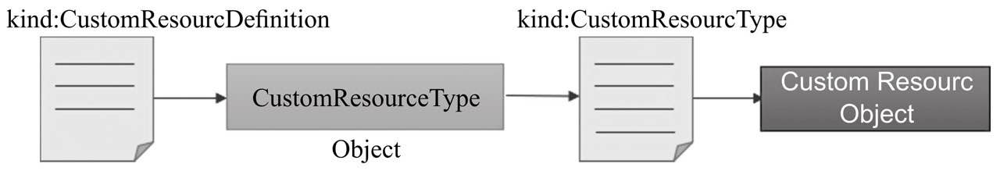
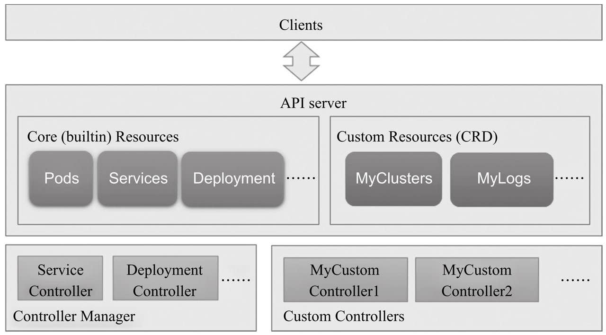
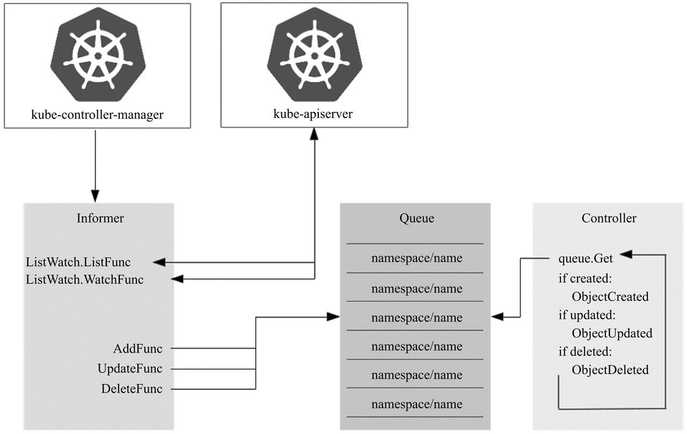

Kubernetes API默认提供的众多的功能性资源类型可用于容器编排以解决多数场景中的编排需求。然而，有些场景也许要借助于额外的或更高级别的编排抽象，例如引入集群外部的一些服务并以资源对象的形式进行管理，再或者把Kubernetes的多个标准资源对象合并为一个单一的更高级别的资源抽象，等等。而这类API扩展抽象通常也应该兼容Kubernetes系统的基本特性，如支持kubectl管理工具、CRUD及watch机制、标签、etcd存储、认证、授权、RBAC及审计，等等，从而使得用户可将精力集中于构建业务逻辑本身。

目前，扩展Kubernetes API的常用方式有三种：使用CRD（CustomResourceDefinitions）自定义资源类型、开发自定义的APIServer并聚合至主API Server，以及定制扩展Kubernetes源码。其中，CRD最为易用但限制颇多，自定义API Server更富于弹性但代码工作量偏大，而仅在必须添加新的核心类型才能确保专用的Kubernetes集群功能正常时才应该定制系统源码。

在某种程度上，Kubernetes API Server可以看作一个JSON方案的数据库存储系统，它内建了众多数据模式（资源类型），以etcd为存储后端，支持存储和检索结合内建模式进行实例化的数据项（对象）。作为客户端，控制器会收到有关这些资源对象变动的通知，并在响应过程中操纵这些对象及相关的其他资源，或者将这些更改反映到外部系统（如云端的软件负载平衡器）。从这个角度进行类比，CRD就像是由用户为Kubernetes存储系统提供的自定义数据模式，基于这些模式进行实例化的数据项一样可以存入系统中。

CRD并非设计用来取代Kubernetes的原生资源类型，而是用于补充一种简单易用的更为灵活和更高级别的自定义API资源的方式。虽然目前在功能上仍存在不少的局限，但对于大多数的需求场景来说，CRD的表现已经足够好，因此在满足需求的前提下是首选的API资源类型扩展方案。

CRD本身也是一种资源类型，隶属于集群级别，实例化出特定的对象之后，它会在API上注册生成GVR类型URL端点，并能够作为一种资源类型被使用并实例化相应的对象。自定义资源类型之前，选定其使用的API群组名称、版本及新建的资源类型名称，根据这些信息即可创建自定义资源类型，并创建自定义类型的资源对象。

除了对操作请求进行身份认证和授权检查之外，对象配置的变动在存入etcd之前还需要经由准入控制器的核验，尤其是验证型（validation）控制器会检查传入的对象格式是否符合有效格式，包括是否设定了不符合定义的数据类型值，以及是否违反了字段的限制规则等。

仅借助于CRD完成资源自定义本身并不能为用户带来太多的价值，它只是资源类型的定义，只是提供了JSON格式的数据范式及存取相关数据的能力，至于如何执行数据相关的业务逻辑，时刻确保将status中的状态移向spec中的状态则是由封装于控制器中的代码来负责实现的。相应地，为自定义资源类型提供业务逻辑代码的控制器需要由用户自行开发，并运行为API Server的客户端程序（通常是托管运行于Kubernetes系统之上，类似于Ingress控制器），这就是所谓的自定义控制器（Custom Controller）。换句话讲，某特定的CRD资源的相关对象发生变动时，如何确保它的当前状态不断地接近期望的状态并非API Server的功能，而是相关的专用控制器组件。

简单来说，控制器负责持续监视资源变动，根据资源的spec及status中的信息执行某些操作逻辑，并将执行结果更新至资源的status中。自定义控制器同样担负着类似的职责，只不过一个特定的控制器通常仅负责管理一部分特定的资源类型，并执行专有管理逻辑。

Kubernetes系统内建了许多控制器，如NodeController、ServiceController等，它们打包在一起并作为一个统一守护进程kube-controller-manager。这些控制器基本上都遵循同一种模式以完成资源管理操作，该模式通常可描述为三种特性：声明式API、异步和水平式处理。

- 声明式API：用户定义期望的状态而非要执行的特定操作，如使用kubectl apply命令将请求发送至API Server存储于etcd中，并由API Server做出处理响应。‰

- 异步：客户端的请求于API Server存储完成之后即返回成功信息，而无须等待控制器执行的和解循环结束。

- 水平式处理（level-based）：同一对象有多次变动事件待处理时，控制器仅需要处理其最新一次的变动。这种根据最新观察结果而非历史变化来和解status和spec的机制即为水平式处理机制。

简单来说，控制器包含两个重要组件：Informer/SharedInformer和Workqueue，前者负责监视资源对象当前状态的更改，并将事件发送至后者，而后由处理函数进行处理。

Informer主要由Listwatcher、ResourceEventHandler和ResyncPeriod三类函数组件进行构造。

- Listwatcher是应用于特定名称空间中特定资源对象的列表函数（listFunc）和监视函数（watchFunc），并结合字段选择器为控制器精确限定关注的资源对象。

- ResourceEventHandler负责处理资源对象状态改变产生的相关通知，其分别使用AddFunc、UpdateFunc和DeleteFunc三个函数完成对象的创建、更新和删除操作。

- ResyncPeriod定义控制器遍历缓存中的所有项目并触发运行UpdateFunc的频率，即和解循环的执行频度。较高的频度对于控制器错过某次更新或此前的更新操作执行失败时非常有用，但会对系统资源带来较高的压力，因此具体的时长需要全面、系统地进行权衡。

Informer是控制器的私有组件，它为相关资源对象创建的缓存信息仅可供当前控制器使用。而在Kubernetes系统上，同一资源对象支持多个控制器共同处理，而且多个控制器监视同一资源对象也是较为常见的情形，于是，一个更高效的方式是使用替代解决方案SharedInformer和Workqueue。SharedInformer支持在监控同类资源对象的控制器之间创建共享缓存，这有效降低了内存资源开销，而且它也仅需要在上游的API Server中注册创建一个监视器，即能显著减轻上游服务器的访问压力。因此，较之Informer, SharedInformer才是更为常用的解决方案。

不过，SharedInformer无法跟踪每个控制器的位置（因为它是共享的），于是控制器必须负责提供自用的工作队列及重试机制，这也意味着它的ResourceEventHandler程序只是将事件放在每个消费者的Workqueue中。

- 每当资源发生变化时，ResourceEventHandler程序都会将一个键放入工作队列中，对于名称空间级别资源对象的相关事件，其键名格式为<resource_namespace>/<resource_name>，集群级别资源对象的键名则只包含<resource_name>。

- 目前，工作队列存在延迟队列、定时队列和速率限制队列等几种形式

因此，自定义控制器构建起来存在一定的复杂度。实践中，为了便于用户使用client-go创建控制器，Kubernetes社区发布了模板类的项目workqueue example和sample-controller，它们提供了一个自定义控制器项目应有的基础结构。通常的做法是复制相应的代码并按需修改相应的部分，例如，将syncHandler修改为自定义资源类型业务处理逻辑等，而后借助于code-generator项目用脚本完成相应的组件，如typed clients、informers等。虽然好过从零构建自定义控制器的代码，但这类方式总觉得有些不趁手和美中不足。

好在，现在已经有了几类更加成熟、更易上手的工具可用，它们甚至已经可以被视作开发CRD和控制器的SDK或框架，其中，主流的项目主要有Kubebuilder、Operator SDK和Metacontroller三个。Kubebuilder主要由Google的工程师Phillip Wittrock创立，但目前归属于SIG API Machinery，有较完善的在线文档。Operator SDK是CoreOS发布的开源项目，是Operator Framework的一个子集，其出现时间略早，社区接受度较高，以致很多人干脆就把自定义控制器与Operator当作同一事物不加区分地使用，目前已经有etcd、Prometheus、Rook和Vault几个成熟的Operator可用。Metacontroller由GCP发布，与前两者的区别较大，它将控制器模式直接委托给Metacontroller框架，并调用用户提供的WebHook实现模式的处理功能，支持任何编程语言开发，接收并返回JSON格式的序列化数据。

---

*以上内容摘自 Kubernetes进阶实战*
