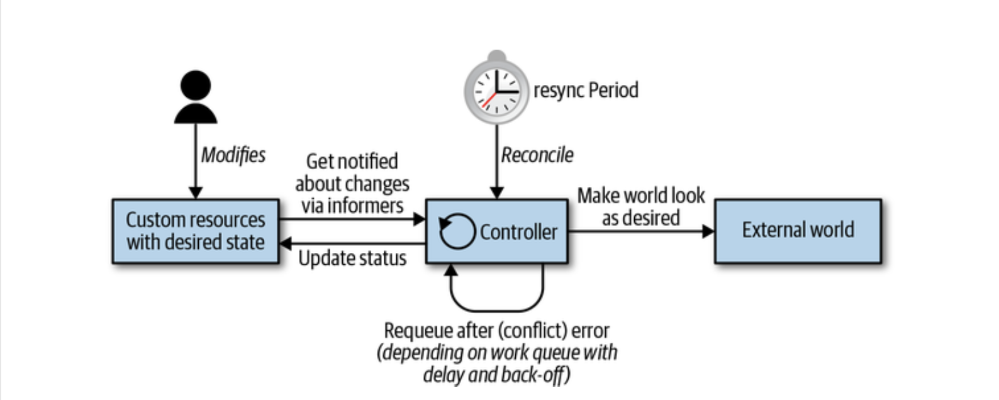
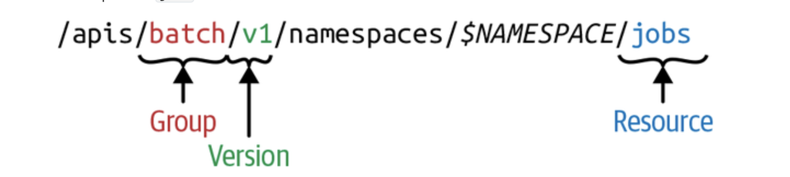
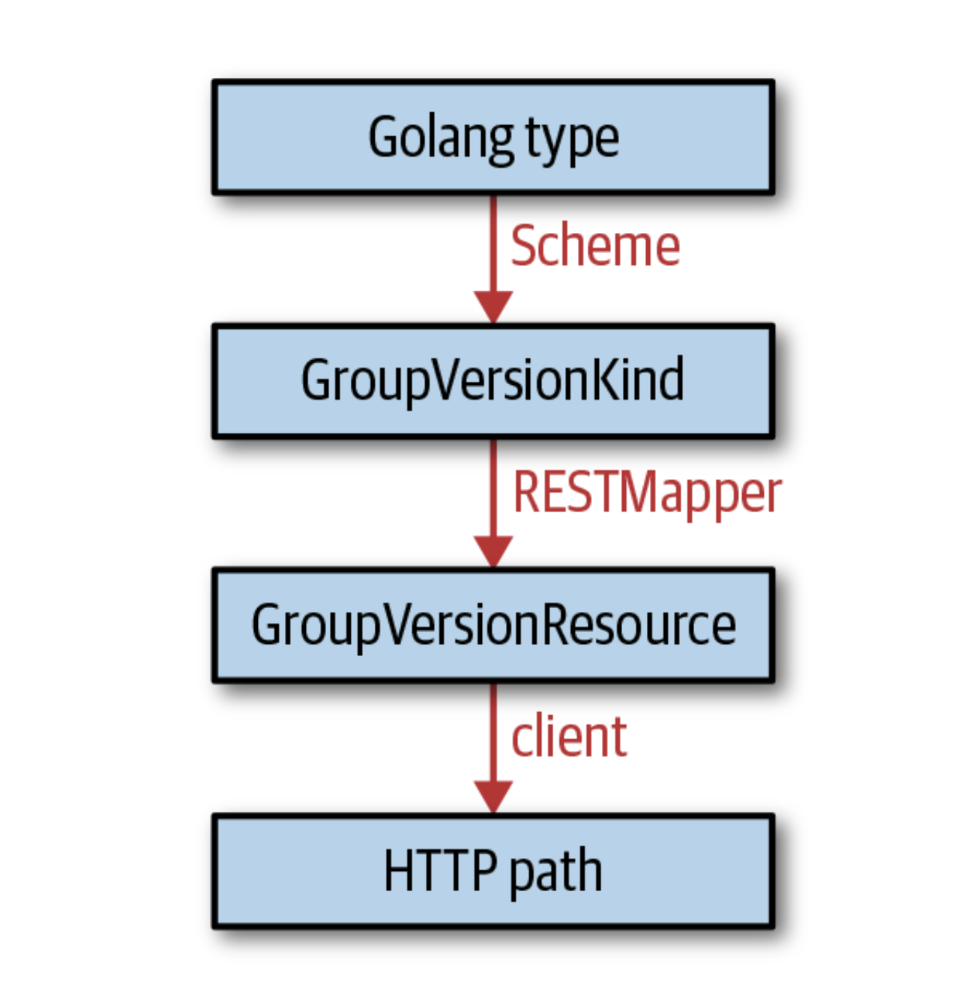

### 第一章 导论

#### 基于Kubernetes编程的定义：

> 开发一个直接与API Server交互，查询资源状态[并/或]更新其状态的Kubernetes原生应用程序。

#### 扩展模式：

- 传统的云服务提供商都是作为controller manager的一部分存在于主代码仓库（in-tree）中的。从1.11版本开始，kubernetes通过提供与云集成的自定义cloud-controller-manager process，使独立于主代码仓库（out-of-tree）进行开发成为可能。云服务提供商允许使用特定于云服务提供商的工具，例如负载均衡器或虚拟机。
- 用于[网络](https://github.com/containernetworking/cni)、[设备](https://kubernetes.io/docs/concepts/extend-kubernetes/compute-storage-net/device-plugins/)（例如GPU），[存储](https://github.com/container-storage-interface/spec/blob/master/spec.md)和[容器运行时](https://github.com/kubernetes/community/blob/master/contributors/devel/sig-node/container-runtime-interface.md)的二进制Kubelet插件。
- 二进制kubectl[插件](https://kubernetes.io/docs/tasks/extend-kubectl/kubectl-plugins/)。
- API Server中的访问扩展，例如webhooks的动态准入控制。
- 自定义资源和自定义controller；
- 自定义API Server；
- 调度器扩展，例如使用[webhook](https://github.com/kubernetes/community/blob/master/contributors/design-proposals/scheduling/scheduler_extender.md)来实现自己的调度决策。
- 通过webhook进行[身份验证](https://kubernetes.io/docs/reference/access-authn-authz/authentication/#webhook-token-authentication)。

#### Controller和Operator

Controller实现控制循环，通过API Server监听集群的共享状态，并尝试进行更改以将当前状态转为期望状态。[Kubernetes术语表](https://kubernetes.io/docs/reference/glossary/?fundamental=true)

##### 控制循环（The Control Loop）：

1. 基于事件驱动读取资源状态；
2. 更改集群内或集群外的对象状态；
3. 通过API Server更新步骤1中的资源状态，并存储在etcd中；
4. 重复循环，返回步骤1；




从架构的角度来看，Controller通常使用以下数据结构：

- Informer：以可扩展且可持续的方式监听所需的资源状态，它还实现了强制定期协调的重新同步机制，这种机制通常用于确保集群状态和缓存在内存中的预期状态不会漂移；
- 工作队列（Work Queue）：本质上，工作队列是事件处理程序可以使用的组件，用于状态更新事件的有序处理并协助实现重试。在client-go中，可以通过workqueue package使用此功能。可以在改变环境对象或更新资源状态时发生错误的情况下，进行资源重新分配。或者仅是由于某些原因我们不得不在一段时间后，也需进行资源重新分配。[Kubernetes原理](https://medium.com/@dominik.tornow/the-mechanics-of-kubernetes-ac8112eaa302)

##### 事件

Kubernetes Control Plane大量使用事件和松耦合的组件，Kubernetes Controller监听API Server中Kubernetes对象的操作，如添加、更新和删除等，当发生此类事件时，controller将执行其业务逻辑。

以下为通过deployment来启动pod，所涉及的controller和其他control plane组件的协同工作：

1. Deployment controller（在kube-controller-manager内部）感知到（通过deployment informer）用户创建了一个deployment。根据其业务逻辑，它将创建一个replica set。
2. Replica set controller（同样在kube-controller-manager内部）感知到（通过replica set informer）新的replica set被创建了。并随后运行其业务逻辑，它将创建一个pod对象。
3. Scheduler（在kube-scheduler二进制文件内部）——同样是一个controller，感知到（通过pod informer）pod设置了一个空的spec.Nodename字段。根据其业务逻辑，它将该pod放入其调度队列中。
4. 与此同时，另一个controller Kubelet（通过其pod informer）感知到有新的pod出现，但是新的pod的spec.Nodename字段为空，因此与Kubelet的node name不匹配。它会忽略该pod并返回休眠状态（直到下一个事件）。
5. Scheduler更新pod的spec.Nodename字段，并将该字段写入API Server，由此将此pod从工作队列中移出，并调度至具有足够可用资源的node上。
6. 由于pod的更新事件，Kubelet将再次唤醒，这次再将pod 的spec.Nodename与自己的node name进行比较，会发现是匹配的，接着Kubelet将启动pod中的容器，并将容器已启动的信息写入pod status中，由此上报给API Server。
7. Replica set controller会感知到已更新的pod，但并不会做什么。
8. 如果pod停止，Kubelet将感知到该事件，进而从API Server获取pod对象，并把pod status设置为”terminated“，然后将其回写至API server。
9. Replica set controller会感知到终止的pod，并决定更换此pod。他将在API server上删除终止了的pod，然后创建一个新的pod。
10. 以此类推。

###### 监听事件和Event对象

- 监听事件是通过API server和controller之间的http长连接发送，从而驱动informer。
- 顶级的Event对象是诸如pod、deployment或service资源具有的特殊属性，它的存在时间为一个小时，然后自动从etcd删除。Event对象只是用户可见的日志记录机制。许多controller创建这些事件，以便其将业务逻辑的各个方面传达给用户。

> 事件即状态变化。

##### 边缘驱动触发和水平驱动触发

原则上有两种方法可检测状态变化（事件本身）：

- 边缘驱动触发（Edge-driven triggers）

在状态变化发生的时间点，将触发处理程序。例如，从无pod运行到pod运行。

- 水平驱动触发（Level-driven triggers）

定期检查状态，如果满足某些条件（例如，pod正在运行），则会触发处理程序。

后者是轮询的一种形式。它不能随对象数量的扩展而高效的扩展，而且controller感知到变化的延迟取决于轮询的间隔以及API server的响应速度。由于涉及到许多异步controller，导致系统需要较长的时间才能满足用户的需求。

对于许多对象，前一种方法效率更高。延迟主要取决于controller处理事件的工作线程数。因此，kubernetes是基于事件的模式（即边缘驱动触发）。

在 kubernetes controller plane中，许多组件会更改API server上的对象，每个更改都会导致事件的产生。我们称这些组件为事件源（event source）或事件产生者。另一方面，在controller上下文中，我们对事件的消费感兴趣，即何时对事件作出何种响应（通过informer）。

##### 更改集群内或集群外对象

基于controller更改资源状态不一定意味着资源本身必须是kubernetes集群的一部分。换句话说，controller可以更改位于kubernetes外部的资源（例如云存储服务）的状态。例如，AWS Service Operator允许您管理AWS资源。除此之外，它还许您管理S3 bucket——也就是说，S3 controller监控kubernetes外部存在的资源（S3 bucket），并且把生命周期中的各种状态变化反馈出来：比如创建和删除S3 bucket。

#### 乐观并发

为了进行无锁并发操作，Kubernetes API Server使用乐观并发控制，这意味着如果且当API Server检测到有并发写，它将拒绝两个写操作中的后者，然后由客户端（controller、scheduler、kubectl等）来处理写冲突并重试写操作。

> 资源版本号实际上是etcd键值对的版本号。每个对象的资源版本是kubernetes中的一个字符串，其中包含一个整数。这个整数直接来自etcd。etcd维护着一个计数器，每次修改键的值时，计数器都会增加。
>
> 在整个API机制代码中，资源版本号像任意字符串一样处理，但是带有一些顺序。存储成整数的实现方式只是当前etcd存储后端的实现细节。

### 第二章 kubernetes API基础

#### API server

**核心职责：**

- 提供kubernetes API。这些API供集群内的主控组件、工作节点、kubernetes原生应用，以及外部客户端调用；
- 代理集群组件，比如kubernetes仪表盘，流式日志，服务端口，kubectl exec 会话。

**API  server的http接口**

从客户端的角度，API Server暴露了一组使用JSON或者protocol buffer（简称protobuf）编码的RESTful HTTP接口。使用protobuf是基于性能上的考虑，主要用于集群内通讯。

#### API术语

- Kind

实体的类型（The type of an entity），每个对象都有个字段Kind（在JSON里全小写kind，在Golang里首字母大写Kind），它用于告诉客户端（比如kubectl）具体是什么类型，比如说这是一个pod。其中有3种Kind类型：

1. Object代表系统中的持久实体——例如Pod或者Endpoints。Object有名字，并且他们大多数位于namespace中。
2. List代表一个或多个类型实体的集合。List有一组有限的通用元数据（common metadata）。例如，PodList或者NodeList。当你执行kubectl get pods，语义即精确表达你将获取的内容。
3. 特殊用途类型（Special-purpose kinds）主要用于Object和非持久实体的特定操作，例如/binding或者/scale。kubernetes使用APIGroup和APIResource用于资源发现，使用Status类型返回错误结果。

在kubernetes的程序中，Kind直接对应一个Golang的类型（Type）。于是，像Golang类型一样，kubernetes类型（kind）都是用单数形式表示的，且首字母大写。

- API Group

逻辑相关的Kind集合。比如，所有的batch对象如Job或者ScheduledJob，都在batch API Group里。

- Version（版本）

每个API Group可以同时存在多个版本。不存在这样 的说法：”在集群内一个对象是v1，而另一个对象是v1beta1“。而应当是，每一个对象可以用v1的版本返回，也可以用v1beta1的版本返回，根据用户不同的期望来决定返回的版本。

- Resource（资源）

通常是小写复数形式的单词（比如pods），用以表示一组HTTP endpoints（路径），以此暴露系统中某个对象类型的CRUD（创建、读取、更新、删除）语义的接口。

常见路径是：

- [x] 根路径，可以列出该类型下所有的实例，如：.../pods。
- [x] 单个命名资源的路径，如：.../pods/nginx。

通常，每种endpoints的返回和接收一种kind。其他情况下（比如，报错的情况下），会返回一个Status kind的对象。主资源除了具备完整的CRUD语义之外，还可以有更进一步的endpoint以完成特定的行为（比如 .../pod/nginx/port-forward，.../pod/nginx/exec，或者.../pod/nginx/logs）。我们称之为subresource。这些subresource通常实现了自定义协议替代REST——比如，有些通过websocket实现的流式链接或者命令式API。

> Resource和kind的明显区别：
>
> - Resource会有对应的http路径；
> - Kind是被这些endpoints（http路径）所返回或者接收的对象的类型，会持久化存储在etcd中。

Resource永远是API Group和Version的一部分。统称为GroupVersionResource（GVR）。一个GVR唯一定义一个http路径。一个固定的路径，例如，在default的namespace中，它会是/apis/batch/v1/namespces/default/jobs。



与jobs的GVR不同的是，集群层面的资源，比如node和namespace本身，它们的路径是没有$NAMESPACE的。例如，nodes的GVR看起来是这样的：/api/v1/nodes。注意，namespace会显示在其他资源http路径中，但namespace本身也是一种资源，可通过/api/v1/namespaces访问。

与GVR类似，每种kind也存在于API Group之下，且有版本标记，且通过GroupVersionKind（GVK）标识。

> 共栖——存在于多个API Group下的Kind
>
> 同名的Kind不仅可以存在不同的versions下，也可以同时存在不同的API Group下。比如Deployment一开始是在扩展组里的alpha kind，后来提升为稳定版本之后，进入它自己的组——apps.k8s.io。我们称这种现象为cohabitation（共栖）。这种情况在kubernetes里并不常见，屈指可数：
>
> - Ingress，NetworkPolicy分别在extensions和networking.k8s.io里；
> - Deployment，DaemonSet，ReplicaSet分别在extensions和apps里；
> - Event分别在核心组（core group）和events.k8s.io里；

GVK和GVR是相互关联的。GVK在GVR标识的http路径下服务。关联GVK到GVR的映射过程称作REST映射。

>  `Resource` 是 `Kind` 在 API 中的标识，通常情况下 `Kind` 和 `Resource` 是一一对应的, 但是有时候相同的 `Kind` 可能对应多个 `Resources`, 比如 Scale Kind 可能对应很多 Resources：deployments/scale 或者 replicasets/scale, 但是在 CRD 中，每个 `Kind` 只会对应一种 `Resource`。
>
> `Scheme` 提供了 `GVK` 与对应 Go types(struct) 之间的映射。

#### Kubernetes API版本

基于扩展性的原因，Kubernetes支持不同路径下的多版本API，例如/api/v1与/apis/extensions/v1beta1。不同的API版本意味着不同级别的稳定性和支持力度：

- Alpha级别（比如v1alpha1）通常默认是关闭的；其支持的特性可能随时被丢弃，仅适合用于短期的测试集群。
- Beta级别（比如v2beta3）默认是启用的，意味着相关代码经过了充分测试；然而对象的语义可能会以不兼容的方式在后续的beta或者stable版本中改变。
- Stable（通常可用，或者GA）级别（比如，v1）将会出现在正式软件的很多后续版本中。

> 由于历史原因，核心组位于/api/v1下，而不是在/api/core/v1之下。因为核心组是在引入API Group的概念之前就存在了。

#### 声明式状态（Declarative State）管理

大多数API对象区分specification定义的期望状态（desired state）和对象的当前状态（current status）。specification（简称spec）是对资源的期望状态的完整描述，spec通常会持久化存储，一般存在etcd中。

> 为什么说一般是etcd呢？其实。Kubernetes有发行版和产品，比如k3s或者微软的AKS，这些版本可能使用其他的持久化存储替换了etcd。得益于Kubernetes的模块化架构设计，替换存储也可以工作的很好。

### 第三章 client-go 基础知识

```go
k8s.io/api // kubernetes API Go类型库； 
k8s.io/client-go // 客户端库，支持所有正式属于kubernetes的API类型，用于执行常用REST操作及watch操作；
k8s.io/apimachinery // 实现类似kubernetes的API的所有通用构建模块；
```

#### Go语言中的kubernetes对象

kubernetes资源（或更确切的说是对象）是某种类型（kind）的实例，被API Server作为资源提供。在Go中，是struct，不同种类的资源，struct的filed不同，但它们公用一个相同的结构。

从类型系统的角度来看，kubernetes对象通过包k8s.io/apimachinery/pkg/runtime来实现一个名为runtime.Object的Go接口：

```go
//interface.go
// Object interface must be supported by all API types registered with Scheme. Since objects in a scheme are
// expected to be serialized to the wire, the interface an Object must provide to the Scheme allows
// serializers to set the kind, version, and group the object is represented as. An Object may choose
// to return a no-op ObjectKindAccessor in cases where it is not expected to be serialized.
type Object interface {
	GetObjectKind() schema.ObjectKind
	DeepCopyObject() Object
}
```

这里，schema.ObjectKind（来自k8s.io/apimachinery/pkg/runtime/schema）是另外一个简单接口：

```go
// All objects that are serialized from a Scheme encode their type information. This interface is used
// by serialization to set type information from the Scheme onto the serialized version of an object.
// For objects that cannot be serialized or have unique requirements, this interface may be a no-op.
type ObjectKind interface {
	// SetGroupVersionKind sets or clears the intended serialized kind of an object. Passing kind nil
	// should clear the current setting.
	SetGroupVersionKind(kind GroupVersionKind)
	// GroupVersionKind returns the stored group, version, and kind of an object, or nil if the object does
	// not expose or provide these fields.
	GroupVersionKind() GroupVersionKind
}
```

换句话说，Go中的kubernetes对象是一个structure，可以满足：

- 设置和获取（set/get）GroupVersionKind；
- 可以被深拷贝；

深拷贝是指和源对象不共享任何内存的数据结构的克隆。它在代码必须不修改原始对象的情况下改变一个对象的情况下使用。简而言之，对象存储其类型并允许克隆。

#### TypeMeta

K8s.io/api中的kubernetes对象通过嵌入k8s.io/apimachinery/meta/v1包中的metav1.TypeMeta struct来实现schema.ObjectKind的类型获取器和设置器：

```go
// k8s.io/apimachinery/pkg/apis/meta/v1/types.go
// TypeMeta describes an individual object in an API response or request
// with strings representing the type of the object and its API schema version.
// Structures that are versioned or persisted should inline TypeMeta.
//
// +k8s:deepcopy-gen=false
type TypeMeta struct {
	// Kind is a string value representing the REST resource this object represents.
	// Servers may infer this from the endpoint the client submits requests to.
	// Cannot be updated.
	// In CamelCase.
	// More info: https://git.k8s.io/community/contributors/devel/sig-architecture/api-conventions.md#types-kinds
	// +optional
	Kind string `json:"kind,omitempty" protobuf:"bytes,1,opt,name=kind"`

	// APIVersion defines the versioned schema of this representation of an object.
	// Servers should convert recognized schemas to the latest internal value, and
	// may reject unrecognized values.
	// More info: https://git.k8s.io/community/contributors/devel/sig-architecture/api-conventions.md#resources
	// +optional
	APIVersion string `json:"apiVersion,omitempty" protobuf:"bytes,2,opt,name=apiVersion"`
}
```

这样，Go中的pod声明如下：

```go
// k8s.io/api/core/v1/types.go
// +genclient
// +genclient:method=GetEphemeralContainers,verb=get,subresource=ephemeralcontainers,result=EphemeralContainers
// +genclient:method=UpdateEphemeralContainers,verb=update,subresource=ephemeralcontainers,input=EphemeralContainers,result=EphemeralContainers
// +k8s:deepcopy-gen:interfaces=k8s.io/apimachinery/pkg/runtime.Object

// Pod is a collection of containers that can run on a host. This resource is created
// by clients and scheduled onto hosts.
type Pod struct {
	metav1.TypeMeta `json:",inline"`
	// Standard object's metadata.
	// More info: https://git.k8s.io/community/contributors/devel/sig-architecture/api-conventions.md#metadata
	// +optional
	metav1.ObjectMeta `json:"metadata,omitempty" protobuf:"bytes,1,opt,name=metadata"`

	// Specification of the desired behavior of the pod.
	// More info: https://git.k8s.io/community/contributors/devel/sig-architecture/api-conventions.md#spec-and-status
	// +optional
	Spec PodSpec `json:"spec,omitempty" protobuf:"bytes,2,opt,name=spec"`

	// Most recently observed status of the pod.
	// This data may not be up to date.
	// Populated by the system.
	// Read-only.
	// More info: https://git.k8s.io/community/contributors/devel/sig-architecture/api-conventions.md#spec-and-status
	// +optional
	Status PodStatus `json:"status,omitempty" protobuf:"bytes,3,opt,name=status"`
}
```

#### ObjectMeta

```go
// k8s.io/apimachinery/pkg/apis/meta/v1/types.go
// ObjectMeta is metadata that all persisted resources must have, which includes all objects
// users must create.
type ObjectMeta struct {
	// Name must be unique within a namespace. Is required when creating resources, although
	// some resources may allow a client to request the generation of an appropriate name
	// automatically. Name is primarily intended for creation idempotence and configuration
	// definition.
	// Cannot be updated.
	// More info: http://kubernetes.io/docs/user-guide/identifiers#names
	// +optional
	Name string `json:"name,omitempty" protobuf:"bytes,1,opt,name=name"`

	// GenerateName is an optional prefix, used by the server, to generate a unique
	// name ONLY IF the Name field has not been provided.
	// If this field is used, the name returned to the client will be different
	// than the name passed. This value will also be combined with a unique suffix.
	// The provided value has the same validation rules as the Name field,
	// and may be truncated by the length of the suffix required to make the value
	// unique on the server.
	//
	// If this field is specified and the generated name exists, the server will
	// NOT return a 409 - instead, it will either return 201 Created or 500 with Reason
	// ServerTimeout indicating a unique name could not be found in the time allotted, and the client
	// should retry (optionally after the time indicated in the Retry-After header).
	//
	// Applied only if Name is not specified.
	// More info: https://git.k8s.io/community/contributors/devel/sig-architecture/api-conventions.md#idempotency
	// +optional
	GenerateName string `json:"generateName,omitempty" protobuf:"bytes,2,opt,name=generateName"`

	// Namespace defines the space within which each name must be unique. An empty namespace is
	// equivalent to the "default" namespace, but "default" is the canonical representation.
	// Not all objects are required to be scoped to a namespace - the value of this field for
	// those objects will be empty.
	//
	// Must be a DNS_LABEL.
	// Cannot be updated.
	// More info: http://kubernetes.io/docs/user-guide/namespaces
	// +optional
	Namespace string `json:"namespace,omitempty" protobuf:"bytes,3,opt,name=namespace"`

	// SelfLink is a URL representing this object.
	// Populated by the system.
	// Read-only.
	//
	// DEPRECATED
	// Kubernetes will stop propagating this field in 1.20 release and the field is planned
	// to be removed in 1.21 release.
	// +optional
	SelfLink string `json:"selfLink,omitempty" protobuf:"bytes,4,opt,name=selfLink"`

	// UID is the unique in time and space value for this object. It is typically generated by
	// the server on successful creation of a resource and is not allowed to change on PUT
	// operations.
	//
	// Populated by the system.
	// Read-only.
	// More info: http://kubernetes.io/docs/user-guide/identifiers#uids
	// +optional
	UID types.UID `json:"uid,omitempty" protobuf:"bytes,5,opt,name=uid,casttype=k8s.io/kubernetes/pkg/types.UID"`

	// An opaque value that represents the internal version of this object that can
	// be used by clients to determine when objects have changed. May be used for optimistic
	// concurrency, change detection, and the watch operation on a resource or set of resources.
	// Clients must treat these values as opaque and passed unmodified back to the server.
	// They may only be valid for a particular resource or set of resources.
	//
	// Populated by the system.
	// Read-only.
	// Value must be treated as opaque by clients and .
	// More info: https://git.k8s.io/community/contributors/devel/sig-architecture/api-conventions.md#concurrency-control-and-consistency
	// +optional
	ResourceVersion string `json:"resourceVersion,omitempty" protobuf:"bytes,6,opt,name=resourceVersion"`

	// A sequence number representing a specific generation of the desired state.
	// Populated by the system. Read-only.
	// +optional
	Generation int64 `json:"generation,omitempty" protobuf:"varint,7,opt,name=generation"`

	// CreationTimestamp is a timestamp representing the server time when this object was
	// created. It is not guaranteed to be set in happens-before order across separate operations.
	// Clients may not set this value. It is represented in RFC3339 form and is in UTC.
	//
	// Populated by the system.
	// Read-only.
	// Null for lists.
	// More info: https://git.k8s.io/community/contributors/devel/sig-architecture/api-conventions.md#metadata
	// +optional
	CreationTimestamp Time `json:"creationTimestamp,omitempty" protobuf:"bytes,8,opt,name=creationTimestamp"`

	// DeletionTimestamp is RFC 3339 date and time at which this resource will be deleted. This
	// field is set by the server when a graceful deletion is requested by the user, and is not
	// directly settable by a client. The resource is expected to be deleted (no longer visible
	// from resource lists, and not reachable by name) after the time in this field, once the
	// finalizers list is empty. As long as the finalizers list contains items, deletion is blocked.
	// Once the deletionTimestamp is set, this value may not be unset or be set further into the
	// future, although it may be shortened or the resource may be deleted prior to this time.
	// For example, a user may request that a pod is deleted in 30 seconds. The Kubelet will react
	// by sending a graceful termination signal to the containers in the pod. After that 30 seconds,
	// the Kubelet will send a hard termination signal (SIGKILL) to the container and after cleanup,
	// remove the pod from the API. In the presence of network partitions, this object may still
	// exist after this timestamp, until an administrator or automated process can determine the
	// resource is fully terminated.
	// If not set, graceful deletion of the object has not been requested.
	//
	// Populated by the system when a graceful deletion is requested.
	// Read-only.
	// More info: https://git.k8s.io/community/contributors/devel/sig-architecture/api-conventions.md#metadata
	// +optional
	DeletionTimestamp *Time `json:"deletionTimestamp,omitempty" protobuf:"bytes,9,opt,name=deletionTimestamp"`

	// Number of seconds allowed for this object to gracefully terminate before
	// it will be removed from the system. Only set when deletionTimestamp is also set.
	// May only be shortened.
	// Read-only.
	// +optional
	DeletionGracePeriodSeconds *int64 `json:"deletionGracePeriodSeconds,omitempty" protobuf:"varint,10,opt,name=deletionGracePeriodSeconds"`

	// Map of string keys and values that can be used to organize and categorize
	// (scope and select) objects. May match selectors of replication controllers
	// and services.
	// More info: http://kubernetes.io/docs/user-guide/labels
	// +optional
	Labels map[string]string `json:"labels,omitempty" protobuf:"bytes,11,rep,name=labels"`

	// Annotations is an unstructured key value map stored with a resource that may be
	// set by external tools to store and retrieve arbitrary metadata. They are not
	// queryable and should be preserved when modifying objects.
	// More info: http://kubernetes.io/docs/user-guide/annotations
	// +optional
	Annotations map[string]string `json:"annotations,omitempty" protobuf:"bytes,12,rep,name=annotations"`

	// List of objects depended by this object. If ALL objects in the list have
	// been deleted, this object will be garbage collected. If this object is managed by a controller,
	// then an entry in this list will point to this controller, with the controller field set to true.
	// There cannot be more than one managing controller.
	// +optional
	// +patchMergeKey=uid
	// +patchStrategy=merge
	OwnerReferences []OwnerReference `json:"ownerReferences,omitempty" patchStrategy:"merge" patchMergeKey:"uid" protobuf:"bytes,13,rep,name=ownerReferences"`

	// Must be empty before the object is deleted from the registry. Each entry
	// is an identifier for the responsible component that will remove the entry
	// from the list. If the deletionTimestamp of the object is non-nil, entries
	// in this list can only be removed.
	// Finalizers may be processed and removed in any order.  Order is NOT enforced
	// because it introduces significant risk of stuck finalizers.
	// finalizers is a shared field, any actor with permission can reorder it.
	// If the finalizer list is processed in order, then this can lead to a situation
	// in which the component responsible for the first finalizer in the list is
	// waiting for a signal (field value, external system, or other) produced by a
	// component responsible for a finalizer later in the list, resulting in a deadlock.
	// Without enforced ordering finalizers are free to order amongst themselves and
	// are not vulnerable to ordering changes in the list.
	// +optional
	// +patchStrategy=merge
	Finalizers []string `json:"finalizers,omitempty" patchStrategy:"merge" protobuf:"bytes,14,rep,name=finalizers"`

	// The name of the cluster which the object belongs to.
	// This is used to distinguish resources with same name and namespace in different clusters.
	// This field is not set anywhere right now and apiserver is going to ignore it if set in create or update request.
	// +optional
	ClusterName string `json:"clusterName,omitempty" protobuf:"bytes,15,opt,name=clusterName"`

	// ManagedFields maps workflow-id and version to the set of fields
	// that are managed by that workflow. This is mostly for internal
	// housekeeping, and users typically shouldn't need to set or
	// understand this field. A workflow can be the user's name, a
	// controller's name, or the name of a specific apply path like
	// "ci-cd". The set of fields is always in the version that the
	// workflow used when modifying the object.
	//
	// +optional
	ManagedFields []ManagedFieldsEntry `json:"managedFields,omitempty" protobuf:"bytes,17,rep,name=managedFields"`
}
```

#### spec和status

几乎每个顶级对象都有一个spec和一个status部分。该约定来自kubernetes API的声明性：spec是用户的愿望，而status是该愿望的结果，通常由系统中的控制器填充。

#### API Machinery进阶

API Machinery代码库实现了kubernetes基础类型系统，但其属于中实际上不存在type属于，它指的是kinds。

##### kinds

kinds被分为API组和版本，因此，API Machinery代码库中的核心术语是GroupVersionKind，简称GVK。

在Go中，每个GVK对应一个Go类型，但是，一个Go类型可以属于多个GVK。

##### Resource

与kinds同级的概念是Resource，其再次进行分组和版本控制，因此有术语GroupVersionResource简称GVR。

每个GVR对应一个http路径，GVR用于标识kubernetes API的REST接口。

##### REST Mapping

一个GVK到一个GVR的映射被称为REST Mapping。

##### Scheme

scheme将Golang世界与GVK连接在一起，其主要特性是将Golang类型映射到可能的GVK。



### 第4章 使用自定义资源

