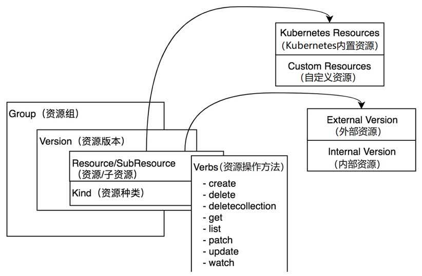

在整个Kubernetes体系架构中，资源是Kubernetes最重要的概念，可以说Kubernetes的生态系统都围绕着资源运作。Kubernetes系统本质上是一个资源控制系统——注册、管理、调度资源并维护资源的状态。

Kubernetes将资源再次分组和版本化，形成Group（资源组）、Version（资源版本）、Resource（资源）。

- Group：被称为资源组，在Kubernetes API Server中也可称其为APIGroup。

- Version：被称为资源版本，在Kubernetes API Server中也可称其为APIVersions。

- Resource：被称为资源，在Kubernetes API Server中也可称其为APIResource。

- Kind：资源种类，描述Resource的种类，与Resource为同一级别。



Kubernetes系统支持多个Group，每个Group支持多个Version，每个Version支持多个Resource，其中部分资源同时会拥有自己的子资源（即SubResource）。例如，Deployment资源拥有Status子资源。

资源组、资源版本、资源、子资源的完整表现形式为<group>/<version>/<resource>/<subresource>。以常用的Deployment资源为例，其完整表现形式为apps/v1/deployments/status。

每一个资源都拥有一定数量的资源操作方法（即Verbs），资源操作方法用于Etcd集群存储中对资源对象的增、删、改、查操作。目前Kubernetes系统支持8种资源操作方法，分别是create、delete、deletecollection、get、list、patch、update、watch操作方法。

每一个资源都至少有两个版本，分别是外部版本（ExternalVersion）和内部版本（Internal Version）。外部版本用于对外暴露给用户请求的接口所使用的资源对象。内部版本不对外暴露，仅在Kubernetes API Server内部使用。

Kubernetes资源也可分为两种，分别是Kubernetes Resource（Kubernetes内置资源）和Custom Resource（自定义资源）。开发者通过CRD（即Custom Resource Definitions）可实现自定义资源，它允许用户将自己定义的资源添加到Kubernetes系统中，并像使用Kubernetes内置资源一样使用它们。

---

Kubernetes Group、Version、Resource等核心数据结构存放在k8s.io/apimachinery/pkg/apis/meta/v1目录中。它包含了Kubernetes集群中所有组件使用的通用核心数据结构，例如APIGroup、APIVersions、APIResource等。其中，我们可以通过APIResourceList数据结构描述所有Group、Version、Resource的结构，代码如下：

```go
// APIResourceList Example	
resourceList := []*metav1.APIResourceList{
		{
			GroupVersion: "v1",
			APIResources: []metav1.APIResource{
				{
					Name: "pods",
					Namespaced: true,
					Kind: "Pod",
					Verbs: []string{"get", "list", "delete", "deletecollection", "create", "update", "patch", "watch"},
				},
				{
					Name: "services",
					Namespaced: true,
					Kind: "Service",
					Verbs: []string{"get", "list", "delete", "deletecollection", "create", "update", "patch", "watch"},
				},
			},
		},
		{
			GroupVersion: "apps/v1",
			APIResources: []metav1.APIResource{
				{
					Name: "deployments",
					Namespaced: true,
					Kind: "Deployment",
					Verbs: []string{"get", "list", "delete", "deletecollection", "create", "update", "patch", "watch"},
				},
			},
		},
	}
```

Kubernetes的每个资源可使用metav1.APIResource结构进行描述，它描述资源的基本信息，例如资源名称（即Name字段）、资源所属的命名空间（即Namespaced字段）、资源种类（即Kind字段）、资源可操作的方法列表（即Verbs字段）。

每一个资源都属于一个或多个资源版本，资源所属的版本通过metav1.APIVersions结构描述，一个或多个资源版本通过Versions[]string字符串数组进行存储。

在APIResourceList Example代码示例中，通过GroupVersion字段来描述资源组和资源版本，它是一个字符串，当资源同时存在资源组和资源版本时，它被设置为<group>/<version>；当资源不存在资源组（Core Group）时，它被设置为/<version>。可以看到Pod、Service资源属于v1版本，而Deployment资源属于apps资源组下的v1版本。

另外，可以通过Group、Version、Resource结构来明确标识一个资源的资源组名称、资源版本及资源名称。Group、Version、Resource简称GVR，在Kubernetes源码中该数据结构被大量使用，它被定义在k8s.io/apimachinery/pkg/runtime/schema中。