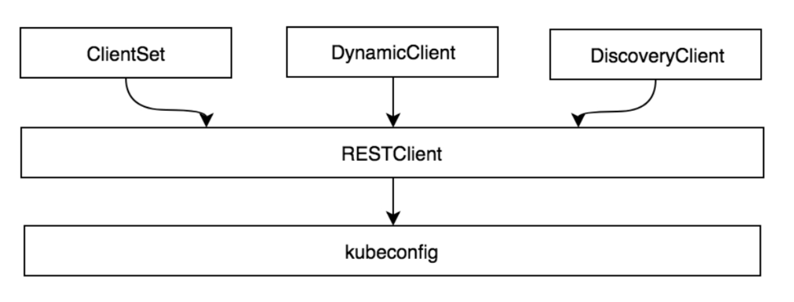

### `client-go`代码结构

`Kubernetes`系统使用`client-go`作为Go语言的官方编程式交互客户端库，提供对`Kubernetes API Server`服务的交互访问。在`Kubernetes`的源码库中已经集成了`client-go`的源码，路径为`vender/k8s.io/client-go`，其代码结构及说明：

```shell
# tree vendor/k8s.io/client-go/ -L 1
vendor/k8s.io/client-go/
├── BUILD
├── code-of-conduct.md
├── CONTRIBUTING.md
├── deprecated
├── discovery  # 提供DiscoveryClient发现客户端
├── dynamic    # 提供DynamicClient动态客户端
├── examples
├── Godeps
├── go.mod
├── go.sum
├── informers  # 每种Kubernetes资源的Informer实现
├── INSTALL.md
├── kubernetes # 提供ClientSet客户端
├── kubernetes_test
├── LICENSE
├── listers    # 为每一个Kubernetes资源提供Lister功能，该功能对Get和List请求提供只读的缓存数据
├── metadata
├── OWNERS
├── pkg
├── plugin     # 提供OpenStack、GCP和Azure等云服务商授权插件
├── rest       # 提供RESTClient客户端，对Kubernetes API Server执行RESTful操作
├── restmapper
├── scale      # 提供ScaleClient客户端，用于扩容或缩容Deployment、ReplicaSet等资源对象
├── SECURITY_CONTACTS
├── testing
├── third_party
├── tools      # 提供常用工具，例如SharedInformer、Reflector、DealtFIFO及Indexers；提供Client查询和缓存机制，以减少向kube-apiserver发起的请求数等
├── transport  # 提供安全的TCP连接，支持Http Stream，某些操作需要在客户端和容器之间传输二进制流，例如exec、attach等操作，该功能由内部的spdy包提供支持
└── util       # 提供常用方法，例如WorkQueue工作队列、Certificate证书管理等
```

### `Client`客户端对象

`client-go`支持4种Client客户端对象与Kubernetes API Server交互的方式，如图所示：



RESTClient是最基础的客户端，对HTTP Request进行了封装，实现了RESTful风格的API。ClientSet、DynamicSet、DIscoveryClient客户点都是基于RESTClient实现的。
ClientSet在RESTClient的基础上封装了对Resource和Version的管理方法。每一个Resource可以理解为一个客户端，而ClientSet则是多个客户端的集合，每一个Resource和Version都以函数的方式暴露给开发者。ClientSet只能够处理Kubernetes内置资源，它是通过client-go代码生成器自动生成的。

DynamicClient与ClientSet最大不同之处是，ClientSet仅能访问Kubernetes自带的资源，不能直接访问CRD资源。DynamicClient能够处理Kubernetes中的所有资源，包括Kubernetes内置资源和CRD资源。DynamicClient用于发现kube-apiserver所支持的资源组、资源版本、资源信息（即Group、Versions、Resources）。

在Kubernetes系统中，组件之间通过HTTP协议进行通信，在不依赖任何中间件的情况下通过Informer机制保证消息的实时性、可靠性、顺序性。Kubernetes的其他组件都是通过client-go的Informer机制与Kubernetes API Server进行通信的。

每一个Kubernetes资源上都实现了Informer机制，每一个Informer上都会实现Informer和Lister方法。

Informer也被称为Shared Informer，它是可以共享使用的。在用client-go编写代码程序时，同一资源的Informer被实例化了多次，每个Informer使用一个Reflector，那会运行过多相同的ListAndWatch，太多重复的序列化和反序列化操作会导致Kubernetes API Server负载过重。

在Informer架构设计中，核心组件如下所述：
1. Reflector
Reflector用于Watch指定的Kubernetes资源，当所监控的资源发生变化时，触发相应的变更事件，如Added、Updated、Deleted，并将其资源对象放到本地缓存DeltaFIFO中。

2. DeltaFIFO
DeltaFIFO可以分开理解，FIFO是一个先进先出的队列，它拥有队列的基本操作方法，例如Add、Update、Delete、List、Pop、Close等，而Delta是一个资源对象存储，它可以保存资源对象的操作类型，例如Added操作类型、Updated操作类型、Deleted操作类型、Sync操作类型。

3. Indexer
Indexer是client-go用来存储资源对象并自带索引功能的本地存储，Reflector从DeltaFIFO将消费出来的资源对象存储至Indexer。Indexer与Etcd中的数据完全保持一致。client-go可以很方便地从本地存储中读取相应的资源对象数据，而无需每次从远程etcd中读取，以减轻Kubernetes API Server和etcd的压力。

