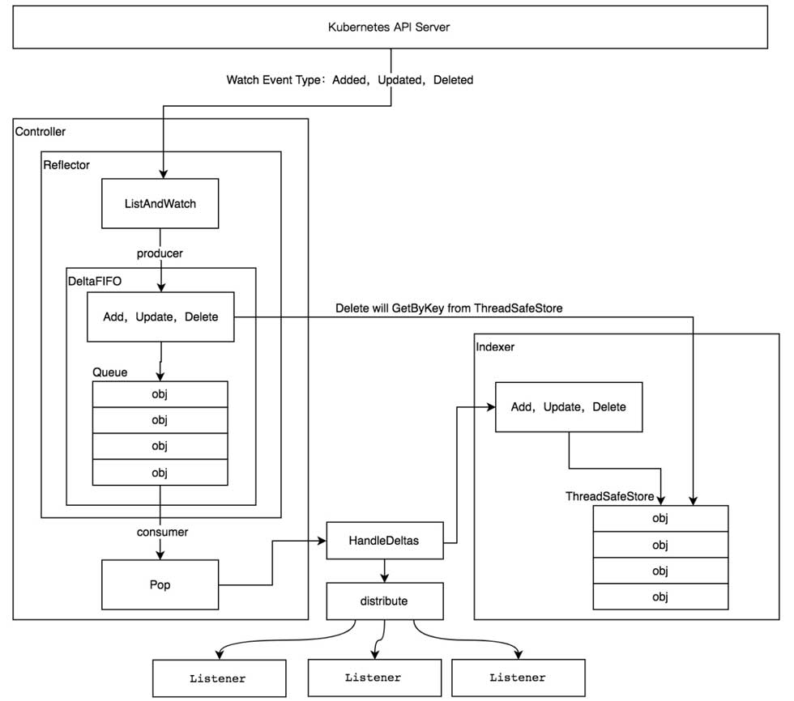

### 第3章 kubernetes核心数据结构

在整个Kubernetes体系架构中，资源是Kubernetes最重要的概念，可以说Kubernetes的生态系统都围绕着资源运作。Kubernetes系统本质上是一个资源控制系统——注册、管理、调度资源并维护资源的状态。

Kubernetes将资源再次分组和版本化，形成Group（资源组）、Version（资源版本）、Resource（资源）。

- Group：被称为资源组，在Kubernetes API Server中也可称其为APIGroup。

- Version：被称为资源版本，在Kubernetes API Server中也可称其为APIVersions。

- Resource：被称为资源，在Kubernetes API Server中也可称其为APIResource。

- Kind：资源种类，描述Resource的种类，与Resource为同一级别。


Kubernetes系统支持多个Group，每个Group支持多个Version，每个Version支持多个Resource，其中部分资源同时会拥有自己的子资源（即SubResource）。例如，Deployment资源拥有Status子资源。

资源组、资源版本、资源、子资源的完整表现形式为<group>/<version>/<resource>/<subresource>。以常用的Deployment资源为例，其完整表现形式为apps/v1/deployments/status。

每一个资源都拥有一定数量的资源操作方法（即Verbs），资源操作方法用于Etcd集群存储中对资源对象的增、删、改、查操作。目前Kubernetes系统支持8种资源操作方法，分别是create、delete、deletecollection、get、list、patch、update、watch操作方法。

每一个资源都至少有两个版本，分别是外部版本（ExternalVersion）和内部版本（Internal Version）。外部版本用于对外暴露给用户请求的接口所使用的资源对象。内部版本不对外暴露，仅在Kubernetes API Server内部使用。

Kubernetes资源也可分为两种，分别是Kubernetes Resource（Kubernetes内置资源）和Custom Resource（自定义资源）。开发者通过CRD（即Custom Resource Definitions）可实现自定义资源，它允许用户将自己定义的资源添加到Kubernetes系统中，并像使用Kubernetes内置资源一样使用它们。

---

Kubernetes Group、Version、Resource等核心数据结构存放在k8s.io/apimachinery/pkg/apis/meta/v1目录中。它包含了Kubernetes集群中所有组件使用的通用核心数据结构，例如APIGroup、APIVersions、APIResource等。其中，我们可以通过APIResourceList数据结构描述所有Group、Version、Resource的结构，代码如下：

```go
// APIResourceList Example	
resourceList := []*metav1.APIResourceList{
		{
			GroupVersion: "v1",
			APIResources: []metav1.APIResource{
				{
					Name: "pods",
					Namespaced: true,
					Kind: "Pod",
					Verbs: []string{"get", "list", "delete", "deletecollection", "create", "update", "patch", "watch"},
				},
				{
					Name: "services",
					Namespaced: true,
					Kind: "Service",
					Verbs: []string{"get", "list", "delete", "deletecollection", "create", "update", "patch", "watch"},
				},
			},
		},
		{
			GroupVersion: "apps/v1",
			APIResources: []metav1.APIResource{
				{
					Name: "deployments",
					Namespaced: true,
					Kind: "Deployment",
					Verbs: []string{"get", "list", "delete", "deletecollection", "create", "update", "patch", "watch"},
				},
			},
		},
	}
```

Kubernetes的每个资源可使用metav1.APIResource结构进行描述，它描述资源的基本信息，例如资源名称（即Name字段）、资源所属的命名空间（即Namespaced字段）、资源种类（即Kind字段）、资源可操作的方法列表（即Verbs字段）。

每一个资源都属于一个或多个资源版本，资源所属的版本通过metav1.APIVersions结构描述，一个或多个资源版本通过Versions[]string字符串数组进行存储。

在APIResourceList Example代码示例中，通过GroupVersion字段来描述资源组和资源版本，它是一个字符串，当资源同时存在资源组和资源版本时，它被设置为<group>/<version>；当资源不存在资源组（Core Group）时，它被设置为/<version>。可以看到Pod、Service资源属于v1版本，而Deployment资源属于apps资源组下的v1版本。

另外，可以通过Group、Version、Resource结构来明确标识一个资源的资源组名称、资源版本及资源名称。Group、Version、Resource简称GVR，在Kubernetes源码中该数据结构被大量使用，它被定义在k8s.io/apimachinery/pkg/runtime/schema中。

---

### 第5章 client-go编程式交互

#### 5.1 `client-go源码结构

`Kubernetes`系统使用`client-go`作为Go语言的官方编程式交互客户端库，提供对`Kubernetes API Server`服务的交互访问。在`Kubernetes`的源码库中已经集成了`client-go`的源码，路径为`vender/k8s.io/client-go`，其代码结构及说明：

```shell
# tree vendor/k8s.io/client-go/ -L 1
vendor/k8s.io/client-go/
├── BUILD
├── code-of-conduct.md
├── CONTRIBUTING.md
├── deprecated
├── discovery  # 提供DiscoveryClient发现客户端
├── dynamic    # 提供DynamicClient动态客户端
├── examples
├── Godeps
├── go.mod
├── go.sum
├── informers  # 每种Kubernetes资源的Informer实现
├── INSTALL.md
├── kubernetes # 提供ClientSet客户端
├── kubernetes_test
├── LICENSE
├── listers    # 为每一个Kubernetes资源提供Lister功能，该功能对Get和List请求提供只读的缓存数据
├── metadata
├── OWNERS
├── pkg
├── plugin     # 提供OpenStack、GCP和Azure等云服务商授权插件
├── rest       # 提供RESTClient客户端，对Kubernetes API Server执行RESTful操作
├── restmapper
├── scale      # 提供ScaleClient客户端，用于扩容或缩容Deployment、ReplicaSet等资源对象
├── SECURITY_CONTACTS
├── testing
├── third_party
├── tools      # 提供常用工具，例如SharedInformer、Reflector、DealtFIFO及Indexers；提供Client查询和缓存机制，以减少向kube-apiserver发起的请求数等
├── transport  # 提供安全的TCP连接，支持Http Stream，某些操作需要在客户端和容器之间传输二进制流，例如exec、attach等操作，该功能由内部的spdy包提供支持
└── util       # 提供常用方法，例如WorkQueue工作队列、Certificate证书管理等
```

#### 5.2 `Client`客户端对象

`client-go`支持4种Client客户端对象与Kubernetes API Server交互的方式，如图所示：


RESTClient是最基础的客户端，对HTTP Request进行了封装，实现了RESTful风格的API。ClientSet、DynamicSet、DIscoveryClient客户点都是基于RESTClient实现的。
ClientSet在RESTClient的基础上封装了对Resource和Version的管理方法。每一个Resource可以理解为一个客户端，而ClientSet则是多个客户端的集合，每一个Resource和Version都以函数的方式暴露给开发者。ClientSet只能够处理Kubernetes内置资源，它是通过client-go代码生成器自动生成的。

DynamicClient与ClientSet最大不同之处是，ClientSet仅能访问Kubernetes自带的资源，不能直接访问CRD资源。DynamicClient能够处理Kubernetes中的所有资源，包括Kubernetes内置资源和CRD资源。DynamicClient用于发现kube-apiserver所支持的资源组、资源版本、资源信息（即Group、Versions、Resources）。

#### 5.3 informer机制



在Kubernetes系统中，组件之间通过HTTP协议进行通信，在不依赖任何中间件的情况下通过Informer机制保证消息的实时性、可靠性、顺序性。Kubernetes的其他组件都是通过client-go的Informer机制与Kubernetes API Server进行通信的。

在Informer架构设计中，核心组件如下所述：
1. Reflector
Reflector用于Watch指定的Kubernetes资源，当所监控的资源发生变化时，触发相应的变更事件，如Added、Updated、Deleted，并将其资源对象放到本地缓存DeltaFIFO中。
2. DeltaFIFO
DeltaFIFO可以分开理解，FIFO是一个先进先出的队列，它拥有队列的基本操作方法，例如Add、Update、Delete、List、Pop、Close等，而Delta是一个资源对象存储，它**可以保存资源对象的操作类型**，例如Added操作类型、Updated操作类型、Deleted操作类型、Sync操作类型。
3. Indexer
Indexer是client-go用来存储资源对象并自带索引功能的本地存储，Reflector从DeltaFIFO将消费出来的资源对象存储至Indexer。Indexer与Etcd中的数据完全保持一致。client-go可以很方便地从本地存储中读取相应的资源对象数据，而无需每次从远程etcd中读取，以减轻Kubernetes API Server和etcd的压力。

---

##### 1、资源informer

每一个Kubernetes资源上都实现了Informer机制，每一个Informer上都会实现Informer和Lister方法。

```go
// kubernetes/staging/src/k8s.io/client-go/informers/apps/v1/deployment.go
// DeploymentInformer provides access to a shared informer and lister for
// Deployments.
type DeploymentInformer interface {
	Informer() cache.SharedIndexInformer
	Lister() v1.DeploymentLister
}
```

实例化sharedinformer，并调用不同资源的informer：

```go
	sharedInformer := informers.NewSharedInformerFactory(clientset, time.Minute)
	informer := sharedInformer.Apps().V1().Deployments()
```

##### 2、shared informer共享机制

Informer也被称为Shared Informer，它是可以共享使用的。在用client-go编写代码程序时，同一资源的Informer被实例化了多次，每个Informer使用一个Reflector，那会运行过多相同的ListAndWatch，太多重复的序列化和反序列化操作会导致Kubernetes API Server负载过重。

Shared Informer可以使同一类资源Informer共享一个Reflector，这样可以节约很多资源。通过map数据结构实现共享的Informer机制。Shared Informer定义了一个map数据结构，用于存放所有Informer的字段，代码示例如下：

```go
// kubernetes/staging/src/k8s.io/client-go/informers/factory.go
type sharedInformerFactory struct {
	client           kubernetes.Interface
	namespace        string
	tweakListOptions internalinterfaces.TweakListOptionsFunc
	lock             sync.Mutex
	defaultResync    time.Duration
	customResync     map[reflect.Type]time.Duration

	informers map[reflect.Type]cache.SharedIndexInformer
	// startedInformers is used for tracking which informers have been started.
	// This allows Start() to be called multiple times safely.
	startedInformers map[reflect.Type]bool
}

// InternalInformerFor returns the SharedIndexInformer for obj using an internal
// client.
func (f *sharedInformerFactory) InformerFor(obj runtime.Object, newFunc internalinterfaces.NewInformerFunc) cache.SharedIndexInformer {
	f.lock.Lock()
	defer f.lock.Unlock()

	informerType := reflect.TypeOf(obj)
	informer, exists := f.informers[informerType]
	if exists {
		return informer
	}

	resyncPeriod, exists := f.customResync[informerType]
	if !exists {
		resyncPeriod = f.defaultResync
	}

	informer = newFunc(f.client, resyncPeriod)
	f.informers[informerType] = informer

	return informer
}
```

informers字段中存储了资源类型和对应于SharedIndexInformer的映射关系。InformerFor函数添加了不同资源的Informer，在添加过程中如果已经存在同类型的资源Informer，则返回当前Informer，不再继续添加。

---

Informer可以对Kubernetes API Server的资源执行监控（Watch）操作，资源类型可以是Kubernetes内置资源，也可以是CRD自定义资源，其中最核心的功能是Reflector。Reflector用于监控指定资源的Kubernetes资源，当监控的资源发生变化时，触发相应的变更事件，例如Added（资源添加）事件、Updated（资源更新）事件、Deleted（资源删除）事件，并将其资源对象存放到本地缓存DeltaFIFO中。

